# **Ferramentas do Git - Seleção de Revisão**

Até agora, tu aprendeste a maioria dos comandos e fluxos de trabalho do
dia-a-dia que para precisa-dia que rio para governatório ou um
repositório Git para teu controle de código-fonte. Tu realizaste as
tarefas de base de rastreamento e decorre e aproveitação do poder demais
da área de teste e do abordagem de ramificação e mesclagem.

Agora, explorarás uma série de maneira poderosa que o Git pode fazer,
que tu talvez não use normalmente no dia-a-dia talvez, mas que algum em
momento necessário.

## **Seleção de Revisão**

O Git permite que você consulte um conjunto de commits ou a um intervalo
de commits de várias maneiras. Eles não são necessariamente óbvios, mas
são úteis para saber.

### **Revisões únicas**

Você pode, obviamente, referir-se a qualquer commit único por seu hash
completo de 40 caracteres SHA-1, mas há maneiras mais amigáveis para se
referir a commits também. Esta seção descreve as várias maneiras pelas
quais você pode se referir a qualquer commit.

### **Baixar Short SHA-1**

O Git é inteligente o suficiente para descobrir a qual commit você está
se referindo se você fornecer os primeiros caracteres do hash SHA-1,
desde que esse hash parcial seja de pelo menos quatro caracteres longos
e inequívoco; isto é, nenhum outro objeto no banco de dados de objetos
pode ter um hash que começa com o mesmo prefixo.

Por exemplo, para examinar um commit específico onde você sabe que
adicionou determinada funcionalidade, você pode primeiro executar git
logcomando para localizar o commit:

\$ git log

commit 734713bc047d87bf7eac9674765ae793478c50d3

Author: Scott Chacon \<schacon@gmail.com\>

Date: Fri Jan 2 18:32:33 2009 -0800

fixed refs handling, added gc auto, updated tests

commit d921970aadf03b3cf0e71becdaab3147ba71cdef

Merge: 1c002dd\... 35cfb2b\...

Author: Scott Chacon \<schacon@gmail.com\>

Date: Thu Dec 11 15:08:43 2008 -0800

Merge commit \'phedders/rdocs\'

commit 1c002dd4b536e7479fe34593e72e6c6c1819e53b

Author: Scott Chacon \<schacon@gmail.com\>

Date: Thu Dec 11 14:58:32 2008 -0800

added some blame and merge stuff

Neste caso, digamos que você está interessado no compromisso cujo hash
começa com 1c002dd\...- A . (í a questão: es. , , , íntepeo. . E. . es.
sobre a questão Você pode inspecionar esse commit com qualquer uma das
seguintes variações de git show(Supondo que as versões mais curtas sejam
inequívocas):

\$ git show 1c002dd4b536e7479fe34593e72e6c6c1819e53b

\$ git show 1c002dd4b536e7479f

\$ git show 1c002d

O Git pode descobrir uma abreviação curta e exclusiva para seus valores
SHA-1. Se você passar \--abbrev-commitpara o git logcomando, a saída
usará valores mais curtos, mas os manterá únicos; é padrão usar sete
caracteres, mas os torna mais longos, se necessário, para manter o SHA-1
inequívoco:

\$ git log \--abbrev-commit \--pretty=oneline

ca82a6d changed the version number

085bb3b removed unnecessary test code

a11bef0 first commit

Geralmente, oito a dez caracteres são mais do que suficientes para serem
únicos dentro de um projeto. Por exemplo, a partir de outubro de 2017, o
kernel Linux (que é um projeto bastante considerável) tem mais de
700.000 commits e quase seis milhões de objetos, sem dois objetos cujos
SHA-1s são idênticos nos primeiros 11 caracteres.

### **Referências de sucursal**

Uma maneira simples de se referir a um determinado commit é se ele é o
commit na ponta de uma ramificação; nesse caso, você pode simplesmente
usar o nome da ramificação em qualquer comando Git que espera uma
referência a um commit. Por exemplo, se você quiser examinar o último
objeto de commit em uma ramificação, os seguintes comandos são
equivalentes, assumindo que o topic1Branch points para se comprometer
ca82a6d\...:

\$ git show ca82a6dff817ec66f44342007202690a93763949

\$ git show topic1

Se você quiser ver para qual posicione um chanfra específico SHA-1, ou
se você quiser ver o que qualquer um desses exemplos se resume em termos
de SHA-1s, você pode usar uma ferramenta de encanamento Git chamada
rev-parse- A . (í a questão: es. , , , íntepeo. . E. . es. sobre a
questão . (em, proprio, e os comandos e. . sobre a questão , , . Você
pode ver [[Internos do
Git]{.underline}](https://git-scm.com/book/pt-pt/v2/ch00/ch10-git-internals)
para obter mais informações sobre ferramentas de encanamento;
basicamente, rev-parseexiste para operações de nível inferior e não é
projetado para ser usado em operações do dia-a-dia. No entanto, às vezes
pode ser útil quando você precisa ver o que realmente está acontecendo.
Aqui você pode correr rev-parseem sua filial.

\$ git rev-parse topic1

ca82a6dff817ec66f44342007202690a93763949

### **Nomes curtos RefLog**

Uma das coisas que o Git faz em segundo plano enquanto você está
trabalhando fora é manter um "reflog" -- um registro de onde suas
referências de HEAD e branch estiveram nos últimos meses.

Você pode ver o seu reflog usando git reflog:

\$ git reflog

734713b HEAD@{0}: commit: fixed refs handling, added gc auto, updated

d921970 HEAD@{1}: merge phedders/rdocs: Merge made by the \'recursive\'
stategy.

1c002dd HEAD@{2}: commit: added some blame and merge stuff

1c36188 HEAD@{3}: rebase -i (squash): updating HEAD

95df984 HEAD@{4}: commit: \# This is a combination of two commits.

1c36188 HEAD@{5}: rebase -i (squash): updating HEAD

7e05da5 HEAD@{6}: rebase -i (pick): updating HEAD

Toda vez que sua dica de ramificação é atualizada por qualquer motivo, o
Git armazena essas informações para você neste histórico temporário.
Você pode usar seus dados de reflog para se referir a commits mais
antigos também. Por exemplo, se você quiser ver o quinto valor anterior
do HEAD do seu repositório, você pode usar o \@{5}referência que você vê
na saída reflog:

\$ git show HEAD@{5}

Você também pode usar essa sintaxe para ver onde uma ramificação era um
período específico de tempo atrás. Por exemplo, para ver onde você
masterO ramo era ontem, você pode digitar

\$ git show master@{yesterday}

Isso mostraria onde a ponta do seu masterO ramo foi ontem. Essa técnica
funciona apenas para dados que ainda estão em seu reflog, então você não
pode usá-lo para procurar commits com mais de alguns meses.

Para ver informações reflog formatadas como o git logsaída, você pode
correr git log -g:

\$ git log -g master

commit 734713bc047d87bf7eac9674765ae793478c50d3

Reflog: master@{0} (Scott Chacon \<schacon@gmail.com\>)

Reflog message: commit: fixed refs handling, added gc auto, updated

Author: Scott Chacon \<schacon@gmail.com\>

Date: Fri Jan 2 18:32:33 2009 -0800

fixed refs handling, added gc auto, updated tests

commit d921970aadf03b3cf0e71becdaab3147ba71cdef

Reflog: master@{1} (Scott Chacon \<schacon@gmail.com\>)

Reflog message: merge phedders/rdocs: Merge made by recursive.

Author: Scott Chacon \<schacon@gmail.com\>

Date: Thu Dec 11 15:08:43 2008 -0800

Merge commit \'phedders/rdocs\'

É importante notar que as informações de reflog são estritamente locais
-- é apenas um registro do que *você* fez em *seu* repositório. As
referências não serão as mesmas na cópia do repositório de outra pessoa;
também, logo após clonar inicialmente um repositório, você terá um
reflog vazio, pois nenhuma atividade ocorreu ainda em seu repositório.
Correndo em frente git show HEAD@{2.months.ago}Ele mostrará o commit
correspondente somente se você clonou o projeto há pelo menos dois meses
-- se você clontá-lo mais recentemente do que isso, você verá apenas seu
primeiro commit local.

### **Referências de ancestralidade**

A outra maneira principal de especificar um commit é através de sua
ancestralidade. Se você colocar a \^(cuidados) no final de uma
referência, o Git resolve que significa o pai dessa confirmação. Suponha
que você veja a história do seu projeto:

\$ git log \--pretty=format:\'%h %s\' \--graph

\* 734713b fixed refs handling, added gc auto, updated tests

\* d921970 Merge commit \'phedders/rdocs\'

\|\\

\| \* 35cfb2b Some rdoc changes

\* \| 1c002dd added some blame and merge stuff

\|/

\* 1c36188 ignore \*.gem

\* 9b29157 add open3_detach to gemspec file list

Então, você pode ver o commit anterior especificando HEAD\^, que
significa "o pai da HEAD":

\$ git show HEAD\^

commit d921970aadf03b3cf0e71becdaab3147ba71cdef

Merge: 1c002dd\... 35cfb2b\...

Author: Scott Chacon \<schacon@gmail.com\>

Date: Thu Dec 11 15:08:43 2008 -0800

Merge commit \'phedders/rdocs\'

Você também pode especificar um número após o \^- Por exemplo,
d921970\^2significa "o segundo pai de d921970". Essa sintaxe é útil
apenas para commits de mesclagem, que têm mais de um pai. O primeiro pai
é o ramo em que você estava quando você se fundiu, e o segundo é o
commit no ramo em que você se fundiu:

\$ git show d921970\^

commit 1c002dd4b536e7479fe34593e72e6c6c1819e53b

Author: Scott Chacon \<schacon@gmail.com\>

Date: Thu Dec 11 14:58:32 2008 -0800

added some blame and merge stuff

\$ git show d921970\^2

commit 35cfb2b795a55793d7cc56a6cc2060b4bb732548

Author: Paul Hedderly \<paul+git@mjr.org\>

Date: Wed Dec 10 22:22:03 2008 +0000

Some rdoc changes

A outra especificação principal de ancestralidade é o \~(tilde). Isso
também se refere ao primeiro pai, então HEAD\~E a HEAD\^São
equivalentes. A diferença se torna aparente quando você especifica um
número. HEAD\~2significa "o primeiro pai do primeiro pai" ou "o avô" --
ele atravessa os primeiros pais o número de vezes que você especificar.
Por exemplo, na história listada anteriormente, HEAD\~3Seria

\$ git show HEAD\~3

commit 1c3618887afb5fbcbea25b7c013f4e2114448b8d

Author: Tom Preston-Werner \<tom@mojombo.com\>

Date: Fri Nov 7 13:47:59 2008 -0500

ignore \*.gem

Isso também pode ser escrito HEAD\^\^\^, que é novamente o primeiro pai
do primeiro progenitor do primeiro progenitor:

\$ git show HEAD\^\^\^

commit 1c3618887afb5fbcbea25b7c013f4e2114448b8d

Author: Tom Preston-Werner \<tom@mojombo.com\>

Date: Fri Nov 7 13:47:59 2008 -0500

ignore \*.gem

Você também pode combinar essas sintaxes --- você pode obter o segundo
pai da referência anterior (supondo que tenha sido um commit de
mesclagem) usando HEAD\~3\^2, e assim por diante.

### **Gamas de Comboio**

Agora que você pode especificar commits individuais, vamos ver como
especificar intervalos de commits. Isso é particularmente útil para
gerenciar suas filiais -- se você tiver muitas filiais, poderá usar
especificações de intervalo para responder a perguntas como: "Qual é o
trabalho nesta ramificação que ainda não me fundi no meu principal
ramo?"

#### **Ponto duplo**

A especificação de intervalo mais comum é a sintaxe de ponto duplo. Isso
basicamente pede ao Git para resolver uma variedade de commits que são
acessíveis a partir de um commit, mas não são alcançáveis de outra. Por
exemplo, digamos que você tem um histórico de commits que se parece com
[[Exemplo de histórico para seleção de
intervalos.]{.underline}](https://git-scm.com/book/pt-pt/v2/ch00/double_dot)

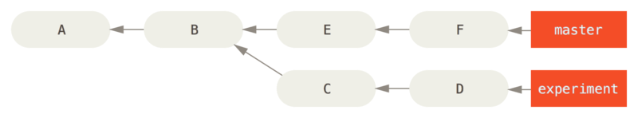{width="6.267716535433071in"
height="1.1527777777777777in"}

Figura 137. Histórico de exemplos para seleção de intervalos.

Diga que você queira ver o que está em seu experimentramo que ainda não
foi fundido em seu masterO ramo. Você pode pedir ao Git para mostrar um
registro de apenas esses commits com master..experiment Isso significa
"todos os commits alcançáveis a partir de experimentos que não são
alcançáveis do mestre". Por uma questão de brevidade e clareza nesses
exemplos, as letras dos objetos de commit do diagrama são usadas no
lugar da saída real do log na ordem que eles exibiriam:

\$ git log master..experiment

D

C

Se, por outro lado, você quer ver o oposto -- tudo se compromete em
masterque não estão em experiment --- você pode reverter os nomes dos
ramos. experiment..masterMostra-lhe tudo dentro masterNão alcançável a
partir de experiment:

\$ git log experiment..master

F

E

Isso é útil se você quiser manter o experimenthospedar-se até à data e
visualize o que você está prestes a fundir. Outro uso frequente desta
sintaxe é ver o que você está prestes a empurrar para um controle
remoto:

\$ git log origin/master..HEAD

Este comando mostra todos os commits em seu ramo atual que não estão no
masterRamo em seu originremoto. Se você correr um git pushe seu ramo
atual está rastreando origin/master, os commits listados por git log
origin/master..HEADsão os commits que serão transferidos para o
servidor. Você também pode deixar de lado a sintaxe para que o Git
assuma HEAD- A . (í a questão: es. , , , íntepeo. . E. . es. sobre a
questão Por exemplo, você pode obter os mesmos resultados que no exemplo
anterior digitando git log origin/master.. --- Suplementos de Git HEADSe
um lado estiver faltando.

#### **Múltiplos pontos**

A sintaxe de ponto duplo é útil como uma abreviação, mas talvez você
queira especificar mais de duas ramificações para indicar sua revisão,
como ver quais commits estão em qualquer um dos vários ramos que não
estão na ramificação em que você está atualmente. O Git permite que você
faça isso usando qualquer um dos \^caráter ou \--notantes de qualquer
referência a partir da qual você não queira ver commits alcançáveis.
Assim, os três comandos seguintes são equivalentes:

\$ git log refA..refB

\$ git log \^refA refB

\$ git log refB \--not refA

Isso é bom porque com esta sintaxe você pode especificar mais de duas
referências em sua consulta, o que você não pode fazer com a sintaxe de
duas doses. Por exemplo, se você quiser ver todos os commits que são
acessíveis a partir de refAou a refBMas não de refC, você pode usar
qualquer um dos seguintes:

\$ git log refA refB \^refC

\$ git log refA refB \--not refC

Isso contribui para um sistema de consulta de revisão muito poderoso que
deve ajudá-lo a descobrir o que está em seus ramos.

#### **Ponto triplo**

A última grande sintaxe de seleção de alcance é a sintaxe de ponto
triplo, que especifica todos os commits que são acessíveis por *qualquer
uma* das duas referências, mas não por ambas. Olhe para trás para o
histórico de commits de exemplo no [[histórico de exemplos para seleção
de
intervalos.]{.underline}](https://git-scm.com/book/pt-pt/v2/ch00/double_dot)
Se você quer ver o que está em masterou a experimentmas não quaisquer
referências comuns, você pode executar:

\$ git log master\...experiment

F

E

D

C

Novamente, isso lhe dá normal logoutput, mas mostra apenas as
informações de commit para esses quatro commits, aparecendo no pedido
tradicional de data de commit.

Um interruptor comum para usar com o logO comando neste caso é
\--left-right, o que mostra em que lado do intervalo cada commit está.
Isso ajuda a tornar a saída mais útil:

\$ git log \--left-right master\...experiment

\< F

\< E

\> D

\> C

Com essas ferramentas, você pode muito mais facilmente deixar o Git
saber o que commit ou commits você deseja inspecionar.

# **Ferramentas do Git - Interativo Staging**

## **Encalomize Interativo**

Nesta seção, você verá alguns comandos interativos do Git que podem
ajudá-lo a criar facilmente seus commits para incluir apenas certas
combinações e partes de arquivos. Essas ferramentas são úteis se você
modificar vários arquivos e decidir que deseja que essas alterações
estejam em vários commits focados, em vez de um grande commit confuso.
Dessa forma, você pode garantir que seus commits sejam logicamente
separados de alterações e possam ser facilmente revisados pelos
desenvolvedores que trabalham com você.

Se você correr git addCom o -iou a \--interactiveO Git entra em um modo
de shell interativo, exibindo algo assim:

\$ git add -i

staged unstaged path

1: unchanged +0/-1 TODO

2: unchanged +1/-1 index.html

3: unchanged +5/-1 lib/simplegit.rb

\*\*\* Commands \*\*\*

1: status 2: update 3: revert 4: add untracked

5: patch 6: diff 7: quit 8: help

What now\>

Você pode ver que esse comando mostra uma visão muito diferente de sua
área de teste do que você provavelmente está acostumado - basicamente,
as mesmas informações que você recebe git statusmas um pouco mais
sucinto e informativo. Ele lista as mudanças que você encenou na
esquerda e as alterações não em fase ao lado.

Depois disso vem uma seção "Comandos", que permite que você faça uma
série de coisas como encenando e descontaging arquivos, encenando partes
de arquivos, adicionando arquivos não rastreados e exibindo diffs do que
foi encenado.

### **Estriação e Instante Arquivos**

Se você digitar 2ou a uno What now\>prompt, você é solicitado para quais
arquivos você deseja encenar:

What now\> 2

staged unstaged path

1: unchanged +0/-1 TODO

2: unchanged +1/-1 index.html

3: unchanged +5/-1 lib/simplegit.rb

Update\>\>

Para encenar o TODOE a index.htmlarquivos, você pode digitar os números:

Update\>\> 1,2

staged unstaged path

\* 1: unchanged +0/-1 TODO

\* 2: unchanged +1/-1 index.html

3: unchanged +5/-1 lib/simplegit.rb

Update\>\>

O que é \*Ao lado de cada arquivo significa que o arquivo é selecionado
para ser encenado. Se você pressionar Enter depois de digitar nada no
Update\>\>prompt, Git leva qualquer coisa selecionada e encena para
você:

Update\>\>

updated 2 paths

\*\*\* Commands \*\*\*

1: status 2: update 3: revert 4: add untracked

5: patch 6: diff 7: quit 8: help

What now\> 1

staged unstaged path

1: +0/-1 nothing TODO

2: +1/-1 nothing index.html

3: unchanged +5/-1 lib/simplegit.rb

Agora você pode ver que o TODOE a index.htmlOs arquivos são encenados e
o simplegit.rbO arquivo ainda não está em fase. Se você quer desencadear
o TODONeste ponto, você usa o 3ou a r(para reverter) opção:

\*\*\* Commands \*\*\*

1: status 2: update 3: revert 4: add untracked

5: patch 6: diff 7: quit 8: help

What now\> 3

staged unstaged path

1: +0/-1 nothing TODO

2: +1/-1 nothing index.html

3: unchanged +5/-1 lib/simplegit.rb

Revert\>\> 1

staged unstaged path

\* 1: +0/-1 nothing TODO

2: +1/-1 nothing index.html

3: unchanged +5/-1 lib/simplegit.rb

Revert\>\> \[enter\]

reverted one path

Olhando para o seu status Git novamente, você pode ver que você
desencadeou o TODOFicheiro:

\*\*\* Commands \*\*\*

1: status 2: update 3: revert 4: add untracked

5: patch 6: diff 7: quit 8: help

What now\> 1

staged unstaged path

1: unchanged +0/-1 TODO

2: +1/-1 nothing index.html

3: unchanged +5/-1 lib/simplegit.rb

Para ver o diff do que você encenou, você pode usar o 6ou a d(para diff)
comando. Ele mostra uma lista de seus arquivos encenados e você pode
selecionar os para os quais você gostaria de ver o diff encenado. É como
especificar git diff \--cachedna linha de comando:

\*\*\* Commands \*\*\*

1: status 2: update 3: revert 4: add untracked

5: patch 6: diff 7: quit 8: help

What now\> 6

staged unstaged path

1: +1/-1 nothing index.html

Review diff\>\> 1

diff \--git a/index.html b/index.html

index 4d07108..4335f49 100644

\-\-- a/index.html

+++ b/index.html

@@ -16,7 +16,7 @@ Date Finder

\
\...\</p\>

-\
contact : support@github.com\</div\>

+\
contact : email.support@github.com\</div\>

\<script type=\"text/javascript\"\>

Com esses comandos básicos, você pode usar o modo de adição interativo
para lidar com sua área de preparação com um pouco mais facilmente.

### **Manchas de estadia**

Também é possível para o Git encenar certas *partes* dos arquivos e não
o resto. Por exemplo, se você fizer duas alterações no seu
simplegit.rbarquivar e querer encenar um deles e não o outro, fazendo
isso é muito fácil no Git. A partir do mesmo prompt interativo explicado
na seção anterior, digite 5ou a p(para o patch). O Git perguntará quais
arquivos você gostaria de organizar parcialmente; então, para cada seção
dos arquivos selecionados, ele exibirá pedaços do diff do arquivo e
perguntará se você gostaria de organizá-los, um por um:

diff \--git a/lib/simplegit.rb b/lib/simplegit.rb

index dd5ecc4..57399e0 100644

\-\-- a/lib/simplegit.rb

+++ b/lib/simplegit.rb

@@ -22,7 +22,7 @@ class SimpleGit

end

def log(treeish = \'master\')

\- command(\"git log -n 25 #{treeish}\")

\+ command(\"git log -n 30 #{treeish}\")

end

def blame(path)

Stage this hunk \[y,n,a,d,/,j,J,g,e,?\]?

Você tem muitas opções neste momento. Typing em Inglês ?Mostra uma lista
do que você pode fazer:

Stage this hunk \[y,n,a,d,/,j,J,g,e,?\]? ?

y - stage this hunk

n - do not stage this hunk

a - stage this and all the remaining hunks in the file

d - do not stage this hunk nor any of the remaining hunks in the file

g - select a hunk to go to

/ - search for a hunk matching the given regex

j - leave this hunk undecided, see next undecided hunk

J - leave this hunk undecided, see next hunk

k - leave this hunk undecided, see previous undecided hunk

K - leave this hunk undecided, see previous hunk

s - split the current hunk into smaller hunks

e - manually edit the current hunk

? - print help

Geralmente, você digitará you a nse você quiser encenar cada pedaço, mas
encenando todos eles em certos arquivos ou pular uma decisão de um
pedaço até mais tarde pode ser útil também. Se você encenar uma parte do
arquivo e deixar outra parte sem encenar, sua saída de status será
assim:

What now\> 1

staged unstaged path

1: unchanged +0/-1 TODO

2: +1/-1 nothing index.html

3: +1/-1 +4/-0 lib/simplegit.rb

O status do simplegit.rbO arquivo é interessante. Isso mostra que
algumas linhas são encenadas e um casal não está encenada. Você encenou
parcialmente esse arquivo. Neste ponto, você pode sair do script de
adição interativa e executar git commitpara confirmar os arquivos
parcialmente encenados.

Você também não precisa estar no modo de adição interativo para fazer a
encenação de arquivos parciais - você pode iniciar o mesmo script usando
git add -pou a git add \--patchna linha de comando.

Além disso, você pode usar o modo de patch para redefinir parcialmente
arquivos com o git reset \--patchcomando, para verificar partes de
arquivos com o git checkout \--patchcomando e para guardar partes de
arquivos com o git stash save \--patch- Comando. Entraremos em mais
detalhes sobre cada um deles à medida que chegarmos a usos mais
avançados desses comandos.

# **Ferramentas do Git - Stashing and Limpeza**

## **Esterco e limpeza**

Muitas vezes, quando você está trabalhando em parte do seu projeto, as
coisas estão em um estado confuso e você quer mudar de ramificação para
um pouco para trabalhar em outra coisa. O problema é que você não quer
fazer um commit de trabalho meio feito apenas para que você possa voltar
a este ponto mais tarde. A resposta para esta questão é a git stash-
Comando.

O Stashing pega o estado sujo do seu diretório de trabalho - isto é,
seus arquivos rastreados modificados e alterações encenadas - e o salva
em uma pilha de alterações inacabadas que você pode reaplicar a qualquer
momento (mesmo em uma ramificação diferente).

### **Arrombando o seu trabalho**

Para demonstrar a estocagem, você entrará em seu projeto e começará a
trabalhar em alguns arquivos e possivelmente em fase uma das alterações.
Se você correr git statusVocê pode ver o seu estado sujo:

\$ git status

Changes to be committed:

(use \"git reset HEAD \<file\>\...\" to unstage)

modified: index.html

Changes not staged for commit:

(use \"git add \<file\>\...\" to update what will be committed)

(use \"git checkout \-- \<file\>\...\" to discard changes in working
directory)

modified: lib/simplegit.rb

Agora você quer trocar de ramificação, mas você não quer comprometer o
que você está trabalhando ainda; então você vai estornar as mudanças.
Para empurrar um novo esconderijo para sua pilha, execute git stashou a
git stash save:

\$ git stash

Saved working directory and index state \\

\"WIP on master: 049d078 added the index file\"

HEAD is now at 049d078 added the index file

(To restore them type \"git stash apply\")

Agora você pode ver que seu diretório de trabalho está limpo:

\$ git status

\# On branch master

nothing to commit, working directory clean

Neste ponto, você pode alternar ramificações e trabalhar em outro lugar;
suas alterações são armazenadas em sua pilha. Para ver quais esconder
itens que você armazenou, você pode usar git stash list:

\$ git stash list

stash@{0}: WIP on master: 049d078 added the index file

stash@{1}: WIP on master: c264051 Revert \"added file_size\"

stash@{2}: WIP on master: 21d80a5 added number to log

Neste caso, dois esconderijos foram feitos anteriormente, então você tem
acesso a três obras escondidas diferentes. Você pode reaplicar o que
você acabou de esconder usando o comando mostrado na saída de ajuda do
comando stash original: git stash apply- A . (í a questão: es. , , ,
íntepeo. . E. . es. sobre a questão . (em, proprio, e os comandos e. .
sobre a questão Se você quiser aplicar um dos esconderijos mais antigos,
você pode especdicá-lo nomeando-o, assim: git stash apply stash@{2}- A .
(í a questão: es. , , , íntepeo. . E. . es. sobre a questão . (em,
proprio, e os comandos e. . sobre a questão Se você não especificar um
stash, o Git assume o estoque mais recente e tenta aplicá-lo:

\$ git stash apply

On branch master

Changes not staged for commit:

(use \"git add \<file\>\...\" to update what will be committed)

(use \"git checkout \-- \<file\>\...\" to discard changes in working
directory)

modified: index.html

modified: lib/simplegit.rb

no changes added to commit (use \"git add\" and/or \"git commit -a\")

Você pode ver que o Git modifique novamente os arquivos que você
reverteu quando você salvou o estoque. Neste caso, você tinha um
diretório de trabalho limpo quando tentou aplicar o estoque e tentou
aplicá-lo na mesma ramificação que você salvou. Ter um diretório de
trabalho limpo e aplicá-lo na mesma ramificação não é necessário aplicar
com sucesso um estoque. Você pode salvar um stash em um branch, alternar
para outro ramo mais tarde e tentar reaplicar as alterações. Você também
pode ter arquivos modificados e não comprometidos em seu diretório de
trabalho quando aplicar um stash --- o Git dá conflitos de mesclagem se
algo não for mais aplicável de forma limpa.

As alterações nos seus arquivos foram reaplicadas, mas o arquivo que
você encenou antes não foi reagendado. Para fazer isso, você deve
executar o git stash applyComando com um \--indexopção para dizer ao
comando para tentar reaplicar as alterações encenadas. Se você tivesse
executado isso em vez disso, você teria voltado para a sua posição
original:

\$ git stash apply \--index

On branch master

Changes to be committed:

(use \"git reset HEAD \<file\>\...\" to unstage)

modified: index.html

Changes not staged for commit:

(use \"git add \<file\>\...\" to update what will be committed)

(use \"git checkout \-- \<file\>\...\" to discard changes in working
directory)

modified: lib/simplegit.rb

A opção de aplicação só tenta aplicar o trabalho escondido - você
continua a tê-lo em sua pilha. Para removê-lo, você pode correr git
stash dropcom o nome do stash para remover:

\$ git stash list

stash@{0}: WIP on master: 049d078 added the index file

stash@{1}: WIP on master: c264051 Revert \"added file_size\"

stash@{2}: WIP on master: 21d80a5 added number to log

\$ git stash drop stash@{0}

Dropped stash@{0} (364e91f3f268f0900bc3ee613f9f733e82aaed43)

Você também pode correr git stash poppara aplicar o stash e, em seguida,
soltá-lo imediatamente a partir de sua pilha.

### **Assalto criativo**

Existem algumas variantes de estoque que também podem ser úteis. A
primeira opção que é bastante popular é o \--keep-indexopção para o
stash save- Comando. Isso diz ao Git para não apenas incluir todo o
conteúdo encenado no estoque que está sendo criado, mas simultaneamente
deixá-lo no índice.

\$ git status -s

M index.html

M lib/simplegit.rb

\$ git stash \--keep-index

Saved working directory and index state WIP on master: 1b65b17 added the
index file

HEAD is now at 1b65b17 added the index file

\$ git status -s

M index.html

Outra coisa comum que você pode querer fazer com o stash é esconder os
arquivos não rastreados, bem como os rastreados. Por defeito, git
stashirá esconder apenas arquivos modificados e encenados*.* Se você
especificar \--include-untrackedou a -u, o Git incluirá arquivos não
rastreados no estoque que está sendo criado.

\$ git status -s

M index.html

M lib/simplegit.rb

?? new-file.txt

\$ git stash -u

Saved working directory and index state WIP on master: 1b65b17 added the
index file

HEAD is now at 1b65b17 added the index file

\$ git status -s

\$

Finalmente, se você especificar o \--patchsinalizador, Git não vai
esconder tudo o que é modificado, mas em vez disso irá prompt-lo
interativamente qual das alterações você gostaria de esconder e que você
gostaria de manter em seu diretório de trabalho.

\$ git stash \--patch

diff \--git a/lib/simplegit.rb b/lib/simplegit.rb

index 66d332e..8bb5674 100644

\-\-- a/lib/simplegit.rb

+++ b/lib/simplegit.rb

@@ -16,6 +16,10 @@ class SimpleGit

return \`#{git_cmd} 2\>&1\`.chomp

end

end

\+

\+ def show(treeish = \'master\')

\+ command(\"git show #{treeish}\")

\+ end

end

test

Stash this hunk \[y,n,q,a,d,/,e,?\]? y

Saved working directory and index state WIP on master: 1b65b17 added the
index file

### **Criando um Ramo a partir de um Stash**

Se você esconder algum trabalho, deixá-lo lá por um tempo, e continuar
no ramo de onde você escondeu o trabalho, você pode ter um problema
reaplicando o trabalho. Se o aplicativo tentar modificar um arquivo que
você modificou desde então, você terá um conflito de mesclagem e terá
que tentar resolvê-lo. Se você quiser uma maneira mais fácil de testar
as alterações de esconderijo novamente, você pode executar git stash
branch \<branch\>, que cria uma nova ramificação para você com o nome do
ramo selecionado, verifica o commit que você estava quando escondeu seu
trabalho, reaplica seu trabalho lá e, em seguida, deixa cair o estoque
se ele se aplicar com sucesso:

\$ git stash branch testchanges

M index.html

M lib/simplegit.rb

Switched to a new branch \'testchanges\'

On branch testchanges

Changes to be committed:

(use \"git reset HEAD \<file\>\...\" to unstage)

modified: index.html

Changes not staged for commit:

(use \"git add \<file\>\...\" to update what will be committed)

(use \"git checkout \-- \<file\>\...\" to discard changes in working
directory)

modified: lib/simplegit.rb

Dropped refs/stash@{0} (29d385a81d163dfd45a452a2ce816487a6b8b014)

Este é um bom atalho para recuperar o trabalho escondido facilmente e
trabalhar nele em um novo ramo.

### **Limpando seu diretório de trabalho**

Finalmente, você pode não querer esconder algum trabalho ou arquivos em
seu diretório de trabalho, mas simplesmente se livrar deles. O que é git
cleanO comando fará isso por você.

Algumas razões comuns para isso podem ser remover o cruft que foi gerado
por mescles ou ferramentas externas ou para remover artefatos de
construção para executar uma construção limpa.

Você vai querer ter muito cuidado com este comando, uma vez que ele é
projetado para remover arquivos do seu diretório de trabalho que não são
rastreados. Se você mudar de ideia, muitas vezes não há recuperação do
conteúdo desses arquivos. Uma opção mais segura é correr git stash
\--allpara remover tudo, mas guardá-lo em um estoque.

Supondo que você deseja remover arquivos cruft ou limpar seu diretório
de trabalho, você pode fazê-lo com git clean- A . (í a questão: es. , ,
, íntepeo. . E. . es. sobre a questão . (em, proprio, e Para remover
todos os arquivos não rastreados em seu diretório de trabalho, você pode
executar git clean -f -d, que remove quaisquer arquivos e também
quaisquer subdiretórios que ficam vazios como resultado. O que é
-fsignifica *força* ou "realmente fazer isso".

Se você quiser ver o que faria, você pode executar o comando com o
-nopção, que significa "fazer um correr seco e me dizer o que você
*teria* removido".

\$ git clean -d -n

Would remove test.o

Would remove tmp/

Por padrão, o git cleanO comando só removerá arquivos não rastreados que
não são ignorados. Qualquer arquivo que corresponda a um padrão em seu
.gitignoreou outros arquivos ignorados não serão removidos. Se você
quiser remover esses arquivos também, como para remover todos os
.oarquivos gerados a partir de uma compilação para que você possa fazer
uma compilação totalmente limpa, você pode adicionar um -xpara o comando
limpo.

\$ git status -s

M lib/simplegit.rb

?? build.TMP

?? tmp/

\$ git clean -n -d

Would remove build.TMP

Would remove tmp/

\$ git clean -n -d -x

Would remove build.TMP

Would remove test.o

Would remove tmp/

Se você não sabe o que git cleancomando vai fazer, sempre executá-lo com
um -nprimeiro a verificar antes de mudar o -npara um -fE fazê-lo de
verdade. A outra maneira que você pode ter cuidado com o processo é
executá-lo com o -iou bandeira "interativa".

Isso executará o comando clean em um modo interativo.

\$ git clean -x -i

Would remove the following items:

build.TMP test.o

\*\*\* Commands \*\*\*

1: clean 2: filter by pattern 3: select by numbers 4: ask each 5: quit

6: help

What now\>

Desta forma, você pode percorrer cada arquivo individualmente ou
especificar padrões para exclusão de forma interativa.

# **7.4 Ferramentas do Git - Assinar o seu trabalho**

## **Assine o seu trabalho**

O Git é criptograficamente seguro, mas não é infalível. Se você está
levando o trabalho de outras pessoas na internet e quer verificar se os
commits são realmente de uma fonte confiável, o Git tem algumas maneiras
de assinar e verificar o trabalho usando o GPG.

### **Introdução ao GPG**

Primeiro de tudo, se você quiser assinar qualquer coisa, você precisa
para configurar o GPG e sua chave pessoal instalada.

\$ gpg \--list-keys

/Users/schacon/.gnupg/pubring.gpg

\-\-\-\-\-\-\-\-\-\-\-\-\-\-\-\-\-\-\-\-\-\-\-\-\-\-\-\-\-\-\-\--

pub 2048R/0A46826A 2014-06-04

uid Scott Chacon (Git signing key) \<schacon@gmail.com\>

sub 2048R/874529A9 2014-06-04

Se você não tiver uma chave instalada, você pode gerar uma com gpg
\--gen-key- A . (í a questão: es. , , , íntepeo. . E. . es

gpg \--gen-key

Depois de ter uma chave privada para assinar, você pode configurar o Git
para usá-lo para assinar as coisas, definindo o
user.signingkeyConfiguração de configuração.

git config \--global user.signingkey 0A46826A

Agora o Git usará sua chave por padrão para assinar tags e commits, se
desejar.

### **Tags de assinatura**

Se você tiver uma configuração de chave privada GPG, agora pode usá-la
para assinar novas tags. Tudo o que você precisa fazer é usar -sEm vez
de -a:

\$ git tag -s v1.5 -m \'my signed 1.5 tag\'

You need a passphrase to unlock the secret key for

user: \"Ben Straub \<ben@straub.cc\>\"

2048-bit RSA key, ID 800430EB, created 2014-05-04

Se você correr git showNessa tag, você pode ver sua assinatura GPG
anexada a ela:

\$ git show v1.5

tag v1.5

Tagger: Ben Straub \<ben@straub.cc\>

Date: Sat May 3 20:29:41 2014 -0700

my signed 1.5 tag

\-\-\-\--BEGIN PGP SIGNATURE\-\-\-\--

Version: GnuPG v1

iQEcBAABAgAGBQJTZbQlAAoJEF0+sviABDDrZbQH/09PfE51KPVPlanr6q1v4/Ut

LQxfojUWiLQdg2ESJItkcuweYg+kc3HCyFejeDIBw9dpXt00rY26p05qrpnG+85b

hM1/PswpPLuBSr+oCIDj5GMC2r2iEKsfv2fJbNW8iWAXVLoWZRF8B0MfqX/YTMbm

ecorc4iXzQu7tupRihslbNkfvfciMnSDeSvzCpWAHl7h8Wj6hhqePmLm9lAYqnKp

8S5B/1SSQuEAjRZgI4IexpZoeKGVDptPHxLLS38fozsyi0QyDyzEgJxcJQVMXxVi

RUysgqjcpT8+iQM1PblGfHR4XAhuOqN5Fx06PSaFZhqvWFezJ28/CLyX5q+oIVk=

=EFTF

\-\-\-\--END PGP SIGNATURE\-\-\-\--

commit ca82a6dff817ec66f44342007202690a93763949

Author: Scott Chacon \<schacon@gee-mail.com\>

Date: Mon Mar 17 21:52:11 2008 -0700

changed the version number

### **Verifying Tags**

Para verificar uma tag assinada, você usa git tag -v \<tag-name\>- A .
(í a questão: es. , , , íntepeo. . E. . es. sobre a questão . (em Este
comando usa GPG para verificar a assinatura. Você precisa da chave
pública do signatário para que isso funcione corretamente:

\$ git tag -v v1.4.2.1

object 883653babd8ee7ea23e6a5c392bb739348b1eb61

type commit

tag v1.4.2.1

tagger Junio C Hamano \<junkio@cox.net\> 1158138501 -0700

GIT 1.4.2.1

Minor fixes since 1.4.2, including git-mv and git-http with alternates.

gpg: Signature made Wed Sep 13 02:08:25 2006 PDT using DSA key ID
F3119B9A

gpg: Good signature from \"Junio C Hamano \<junkio@cox.net\>\"

gpg: aka \"\[jpeg image of size 1513\]\"

Primary key fingerprint: 3565 2A26 2040 E066 C9A7 4A7D C0C6 D9A4 F311
9B9A

Se você não tem a chave pública do signatário, você tem algo assim:

gpg: Signature made Wed Sep 13 02:08:25 2006 PDT using DSA key ID
F3119B9A

gpg: Can\'t check signature: public key not found

error: could not verify the tag \'v1.4.2.1\'

### **Assinando os compromissos**

Em versões mais recentes do Git (v1.7.9 e acima), agora você também pode
assinar commits individuais. Se você estiver interessado em assinar
commits diretamente em vez de apenas as tags, tudo o que você precisa
fazer é adicionar um -Spara o seu git commit- Comando.

\$ git commit -a -S -m \'signed commit\'

You need a passphrase to unlock the secret key for

user: \"Scott Chacon (Git signing key) \<schacon@gmail.com\>\"

2048-bit RSA key, ID 0A46826A, created 2014-06-04

\[master 5c3386c\] signed commit

4 files changed, 4 insertions(+), 24 deletions(-)

rewrite Rakefile (100%)

create mode 100644 lib/git.rb

Para ver e verificar essas assinaturas, há também um
\--show-signatureOpção para git log- A . (í a questão: es. , , ,
íntepeo. .

\$ git log \--show-signature -1

commit 5c3386cf54bba0a33a32da706aa52bc0155503c2

gpg: Signature made Wed Jun 4 19:49:17 2014 PDT using RSA key ID
0A46826A

gpg: Good signature from \"Scott Chacon (Git signing key)
\<schacon@gmail.com\>\"

Author: Scott Chacon \<schacon@gmail.com\>

Date: Wed Jun 4 19:49:17 2014 -0700

signed commit

Além disso, você pode configurar git logpara verificar quaisquer
assinaturas que ele encontra e liste-os em sua saída com o %G?Formato de
formato.

\$ git log \--pretty=\"format:%h %G? %aN %s\"

5c3386c G Scott Chacon signed commit

ca82a6d N Scott Chacon changed the version number

085bb3b N Scott Chacon removed unnecessary test code

a11bef0 N Scott Chacon first commit

Aqui podemos ver que apenas o commit mais recente é assinado e válido e
os commits anteriores não são.

No Git 1.8.3 e mais tarde, git mergeE a git pullpode ser dito para
inspecionar e rejeitar ao mesclar um commit que não carrega uma
assinatura GPG confiável com o \--verify-signatures- Comando.

Se você usar essa opção ao mesclar uma ramificação e ela contiver
commits que não estejam assinados e válidos, a mesclagem não funcionará.

\$ git merge \--verify-signatures non-verify

fatal: Commit ab06180 does not have a GPG signature.

Se a mesclagem contiver apenas commits assinados válidos, o comando
mesclagem mostrará todas as assinaturas que ele fez check e, em seguida,
avançará com a mesclagem.

\$ git merge \--verify-signatures signed-branch

Commit 13ad65e has a good GPG signature by Scott Chacon (Git signing
key) \<schacon@gmail.com\>

Updating 5c3386c..13ad65e

Fast-forward

README \| 2 ++

1 file changed, 2 insertions(+)

Você também pode usar o -Sopção com o git mergecomando para assinar a
mesclagem resultante commit-se. O exemplo a seguir verifica se cada
commit no branch a ser mesclado é assinado e, além disso, assina o
commit de mesclagem resultante.

\$ git merge \--verify-signatures -S signed-branch

Commit 13ad65e has a good GPG signature by Scott Chacon (Git signing
key) \<schacon@gmail.com\>

You need a passphrase to unlock the secret key for

user: \"Scott Chacon (Git signing key) \<schacon@gmail.com\>\"

2048-bit RSA key, ID 0A46826A, created 2014-06-04

Merge made by the \'recursive\' strategy.

README \| 2 ++

1 file changed, 2 insertions(+)

### **Todo mundo deve assinar**

Assinar tags e commits é ótimo, mas se você decidir usar isso em seu
fluxo de trabalho normal, você terá que garantir que todos em sua equipe
entendam como fazê-lo. Se você não fizer isso, você vai acabar gastando
muito tempo ajudando as pessoas a descobrir como reescrever seus commits
com versões assinadas. Certifique-se de entender o GPG e os benefícios
de assinar as coisas antes de adotar isso como parte do seu fluxo de
trabalho padrão.

[[p]{.underline}](https://git-scm.com/book/pt-pt/v2/Ferramentas-do-Git-Stashing-and-Cleaning)

# **Ferramentas do Git - Busca**

## **Pesquisa**

Com praticamente qualquer base de código de tamanho, muitas vezes você
precisará encontrar onde uma função é chamada ou definida, ou exibir o
histórico de um método. O Git fornece algumas ferramentas úteis para
procurar o código e se compromete armazenados em seu banco de dados de
forma rápida e fácil. Nós vamos passar por alguns deles.

### **Git GrepTradução**

Git envia com um comando chamado grepque permite que você facilmente
pesquise através de qualquer árvore comprometida ou o diretório de
trabalho para uma cadeia de caracteres ou expressão regular. Para os
exemplos que se seguem, vamos pesquisar através do código fonte para o
próprio Git.

Por defeito, git grepirá olhar através dos arquivos em seu diretório de
trabalho. Como primeira variação, você pode usar qualquer um dos -nou a
\--line-numberopções para imprimir os números de linha onde o Git
encontrou correspondências:

\$ git grep -n gmtime_r

compat/gmtime.c:3:#undef gmtime_r

compat/gmtime.c:8: return git_gmtime_r(timep, &result);

compat/gmtime.c:11:struct tm \*git_gmtime_r(const time_t \*timep, struct
tm \*result)

compat/gmtime.c:16: ret = gmtime_r(timep, result);

compat/mingw.c:826:struct tm \*gmtime_r(const time_t \*timep, struct tm
\*result)

compat/mingw.h:206:struct tm \*gmtime_r(const time_t \*timep, struct tm
\*result);

date.c:482: if (gmtime_r(&now, &now_tm))

date.c:545: if (gmtime_r(&time, tm)) {

date.c:758: /\* gmtime_r() in match_digit() may have clobbered it \*/

git-compat-util.h:1138:struct tm \*git_gmtime_r(const time_t \*, struct
tm \*);

git-compat-util.h:1140:#define gmtime_r git_gmtime_r

Além da pesquisa básica mostrada acima, git grepsuporta uma infinidade
de outras opções interessantes.

Por exemplo, em vez de imprimir todas as correspondências, você pode
perguntar git greppara resumir a saída, mostrando apenas quais arquivos
continham a cadeia de pesquisa e quantas correspondências havia em cada
arquivo com o -cou a \--countOpção:

\$ git grep \--count gmtime_r

compat/gmtime.c:4

compat/mingw.c:1

compat/mingw.h:1

date.c:3

git-compat-util.h:2

Se você estiver interessado no *contexto* de uma string de pesquisa,
você pode exibir o método ou função de fechamento para cada string
correspondente com qualquer um dos -pou a \--show-functionAs opções:

\$ git grep -p gmtime_r \*.c

date.c=static int match_multi_number(timestamp_t num, char c, const char
\*date,

date.c: if (gmtime_r(&now, &now_tm))

date.c=static int match_digit(const char \*date, struct tm \*tm, int
\*offset, int \*tm_gmt)

date.c: if (gmtime_r(&time, tm)) {

date.c=int parse_date_basic(const char \*date, timestamp_t \*timestamp,
int \*offset)

date.c: /\* gmtime_r() in match_digit() may have clobbered it \*/

Como você pode ver, gmtime_rA rotina é chamada de ambos os
match_multi_numberE a match_digitAs funções no date.cFile (o terceiro
jogo exibido representa apenas a string que aparece em um comentário).

Você também pode procurar combinações complexas de cordas com o
\--andsinalizador, que garante que várias correspondências devem ocorrer
na mesma linha de texto. Por exemplo, vamos procurar por quaisquer
linhas que definam uma constante cujo nome contém *qualquer um* dos
substrings "LINK" ou "BUF_MAX", especificamente em uma versão mais
antiga da base de código do Git representada pela tag v1.8.0(nós vamos
jogar no \--breakE a \--headingopções que ajudam a dividir a saída em um
formato mais legível):

\$ git grep \--break \--heading \\

-n -e \'#define\' \--and \\( -e LINK -e BUF_MAX \\) v1.8.0

v1.8.0:builtin/index-pack.c

62:#define FLAG_LINK (1u\<\<20)

v1.8.0:cache.h

73:#define S_IFGITLINK 0160000

74:#define S_ISGITLINK(m) (((m) & S_IFMT) == S_IFGITLINK)

v1.8.0:environment.c

54:#define OBJECT_CREATION_MODE OBJECT_CREATION_USES_HARDLINKS

v1.8.0:strbuf.c

326:#define STRBUF_MAXLINK (2\*PATH_MAX)

v1.8.0:symlinks.c

53:#define FL_SYMLINK (1 \<\< 2)

v1.8.0:zlib.c

30:/\* #define ZLIB_BUF_MAX ((uInt)-1) \*/

31:#define ZLIB_BUF_MAX ((uInt) 1024 \* 1024 \* 1024) /\* 1GB \*/

O que é git grepcomando tem algumas vantagens sobre os comandos de busca
normais como grepE a ack- A . (í a questão: es. , , , íntepeo. . E. .
es. sobre a questão . (em, proprio, e os comandos e. . sobre a questão ,
, . A primeira é que é muito rápido, o segundo é que você pode pesquisar
em qualquer árvore no Git, não apenas no diretório de trabalho. Como
vimos no exemplo acima, procuramos termos em uma versão mais antiga do
código-fonte do Git, não a versão que estava atualmente marcada.

### **Pesquisa de Log do Git**

Talvez você não esteja procurando *onde* exista um termo, mas *quando*
ele existiu ou foi introduzido. O que é git logO comando tem uma série
de ferramentas poderosas para encontrar commits específicos pelo
conteúdo de suas mensagens ou até mesmo o conteúdo do diff que eles
introduzem.

Se, por exemplo, queremos saber quando ZLIB_BUF_MAXA constante foi
originalmente introduzida, podemos usar o -Sopção (coloquialmente
referida como a opção Git "pickaxe") para dizer ao Git para nos mostrar
apenas aqueles commits que alteraram o número de ocorrências dessa
string.

\$ git log -S ZLIB_BUF_MAX \--oneline

e01503b zlib: allow feeding more than 4GB in one go

ef49a7a zlib: zlib can only process 4GB at a time

Se olharmos para o diff desses commits, podemos ver isso em ef49a7aa
constante foi introduzida e em e01503bFoi modificado.

Se você precisa ser mais específico, você pode fornecer uma expressão
regular para procurar com o -GOpção.

#### **Pesquisa de Log de Linha**

Outra pesquisa de log bastante avançada que é insanamente útil é a
pesquisa de histórico de linhas. Simplesmente correr git logCom o
-Lopção, e ele irá mostrar-lhe o histórico de uma função ou linha de
código em sua base de código.

Por exemplo, se quiséssemos ver cada alteração feita para a função
git_deflate_boundNo zlib.carquivo, nós poderíamos correr git log -L
:git_deflate_bound:zlib.c- A . (í a questão: es. , , , íntepeo. . E. .
es. sobre a questão . (em, proprio, e os comandos e. . sobre a questão ,
, . Isso tentará descobrir quais são os limites dessa função e, em
seguida, olhará pela história e nos mostrará cada mudança que foi feita
para a função como uma série de patches de volta para quando a função
foi criada pela primeira vez.

\$ git log -L :git_deflate_bound:zlib.c

commit ef49a7a0126d64359c974b4b3b71d7ad42ee3bca

Author: Junio C Hamano \<gitster@pobox.com\>

Date: Fri Jun 10 11:52:15 2011 -0700

zlib: zlib can only process 4GB at a time

diff \--git a/zlib.c b/zlib.c

\-\-- a/zlib.c

+++ b/zlib.c

@@ -85,5 +130,5 @@

-unsigned long git_deflate_bound(z_streamp strm, unsigned long size)

+unsigned long git_deflate_bound(git_zstream \*strm, unsigned long size)

{

\- return deflateBound(strm, size);

\+ return deflateBound(&strm-\>z, size);

}

commit 225a6f1068f71723a910e8565db4e252b3ca21fa

Author: Junio C Hamano \<gitster@pobox.com\>

Date: Fri Jun 10 11:18:17 2011 -0700

zlib: wrap deflateBound() too

diff \--git a/zlib.c b/zlib.c

\-\-- a/zlib.c

+++ b/zlib.c

@@ -81,0 +85,5 @@

+unsigned long git_deflate_bound(z_streamp strm, unsigned long size)

+{

\+ return deflateBound(strm, size);

+}

\+

Se o Git não conseguir descobrir como combinar uma função ou método em
sua linguagem de programação, você também pode fornecer uma expressão
regular (ou *regex*). Por exemplo, isso teria feito o mesmo que o
exemplo acima: git log -L \'/unsigned long
git_deflate_bound/\',/\^}/:zlib.c- A . (í a questão: es. , , , íntepeo.
. E. . es. sobre a questão . (em, proprio, e os comandos e. . sobre a
questão , , . Você também pode dar-lhe uma gama de linhas ou um único
número de linha e você vai ter o mesmo tipo de saída.

# **Ferramentas do Git - Reescrevendo História**

## **Reescrevendo a História**

Muitas vezes, ao trabalhar com o Git, você pode querer rever o histórico
de commits local. Uma das grandes coisas sobre o Git é que ele permite
que você tome decisões no último momento possível. Você pode decidir
quais arquivos entram em quais commits antes de se comprometer com a
área de preparação, você pode decidir que você não queria estar
trabalhando em algo ainda com git stash, e você pode reescrever commits
que já aconteceram para que pareçam ter acontecido de uma maneira
diferente. Isso pode envolver alterar a ordem dos commits, alterar
mensagens ou modificar arquivos em um commit, esmagar ou dividir commits
ou remover commits completamente antes de compartilhar seu trabalho com
outras pessoas.

Nesta seção, você verá como realizar essas tarefas para que você possa
fazer seu histórico de commits parecer do jeito que você quer antes de
compartilhá-lo com os outros.

### **Mudando o último comitê**

Mudar seu commit mais recente é provavelmente a reescrita mais comum da
história que você fará. Muitas vezes, você deseja fazer duas coisas
básicas para o seu último commit: basta alterar a mensagem de commit ou
alterar o conteúdo real do commit adicionando, removendo e modificando
arquivos.

Se você simplesmente quiser modificar sua última mensagem de commit,
isso é fácil:

\$ git commit \--amend

O comando acima carrega a mensagem de commit anterior em uma sessão do
editor, onde você pode fazer alterações na mensagem, salvar essas
alterações e sair. Quando você salva e fecha o editor, o editor escreve
um novo commit contendo essa mensagem de confirmação atualizada e a
torna seu novo último commit.

Se, por outro lado, você quiser alterar o *conteúdo* real do seu último
commit, o processo funcionar basicamente da mesma maneira -- primeiro
faça as mudanças que você acha que esqueceu, encenar essas mudanças e as
seguintes mudanças. git commit \--amend*substituindo* o último commit
com o seu novo commit aprimorado.

Você precisa ter cuidado com esta técnica porque alterar o SHA-1 do
commit. É como uma rebase muito pequena -- não altere seu último commit
se você já o empurrou.

### **Alterar várias mensagens de comunicação**

Para modificar um commit que está mais longe em sua história, você deve
passar para ferramentas mais complexas. O Git não tem uma ferramenta de
arquivamento, mas você pode usar a ferramenta de rebasear uma série de
commits no HEAD em que eles foram originalmente baseados em vez de
movê-los para outro. Com a ferramenta de rebase interativa, você pode
parar após cada commit que deseja modificar e alterar a mensagem,
adicionar arquivos ou fazer o que quiser. Você pode executar rebase de
forma interativa, adicionando o -iOpção para git rebase- A . (í a
questão: es. , , , íntepeo. . E. . es. sobre a questão . (em, proprio, e
os comandos e. . sobre a questão , , . Você deve indicar o quão longe
você deseja reescrever commits, dizendo ao comando que se compromete a
rebasear.

Por exemplo, se você quiser alterar as últimas três mensagens de commit,
ou qualquer uma das mensagens de commit nesse grupo, você fornecerá como
argumento para git rebase -io pai do último commit que você deseja
editar, que é HEAD\~2\^ou a HEAD\~3- A . (í a questão: es. , , ,
íntepeo. . E. . es. sobre a questão . (em, proprio, e os comandos e. .
sobre a questão , , . Pode ser mais fácil lembrar o \~3porque você está
tentando editar os três últimos commits, mas tenha em mente que você
está realmente designando quatro commits atrás, o pai do último commit
que você deseja editar:

\$ git rebase -i HEAD\~3

Lembre-se novamente que este é um comando rebaseing -- todos os commits
incluídos no intervalo HEAD\~3..HEADSerá reescrito, quer você altere a
mensagem ou não. Não inclua nenhum commit que você já tenha enviado para
um servidor central -- isso confundirá outros desenvolvedores fornecendo
uma versão alternativa da mesma mudança.

Executar este comando fornece uma lista de commits em seu editor de
texto que se parece com isso:

pick f7f3f6d changed my name a bit

pick 310154e updated README formatting and added blame

pick a5f4a0d added cat-file

\# Rebase 710f0f8..a5f4a0d onto 710f0f8

\#

\# Commands:

\# p, pick = use commit

\# r, reword = use commit, but edit the commit message

\# e, edit = use commit, but stop for amending

\# s, squash = use commit, but meld into previous commit

\# f, fixup = like \"squash\", but discard this commit\'s log message

\# x, exec = run command (the rest of the line) using shell

\#

\# These lines can be re-ordered; they are executed from top to bottom.

\#

\# If you remove a line here THAT COMMIT WILL BE LOST.

\#

\# However, if you remove everything, the rebase will be aborted.

\#

\# Note that empty commits are commented out

É importante notar que esses commits estão listados na ordem oposta do
que você normalmente os vê usando o log- Comando. Se você correr um log,
você vê algo assim:

\$ git log \--pretty=format:\"%h %s\" HEAD\~3..HEAD

a5f4a0d added cat-file

310154e updated README formatting and added blame

f7f3f6d changed my name a bit

Observe a ordem inversa. O rebase interativo dá-lhe um script que vai
executar. Ele começará no commit que você especificar na linha de
comando (HEAD\~3) e reproduzir as alterações introduzidas em cada um
desses commits de cima para baixo. Ele lista o mais antigo no topo, em
vez do mais novo, porque esse é o primeiro que ele vai repetir.

Você precisa editar o script para que ele pare no commit que deseja
editar. Para fazer isso, altere a palavra "pick" para a palavra "editar"
para cada um dos commits que você deseja que o script pare depois. Por
exemplo, para modificar apenas a terceira mensagem de confirmação, você
altera o arquivo para se parecer com isso:

edit f7f3f6d changed my name a bit

pick 310154e updated README formatting and added blame

pick a5f4a0d added cat-file

Quando você salva e sai do editor, o Git rebobina você de volta ao
último commit nessa lista e deixa você na linha de comando com a
seguinte mensagem:

\$ git rebase -i HEAD\~3

Stopped at f7f3f6d\... changed my name a bit

You can amend the commit now, with

git commit \--amend

Once you're satisfied with your changes, run

git rebase \--continue

Estas instruções dizem-lhe exatamente o que fazer. Tipo de tipo

\$ git commit \--amend

Altere a mensagem de commit e saia do editor. Em seguida, corra

\$ git rebase \--continue

Este comando irá aplicar os outros dois commits automaticamente, e então
você está feito. Se você alterar a opção de editar em mais linhas,
poderá repetir essas etapas para cada commit que você alterar para
editar. Cada vez, o Git vai parar, permitir que você altere o commit e
continue quando terminar.

### **Reordenação de Commissos**

Você também pode usar rebases interativas para reordenar ou remover
commits inteiramente. Se você quiser remover o commit do "arquivo de
gato adicionado" e alterar a ordem em que os outros dois commits são
introduzidos, você pode alterar o script de rebase disso

pick f7f3f6d changed my name a bit

pick 310154e updated README formatting and added blame

pick a5f4a0d added cat-file

Para isso:

pick 310154e updated README formatting and added blame

pick f7f3f6d changed my name a bit

Quando você salva e sai do editor, o Git rebobina sua ramificação para o
pai desses commits, aplica-se 310154eE então f7f3f6d, e depois pára.
Você efetivamente muda a ordem desses commits e remove o "arquivo de
gato adicionado" commit completamente.

### **Esmagamento de Combotas**

Também é possível pegar uma série de commits e esmagá-los em um único
commit com a ferramenta de rebaseing interativa. O script coloca
instruções úteis na mensagem de rebase:

\#

\# Commands:

\# p, pick = use commit

\# r, reword = use commit, but edit the commit message

\# e, edit = use commit, but stop for amending

\# s, squash = use commit, but meld into previous commit

\# f, fixup = like \"squash\", but discard this commit\'s log message

\# x, exec = run command (the rest of the line) using shell

\#

\# These lines can be re-ordered; they are executed from top to bottom.

\#

\# If you remove a line here THAT COMMIT WILL BE LOST.

\#

\# However, if you remove everything, the rebase will be aborted.

\#

\# Note that empty commits are commented out

Se, em vez de \"pick\" ou \"edit\", você especificar \"squash\", o Git
aplica tanto essa alteração quanto a alteração diretamente antes dela e
faz você mesclar as mensagens de commit juntas. Então, se você quiser
fazer um único commit desses três commits, você faz o script parecer
assim:

pick f7f3f6d changed my name a bit

squash 310154e updated README formatting and added blame

squash a5f4a0d added cat-file

Quando você salva e sai do editor, o Git aplica as três alterações e, em
seguida, coloca você de volta no editor para mesclar as três mensagens
de confirmação:

\# This is a combination of 3 commits.

\# The first commit\'s message is:

changed my name a bit

\# This is the 2nd commit message:

updated README formatting and added blame

\# This is the 3rd commit message:

added cat-file

Quando você salva isso, você tem um único commit que introduz as
alterações de todos os três commits anteriores.

### **Dividindo um compromisso**

Dividir um commit desfaz um commit e, em seguida, parcialmente estágios
e se compromete quantas vezes commits você deseja acabar com. Por
exemplo, suponha que você queira dividir o commit do meio de seus três
commits. Em vez de "formatagem README atualizada e culpa adicional",
você quer dividi-lo em dois commits: "formatação README atualizada" para
o primeiro, e "primida culpada" pelo segundo. Você pode fazer isso no
rebase -iscript, alterando as instruções sobre o commit que você deseja
dividir para \"editar\":

pick f7f3f6d changed my name a bit

edit 310154e updated README formatting and added blame

pick a5f4a0d added cat-file

Então, quando o script cai para a linha de comando, você redefiniu esse
commit, pega as alterações que foram redefinidas e cria vários commits
para fora delas. Quando você salva e sai do editor, o Git rebobina para
o pai do primeiro commit em sua lista, aplica o primeiro commit
(f7f3f6d), aplica-se o segundo (310154e), e deixa você para o console.
Lá, você pode fazer um reset misto desse commit com git reset HEAD\^,
que efetivamente desfaz esse commit e deixa os arquivos modificados sem
encenar. Agora você pode organizar e confirmar arquivos até ter vários
commits e executar git rebase \--continueQuando você está feito:

\$ git reset HEAD\^

\$ git add README

\$ git commit -m \'updated README formatting\'

\$ git add lib/simplegit.rb

\$ git commit -m \'added blame\'

\$ git rebase \--continue

O Git aplica o último commit (a5f4a0d) no roteiro, e sua história é
assim:

\$ git log -4 \--pretty=format:\"%h %s\"

1c002dd added cat-file

9b29157 added blame

35cfb2b updated README formatting

f3cc40e changed my name a bit

Mais uma vez, isso altera os SHA-1s de todos os commits da sua lista,
então certifique-se de que nenhum commit apareça nessa lista que você já
enviou para um repositório compartilhado.

### **A opção nuclear: filtro-ramo**

Há outra opção de reescrita de histórico que você pode usar se precisar
reescrever um número maior de commits de alguma maneira com scripts --
por exemplo, alterar seu endereço de e-mail globalmente ou remover um
arquivo de cada commit. O comando é filter-branch, e pode reescrever
grandes faixas do seu histórico, então você provavelmente não deve
usá-lo a menos que seu projeto ainda não seja público e outras pessoas
não tenham baseado no trabalho dos commits que você está prestes a
reescrever. No entanto, pode ser muito útil. Você aprenderá alguns dos
usos comuns para que você possa ter uma ideia de algumas das coisas que
é capaz.

#### **Remover um arquivo de cada compromisso**

Isso ocorre bastante comumente. Alguém acidentalmente comete um arquivo
binário enorme com um pensamento git add ., e você quer removê-lo em
todos os lugares. Talvez você tenha acidentalmente confirmado um arquivo
que continha uma senha e deseja tornar seu projeto de código aberto.
filter-branché a ferramenta que você provavelmente deseja usar para
limpar toda a sua história. Para remover um arquivo chamado
passwords.txtde toda a sua história, você pode usar o
\--tree-filterOpção para filter-branch:

\$ git filter-branch \--tree-filter \'rm -f passwords.txt\' HEAD

Rewrite 6b9b3cf04e7c5686a9cb838c3f36a8cb6a0fc2bd (21/21)

Ref \'refs/heads/master\' was rewritten

O que é \--tree-filterOpção executa o comando especificado após cada
checkout do projeto e, em seguida, confirma novamente os resultados.
Neste caso, você remove um arquivo chamado passwords.txtde cada
instantâneo, exista ou não. Se você quiser remover todos os arquivos de
backup do editor confirmados acidentalmente, você pode executar algo
como git filter-branch \--tree-filter \'rm -f \*\~\' HEAD- A . (í a
questão: es. , , , íntepeo. . E. . es. sobre a questão . (em, proprio

Você poderá assistir Git reescrevendo árvores e commits e, em seguida,
mover o ponteiro do ramo no final. Geralmente, é uma boa ideia fazer
isso em um ramo de teste e, em seguida, redefinir seu ramo mestre depois
que você determinou que o resultado é o que você realmente quer. Para
correr filter-branchEm todos os seus ramos, você pode passar \--allpara
o comando.

#### **Fazendo um Subdiretório a Nova Raiz**

Suponha que você tenha feito uma importação de outro sistema de controle
de origem e tenha subdiretórios que não fazem sentido (trunk,, , - A ,
de pé sobre o que sobre o rodeas de rodeas de rodeas de rodeas de
rodeas, de , de conta. , de , de que sobre o que sobre o que sobre o
tags, e assim por diante). Se você quer fazer o trunksubdiretório ser a
nova raiz do projeto para cada commit, filter-branchTambém pode ajudar a
fazer isso:

\$ git filter-branch \--subdirectory-filter trunk HEAD

Rewrite 856f0bf61e41a27326cdae8f09fe708d679f596f (12/12)

Ref \'refs/heads/master\' was rewritten

Agora sua nova raiz do projeto é o que estava no trunkSubdiretório de
cada vez. O Git também removerá automaticamente os commits que não
afetaram o subdiretório.

#### **Alterar endereços de e-mail globalmente**

Outro caso comum é que você esqueceu de correr git configpara definir
seu nome e endereço de e-mail antes de começar a trabalhar, ou talvez
você queira abrir um projeto no trabalho e alterar todos os seus
endereços de e-mail de trabalho para o seu endereço pessoal. Em qualquer
caso, você pode alterar endereços de e-mail em vários commits em um lote
com filter-branch- Também. A. A.A.. Você precisa ter cuidado para
alterar apenas os endereços de e-mail que são seus, então você usa
\--commit-filter:

\$ git filter-branch \--commit-filter \'

if \[ \"\$GIT_AUTHOR_EMAIL\" = \"schacon@localhost\" \];

then

GIT_AUTHOR_NAME=\"Scott Chacon\";

GIT_AUTHOR_EMAIL=\"schacon@example.com\";

git commit-tree \"\$@\";

else

git commit-tree \"\$@\";

fi\' HEAD

Isso passa e reescreve cada commit para ter seu novo endereço. Como os
commits contêm os valores SHA-1 de seus pais, esse comando altera cada
commit SHA-1 em seu histórico, não apenas aqueles que têm o endereço de
e-mail correspondente.

# **Ferramentas do Git - Reset Demistified**

## **Redefinir Demistificado**

Antes de passar para ferramentas mais especializadas, vamos falar sobre
o Git resetE a checkoutcomandos. Esses comandos são duas das partes mais
confusas do Git quando você as encontra pela primeira vez. Eles fazem
tantas coisas que parece impossível realmente entendê-los e empregá-los
adequadamente. Para isso, recomendamos uma metáfora simples.

### **As três árvores**

Uma maneira mais fácil de pensar resetE a checkoutÉ através do quadro
mental do Git ser um gerente de conteúdo de três árvores diferentes. Por
"árvore" aqui, nós realmente queremos dizer "coleção de arquivos", não
especificamente a estrutura de dados. (Há alguns casos em que o índice
não age exatamente como uma árvore, mas para nossos propósitos é mais
fácil pensar sobre isso dessa maneira por enquanto.)

Git como um sistema gerencia e manipula três árvores em seu
funcionamento normal:

  -----------------------------------------------------------------------
  **Árvore**               **Papel**
  ------------------------ ----------------------------------------------
  HEAD (em inglês)         Perda o último snapshot, o próximo pai

  Index (em inglês         Proposta próximo snapshot de commit

  Diretório de Trabalho    Caixa de areia
  -----------------------------------------------------------------------

#### **O HEAD**

HEAD é o ponteiro para a referência do ramo atual, que por sua vez é um
ponteiro para o último commit feito nesse ramo. Isso significa que o
HEAD será o pai do próximo commit que é criado. Geralmente, é mais
simples pensar no HEAD como o instantâneo do **seu último commit nesse
ramo**.

Na verdade, é muito fácil ver como esse instantâneo se parece. Aqui está
um exemplo de obter a listagem de diretórios real e as somas de
verificação SHA-1 para cada arquivo no snapshot HEAD:

\$ git cat-file -p HEAD

tree cfda3bf379e4f8dba8717dee55aab78aef7f4daf

author Scott Chacon 1301511835 -0700

committer Scott Chacon 1301511835 -0700

initial commit

\$ git ls-tree -r HEAD

100644 blob a906cb2a4a904a152\... README

100644 blob 8f94139338f9404f2\... Rakefile

040000 tree 99f1a6d12cb4b6f19\... lib

The GitTradução cat-fileE a ls-treeOs comandos são comandos de
"encanamento" que são usados para coisas de nível inferior e não
realmente usados no trabalho do dia-a-dia, mas nos ajudam a ver o que
está acontecendo aqui.

#### **O índice**

O índice é o **seu próximo commit proposto**. Também nos referimos a
esse conceito como a "Área de Estágio" do Git, pois é isso que o Git
olha quando você corre git commit- A . (í a questão: es. , , , íntepeo.
. E. . es. sobre a questão . (em, proprio, e os comandos e. . sobre a
questão , , .

O Git preenche esse índice com uma lista de todos os conteúdos do
arquivo que foram verificados pela última vez em seu diretório de
trabalho e como eles se pareciam quando foram originalmente verificados.
Você então substitui alguns desses arquivos por novas versões deles, e
git commitconverte isso na árvore para um novo commit.

\$ git ls-files -s

100644 a906cb2a4a904a152e80877d4088654daad0c859 0 README

100644 8f94139338f9404f26296befa88755fc2598c289 0 Rakefile

100644 47c6340d6459e05787f644c2447d2595f5d3a54b 0 lib/simplegit.rb

Novamente, aqui estamos usando git ls-files, que é mais um comando de
bastidores que mostra como seu índice atualmente se parece.

O índice não é tecnicamente uma estrutura de árvore -- é realmente
implementado como um manifesto achatado -- mas para nossos propósitos
está perto o suficiente.

#### **O Diretório de Trabalho**

Finalmente, você tem o seu diretório de trabalho. As outras duas árvores
armazenam seu conteúdo de maneira eficiente, mas inconveniente, dentro
do .gitPasta. O diretório de trabalho os descompacta em arquivos reais,
o que torna muito mais fácil para você editá-los. Pense no Diretório de
Trabalho como uma **caixa** de **areia**, onde você pode tentar mudar
antes de comprometê-los para a área de preparação (índice) e depois para
o histórico.

\$ tree

.

├── README

├── Rakefile

└── lib

└── simplegit.rb

1 directory, 3 files

### **O fluxo de trabalho**

O principal objetivo do Git é gravar fotos do seu projeto em estados
sucessivamente melhores, manipulando essas três árvores.

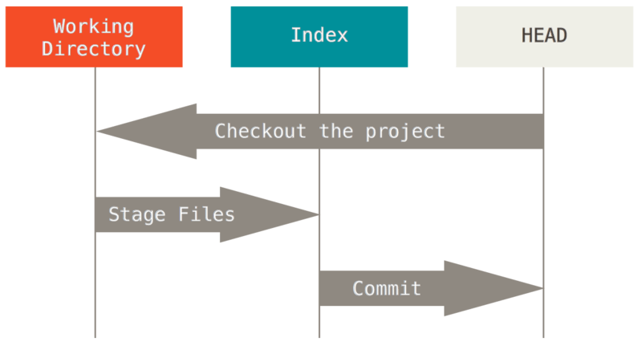{width="6.267716535433071in"
height="3.4583333333333335in"}

Vamos visualizar esse processo: digamos que você entra em um novo
diretório com um único arquivo nele. Vamos chamar isso **de v1** do
arquivo, e vamos indicá-lo em azul. Agora nós corremos git init, que irá
criar um repositório Git com uma referência HEAD que aponta para um ramo
não nascido ( masterNão existe ainda).

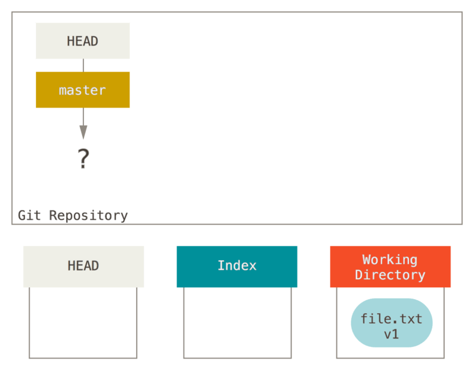{width="6.267716535433071in"
height="5.041666666666667in"}

Neste ponto, apenas a árvore do diretório de trabalho tem qualquer
conteúdo.

Agora queremos confirmar este arquivo, então usamos git addpara levar
conteúdo no Diretório de Trabalho e copiá-lo para o índice.

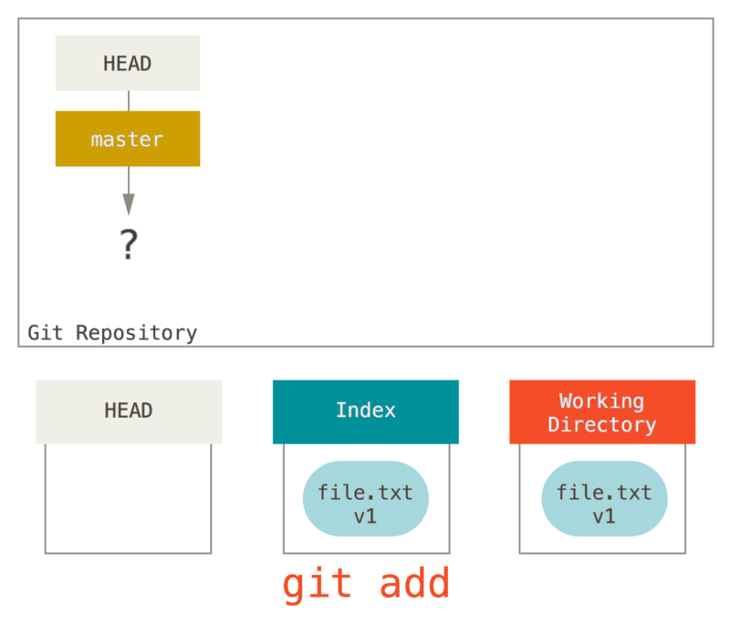{width="6.267716535433071in"
height="5.361111111111111in"}

Então nós corremos git commit, que pega o conteúdo do índice e o salva
como um instantâneo permanente, cria um objeto de commit que aponta para
esse instantâneo e atualizações masterpara apontar para esse commit.

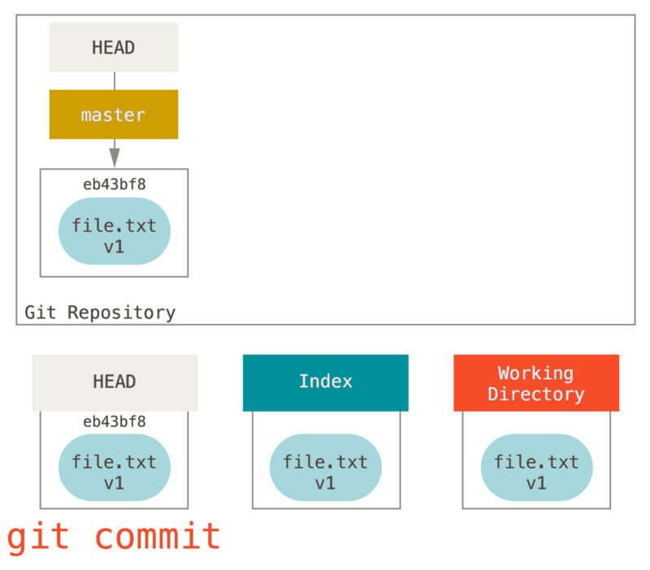{width="6.267716535433071in" height="5.5in"}

Se corrermos git statusNão veremos mudanças, porque as três árvores são
iguais.

Agora queremos fazer uma alteração nesse arquivo e comprometê-lo. Vamos
passar pelo mesmo processo; primeiro, alteramos o arquivo em nosso
diretório de trabalho. Vamos chamar isso **de v2** do arquivo, e
indicá-lo em vermelho.

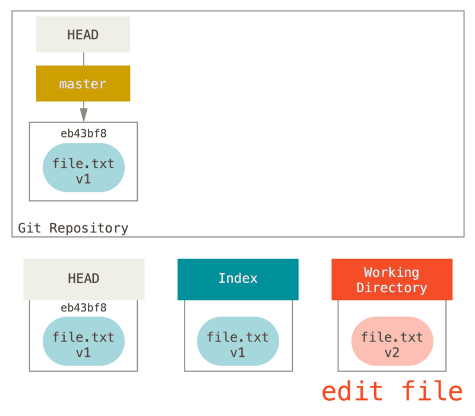{width="6.267716535433071in" height="5.5in"}

Se corrermos git statusNo momento, veremos o arquivo em vermelho como
"Mudanças não agendadas para commit", porque essa entrada difere entre o
índice e o Diretório de Trabalho. Em seguida, corremos git addnele para
encenar em nosso índice.

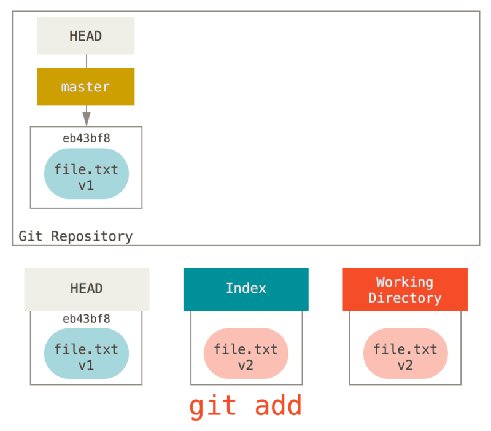{width="6.267716535433071in" height="5.5in"}

Neste ponto, se corrermos git status, veremos o arquivo em verde em
"Alterações a serem confirmadas" porque o Index and HEAD difere -- ou
seja, nosso próximo commit proposto agora é diferente do nosso último
commit. Por fim, nós corremos git commitpara finalizar o commit.

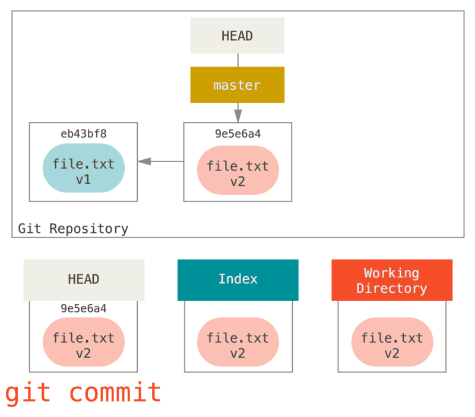{width="6.267716535433071in" height="5.5in"}

Agora a mais git statusNão nos dará nenhuma saída, porque as três
árvores são as mesmas novamente.

A troca de ramificações ou a clonagem passa por um processo semelhante.
Quando você faz o check-out de uma ramificação, ela muda **HEAD** para
apontar para o novo ref de ramificação, preenche seu **índice** com o
instantâneo desse commit e, em seguida, copia o conteúdo do **índice**
no seu **diretório de trabalho**.

### **O papel da redefinição**

O que é resetO comando faz mais sentido quando visto neste contexto.

Para os propósitos desses exemplos, digamos que nós modificamos
file.txtMais uma vez e comete-o uma terceira vez. Então, agora a nossa
história é assim:

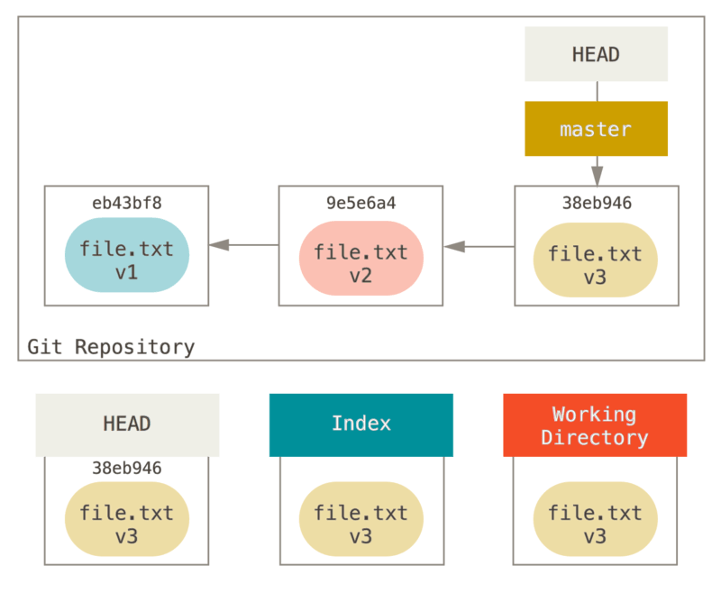{width="6.267716535433071in"
height="5.152777777777778in"}

Vamos agora percorrer exatamente o que resetfaz quando você chama isso.
Ele manipula diretamente essas três árvores de uma forma simples e
previsível. Ele faz até três operações básicas.

#### **Passo 1: Mover o HEAD**

A primeira coisa resetVai fazer é mover o que HEAD aponta. Isso não é o
mesmo que mudar a própria HEAD (que é o que checkoutfaz); resetmove o
ramo que o HEAD está apontando. Isso significa que, se o HEAD estiver
definido para o masterbranch (ou seja, você está atualmente no
masterramo), em execução git reset 9e5e6a4Vai começar fazendo
masterPonto para 9e5e6a4- A . (í a questão: es. , , , íntepeo. . E. . es

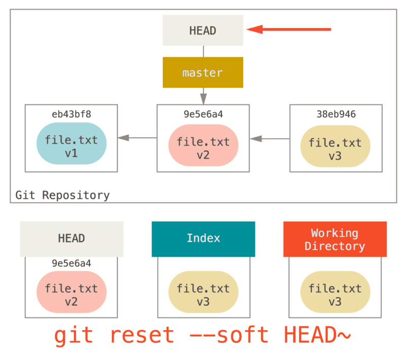{width="6.267716535433071in" height="5.5in"}

ão importa qual forma de resetCom um commit invocado, esta é a primeira
coisa que sempre tentará fazer. Com reset \--soft, vai simplesmente
parar por aí.

Agora tire um segundo para olhar para esse diagrama e perceba o que
aconteceu: ele essencialmente desfez o último git commit- Comando.
Quando você corre git commit, Git cria um novo commit e move o ramo que
HEAD aponta para até ele. Quando você resetDe volta para a ação HEAD\~(o
pai da HEAD), você está movendo o ramo de volta para onde estava, sem
alterar o índice ou o Diretório de Trabalho. Agora você pode atualizar o
índice e executar git commitMais uma vez para realizar o que git commit
\--amendteria feito (ver [[a mudança do último
compromisso]{.underline}](https://git-scm.com/book/pt-pt/v2/ch00/_git_amend)).

#### **Passo 2: Atualizando o índice (-misturado)**

Note que se você correr git statusAgora você verá em verde a diferença
entre o índice e o que o novo HEAD é.

A próxima coisa resetO fará é atualizar o índice com o conteúdo de
qualquer instantâneo que o HEAD agora aponte.

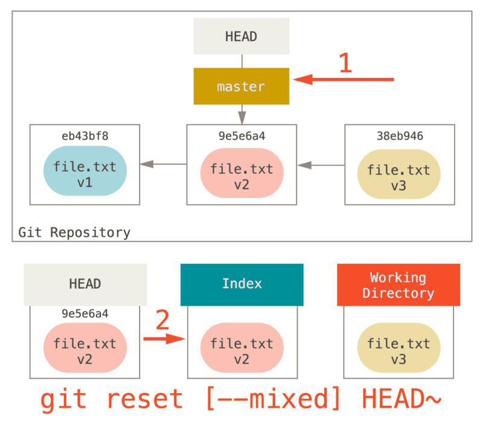{width="6.267716535433071in" height="5.5in"}

Se você especificar o \--mixedopção, resetVai parar neste momento. Este
também é o padrão, portanto, se você especificar nenhuma opção (apenas
git reset HEAD\~Neste caso), é aqui que o comando vai parar.

Agora, tire outro segundo para olhar para esse diagrama e perceba o que
aconteceu: ele ainda desfez seu último commit, mas também *não encenou*
tudo. Você rolou de volta para antes de correr tudo o seu git addE a git
commitcomandos.

#### **Passo 3: Atualização do Diretório de Trabalho (-difícil)**

A terceira coisa que resetO que será feito para fazer com que o
Diretório de Trabalho pareça o índice. Se você usa o \--hardOpção, vai
continuar a esta fase.

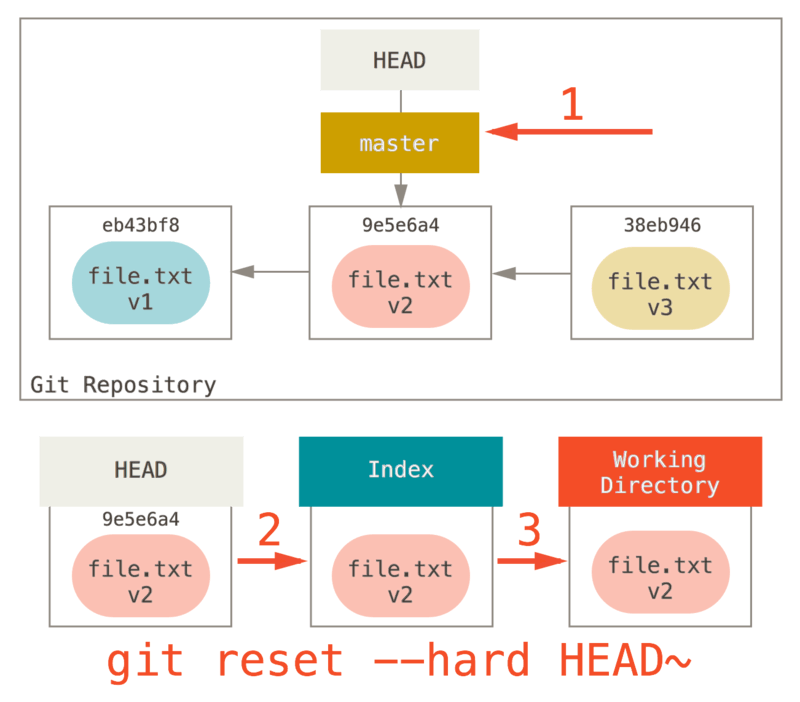{width="6.267716535433071in" height="5.5in"}

Então, vamos pensar sobre o que acabou de acontecer. Você desfez seu
último commit, o git addE a git commitcomandos, **e** todo o trabalho
que você fez em seu diretório de trabalho.

É importante notar que esta bandeira (\--hardÉ a única maneira de fazer
o resetcomando perigoso, e um dos poucos casos em que o Git realmente
destruirá os dados. Qualquer outra invocação de resetpode ser facilmente
desfeito, mas o \--hardopção não pode, uma vez que substitui à força
arquivos no diretório de trabalho. Neste caso particular, ainda temos a
versão **v3** do nosso arquivo em um commit em nosso Git DB, e
poderíamos recuperá-lo olhando para o nosso reflog, mas se não
tivéssemos cometido, o Git ainda teria substituído o arquivo e seria
irrecuperável.

#### **Recapitulação**

O que é resetO comando substitui essas três árvores em uma ordem
específica, parando quando você diz para:

1.  Mova o ramo para *os* pontos HEAD *(pare aqui se ) - Em relação . .
    . )\
    *

2.  Faça o índice parecer HEAD *(pare aqui, a menos que \--hard) - Em
    relação . . . )\
    *

3.  Faça o diretório de trabalho parecer o índice

### **Redefinir com um caminho**

Que abrange o comportamento de resetem sua forma básica, mas você também
pode fornecer-lhe um caminho para agir. Se você especificar um caminho,
resetirá pular a etapa 1, e limitar o restante de suas ações a um
arquivo específico ou conjunto de arquivos. Isso realmente faz sentido
-- a cabeça é apenas um ponteiro, e você não pode apontar para parte de
um commit e parte de outro. Mas o diretório Index e Working *podem* ser
parcialmente atualizados, então redefinir os recursos com as etapas 2 e
3.

Então, suponha que nós corremos git reset file.txt- A . (í a questão:
es. , , , íntepeo. . E. . es. sobre a questão . (em, proprio, e Este
formulário (uma vez que você não especificou um commit SHA-1 ou branch,
e você não especificou \--softou a \--hard) é uma abreviação para git
reset \--mixed HEAD file.txt, que irá:

1.  Mova o ramo HEAD pontos para *(pulado)\
    *

2.  Faça o índice parecer HEAD *(pare aqui)\
    *

Então, essencialmente, apenas copia file.txtdo HEAD ao índice.

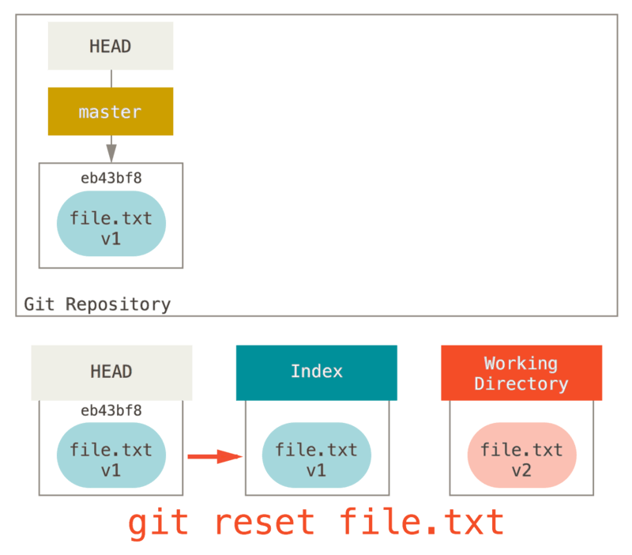{width="6.267716535433071in" height="5.5in"}

Isso tem o efeito prático de *desativação* do arquivo. Se olharmos para
o diagrama para esse comando e pensarmos sobre o que git addO faz, são
exatamente opostos.

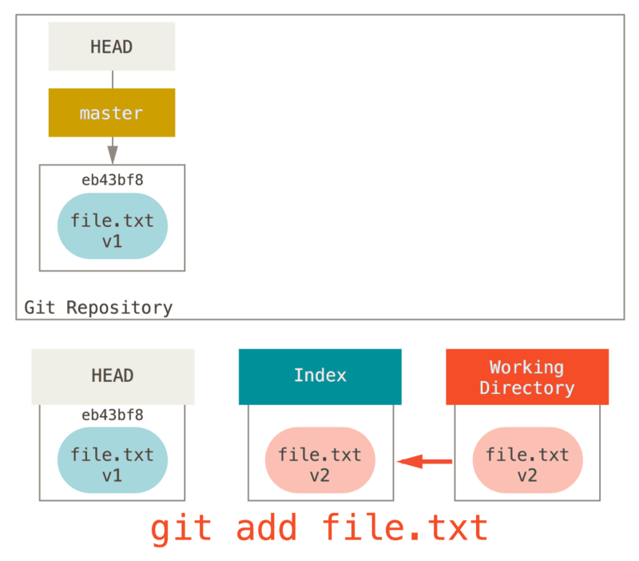{width="6.267716535433071in" height="5.5in"}

É por isso que a saída do git statusO comando sugere que você execute
isso para desfazer o processo. (Veja [[Desfazer um Arquivo
Preparado]{.underline}](https://git-scm.com/book/pt-pt/v2/ch00/_unstaging)
para mais informações sobre isso.)

Poderíamos facilmente não deixar o Git assumir que quisemos "puxar os
dados do HEAD", especificando um commit específico para extrair essa
versão do arquivo. Nós apenas corremos algo como git reset eb43bf
file.txt- A . (í a questão: es. , , , íntepeo. . E. . es. sobre a
questão . (em, proprio, e os comandos e. . sobre a questão , , .

sso efetivamente faz a mesma coisa que se tivéssemos revertido o
conteúdo do arquivo para **v1** no Diretório de Trabalho, executado git
addnele, em seguida, revertei-o de volta para **v3** novamente (sem
realmente passar por todas essas etapas). Se corrermos git commitagora,
ele registrará uma mudança que reverte esse arquivo de volta para
**v1**v1, mesmo que nunca tenhamos realmente tido isso em nosso
diretório de trabalho novamente.

Também é interessante notar que git add, o resetO comando aceitará a
\--patchopção para descontinuar o conteúdo em uma base de hunk-by-hunk.
Assim, você pode seletivamente deseta ou reverter o conteúdo.

### **SquashingTradução**

Vejamos como fazer algo interessante com esse poder recém-descoberto --
commits de esmagamento.

Digamos que você tenha uma série de commits com mensagens como "oops.",
"WIP" e "esqueceu este arquivo". Você pode usar resetpara abóbará-los
rápida e facilmente em um único commit que faz você parecer realmente
inteligente. ([[Squashing
Commits]{.underline}](https://git-scm.com/book/pt-pt/v2/ch00/_squashing)
mostra outra maneira de fazer isso, mas neste exemplo é mais simples de
usar reset.) (Imp) e a janelas.

Digamos que você tenha um projeto onde o primeiro commit tenha um
arquivo, o segundo commit adicionou um novo arquivo e alterou o
primeiro, e o terceiro commit alterou o primeiro arquivo novamente. O
segundo commit foi um trabalho em andamento e você quer esmagá-lo.

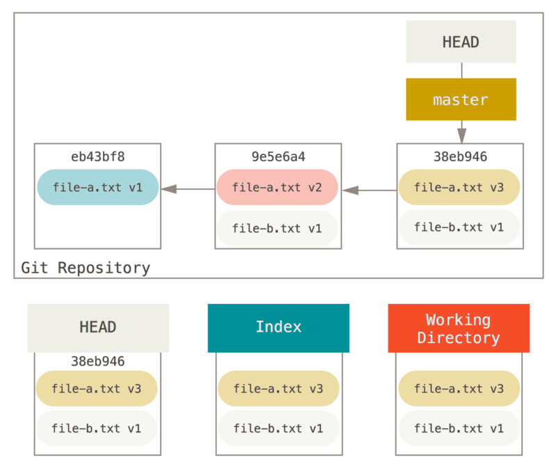{width="6.267716535433071in"
height="5.277777777777778in"}

Você pode correr git reset \--soft HEAD\~2para mover o branch HEAD de
volta para um commit antigo (o commit mais recente que você deseja
manter):

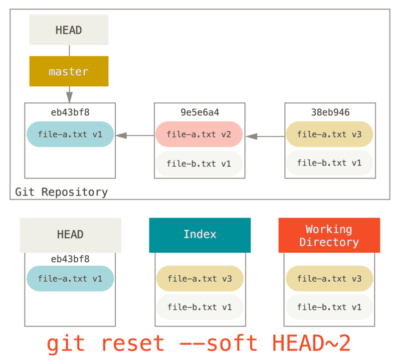{width="6.267716535433071in"
height="5.722222222222222in"}E então simplesmente correr git commitMais
uma vez:

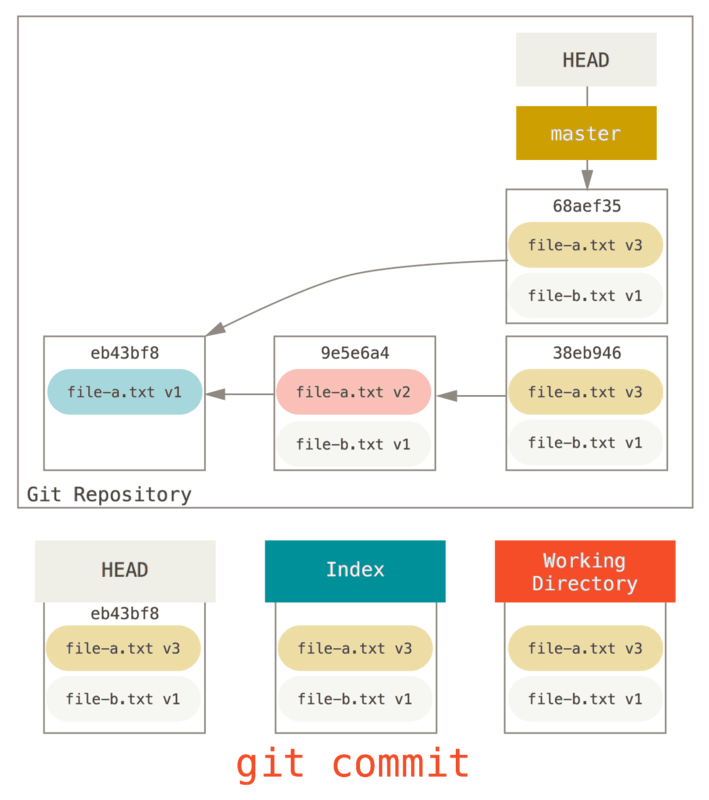{width="6.267716535433071in"
height="7.069444444444445in"}

Agora você pode ver que sua história alcançável, a história que você
empurraria, agora parece que você teve um compromisso com file-a.txtv1,
então um segundo que ambos modificaram file-a.txtpara v3 e adicionado
file-b.txt- A . (í a questão: es. , , , íntepeo. . E. . es. sobre a
questão . (em, proprio, e os comandos e O commit com a versão v2 do
arquivo não está mais no histórico.

### **Check It OutTraTradução**

Finalmente, você pode se perguntar qual é a diferença entre checkoutE a
resetÉ isso mesmo. - A partir de si reset,, , - A , de pé sobre o que
sobre o rodeas de rodeas de rodeas de rodeas de rodeas, de , de conta. ,
de , de que sobre o que sobre o que sobre o checkoutmanipula as três
árvores, e é um pouco diferente, dependendo se você dá ao comando um
caminho de arquivo ou não.

#### **Sem os Caminhos**

Correndo em frente git checkout \[branch\]É bastante semelhante a correr
git reset \--hard \[branch\]Em que ele atualiza todas as três árvores
para você olhar como \[branch\], mas há duas diferenças importantes.

Em primeiro lugar, ao contrário de reset \--hard,, , - A , de pé sobre o
que sobre o rodeas de rodeas de rodeas de rodeas de rodeas, de , de
conta. , de , de que sobre o que sobre o que sobre o rodeas de rodeas.
checkouté seguro de funcionamento-diretório; ele irá verificar se ele
não está soprando arquivos que têm alterações neles. Na verdade, é um
pouco mais inteligente do que isso -- ele tenta fazer uma mesclagem
trivial no Diretório de Trabalho, então todos os arquivos que você *não*
mudou serão atualizados. reset \--hard, por outro lado, simplesmente
substituirá tudo em toda a linha sem verificar.

A segunda diferença importante é como checkoutatualizações HEAD.
Enquanto a questão resetvai mover o ramo que HEAD aponta para,
checkoutvai mover-se HEAD para apontar para outro ramo.

Por exemplo, digamos que temos masterE a developramificações que apontam
em diferentes commits, e estamos atualmente em develop(Então HEAD aponta
para ele). Se corrermos git reset master,, , - A , de pé sobre o que
sobre o rodeas de rodeas de rodeas de rodeas de rodeas developEle mesmo
agora apontará para o mesmo compromisso que master- Porque o faz. Se nós
corrermos em vez disso git checkout master,, , - A , de pé sobre o que
sobre o rodeas de rodeas de rodeas de rodeas de rodeas developnão se
move, o próprio HEAD faz. HEAD agora vai apontar para master- A . (í a
questão: es. , , , íntepeo. . E. .

Então, em ambos os casos, estamos movendo o HEAD para apontar para
cometer A, mas *como* fazemos isso é muito diferente. resetvai mover o
ramo HEAD pontos para, checkoutMove-se a cabeça.

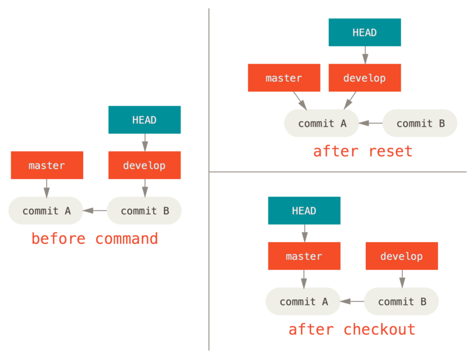{width="6.267716535433071in"
height="4.736111111111111in"}

#### **Com os caminhos**

O outro caminho para correr checkouté com um caminho de arquivo, que,
como reset, não move HEAD. É como se git reset \[branch\] filena medida
em que ele atualiza o índice com esse arquivo nesse commit, mas também
substitui o arquivo no diretório de trabalho. Seria exatamente como git
reset \--hard \[branch\] file( se resetpermitiria que você corresse
isso) - não é seguro de direção de trabalho e não se move.

Além disso, como git resetE a git add,, , - A , de pé sobre o que sobre
o rodeas de rodeas de rodeas de rodeas de rodeas, de , de conta. , de ,
de que sobre o checkoutVai aceitar a \--patchopção para permitir que
você reverta seletivamente o conteúdo do arquivo em uma base de
hunk-by-hunk.

### **Sumário**

Espero que agora você entenda e se sinta mais confortável com o
resetcomando, mas provavelmente ainda estão um pouco confuso sobre como
exatamente ele difere de checkoute não poderia lembrar todas as regras
das diferentes invocações.

Aqui está uma folha de trapaça para a qual os comandos afetam quais
árvores. A coluna "HEAD" diz "REF" se esse comando mover a referência
(branch) para a qual o HEAD aponta e "LEAD" se ele se mover HEAD. Preste
atenção especial ao *WD Safe?* column --- se ele **disser não**, tome um
segundo para pensar antes de executar esse comando.

  ------------------------------------------------------------------------------
                               **HEAD (em  **Index    **Trabalho   **WD Safe (em
                               inglês)**   (em        de           inglês)**
                                           inglês**   trabalho**   
  ---------------------------- ----------- ---------- ------------ -------------
  **Nível de Competição**                                          

  reset \--soft \[commit\]     REF (em     NENHUMA    NENHUMA      SIM
                               inglês)                             

  reset \[commit\]             REF (em     SIM        NENHUMA      SIM
                               inglês)                             

  reset \--hard \[commit\]     REF (em     SIM        SIM          **NENHUMA**
                               inglês)                             

  checkout \<commit\>          HEAD (em    SIM        SIM          SIM
                               inglês)                             

  **Nível de arquivo**                                             

  reset \[commit\] \<paths\>   NENHUMA     SIM        NENHUMA      SIM

  checkout \[commit\]          NENHUMA     SIM        SIM          **NENHUMA**
  \<paths\>                                                        
  ------------------------------------------------------------------------------

# **Ferramentas do Git - Mescimento Avançado**

## **Mesclarização avançada**

Mexer no Git é tipicamente bastante fácil. Como o Git facilita a fusão
de outro ramo várias vezes, isso significa que você pode ter um ramo
muito de vida muito longa, mas você pode mantê-lo atualizado à medida
que avança, resolvendo pequenos conflitos com frequência, em vez de se
surpreender com um enorme conflito no final da série.

No entanto, às vezes, conflitos complicados ocorrem. Ao contrário de
alguns outros sistemas de controle de versão, o Git não tenta ser
excessivamente inteligente sobre a fusão de resolução de conflitos. A
filosofia de Git é ser inteligente em determinar quando uma resolução de
mesclagem é inequívoca, mas se houver um conflito, não tenta ser
inteligente em resolvê-la automaticamente. Portanto, se você esperar
muito tempo para mesclar dois ramos que divergem rapidamente, você pode
se deparar com alguns problemas.

Nesta seção, examinaremos quais podem ser alguns desses problemas e
quais ferramentas o Git oferece para ajudar a lidar com essas situações
mais complicadas. Também cobriremos alguns dos diferentes tipos de
mesclagem que você pode fazer, além de ver como sair de fusões que você
fez.

### **Mesclar conflitos**

Embora tenhamos abordado alguns conceitos básicos sobre a resolução de
conflitos de mesclagem em [[conflitos de fusão
Básico]{.underline}](https://git-scm.com/book/pt-pt/v2/ch00/_basic_merge_conflicts),
para conflitos mais complexos, o Git fornece algumas ferramentas para
ajudá-lo a descobrir o que está acontecendo e como lidar melhor com o
conflito.

Em primeiro lugar, se possível, tente certificar-se de que seu diretório
de trabalho está limpo antes de fazer uma mesclagem que pode ter
conflitos. Se você tiver trabalho em andamento, entre empurre-o com uma
agência temporária ou armazená-lo. Isso faz com que você possa desfazer
**tudo o** que você tenta aqui. Se você tiver alterações não salvas em
seu diretório de trabalho quando tentar uma mesclagem, algumas dessas
dicas podem ajudá-lo a perder esse trabalho.

Vamos percorrer um exemplo muito simples. Temos um arquivo Ruby super
simples que imprime *o hello world*.

#! /usr/bin/env ruby

def hello

puts \'hello world\'

end

hello()

Em nosso repositório, criamos um novo ramo chamado whitespacee prossiga
para alterar todas as terminações da linha Unix para terminações de
linha DOS, essencialmente alterando cada linha do arquivo, mas apenas
com espaço em branco. Então mudamos a linha "olá mundo" para "olá
mundo".

\$ git checkout -b whitespace

Switched to a new branch \'whitespace\'

\$ unix2dos hello.rb

unix2dos: converting file hello.rb to DOS format \...

\$ git commit -am \'converted hello.rb to DOS\'

\[whitespace 3270f76\] converted hello.rb to DOS

1 file changed, 7 insertions(+), 7 deletions(-)

\$ vim hello.rb

\$ git diff -b

diff \--git a/hello.rb b/hello.rb

index ac51efd..e85207e 100755

\-\-- a/hello.rb

+++ b/hello.rb

@@ -1,7 +1,7 @@

#! /usr/bin/env ruby

def hello

\- puts \'hello world\'

\+ puts \'hello mundo\'\^M

end

hello()

\$ git commit -am \'hello mundo change\'

\[whitespace 6d338d2\] hello mundo change

1 file changed, 1 insertion(+), 1 deletion(-)

Agora voltamos para o nosso masterbranch e adicionar alguma documentação
para a função.

\$ git checkout master

Switched to branch \'master\'

\$ vim hello.rb

\$ git diff

diff \--git a/hello.rb b/hello.rb

index ac51efd..36c06c8 100755

\-\-- a/hello.rb

+++ b/hello.rb

@@ -1,5 +1,6 @@

#! /usr/bin/env ruby

+# prints out a greeting

def hello

puts \'hello world\'

end

\$ git commit -am \'document the function\'

\[master bec6336\] document the function

1 file changed, 1 insertion(+)

Agora tentamos nos fundirmos em nosso whitespacebranch e teremos
conflitos por causa das mudanças de espaço em branco.

\$ git merge whitespace

Auto-merging hello.rb

CONFLICT (content): Merge conflict in hello.rb

Automatic merge failed; fix conflicts and then commit the result.

#### **Abortar uma fusão**

Agora temos algumas opções. Primeiro, vamos cobrir como sair dessa
situação. Se você talvez não estivesse esperando conflitos e não quer
lidar com a situação ainda, você pode simplesmente sair da fusão com git
merge \--abort- A . (í a questão: es. , , , íntepeo. . E. . es. sobre a
questão . (em, proprio, e os comandos e. . sobre a questão , , .

\$ git status -sb

\## master

UU hello.rb

\$ git merge \--abort

\$ git status -sb

\## master

O que é git merge \--abortA opção tenta reverter para o seu estado antes
de executar a fusão. Os únicos casos em que pode não ser capaz de fazer
isso perfeitamente seria se você tivesse alterações não descartadas e
descomprometidas em seu diretório de trabalho quando você executá-lo,
caso contrário, ele deve funcionar bem.

Se por algum motivo você quiser apenas começar de novo, você também pode
correr git reset \--hard HEAD, e o seu repositório estará de volta ao
último estado comprometido. Lembre-se de que qualquer trabalho não
comprometido será perdido, então certifique-se de não querer nenhuma de
suas alterações.

#### **Ignorando o espaço em branco**

Neste caso específico, os conflitos são relacionados com espaços em
branco. Sabemos disso porque o caso é simples, mas também é muito fácil
dizer em casos reais quando se olha para o conflito, porque cada linha é
removida de um lado e adicionada novamente do outro. Por padrão, o Git
vê todas essas linhas como sendo alteradas, portanto, não pode mesclar
os arquivos.

A estratégia de mesclagem padrão pode aceitar argumentos, e alguns deles
são sobre ignorar corretamente as mudanças de espaços em branco. Se você
vê que você tem um monte de problemas de espaço em branco em uma fusão,
você pode simplesmente abortá-lo e fazê-lo novamente, desta vez com
-Xignore-all-spaceou a -Xignore-space-change- A . (í a questão: es. , ,
, íntepeo. . E. . es. sobre a questão . (em, proprio, e os comandos e. .
sobre a questão , , . A primeira opção ignora **completamente** o espaço
em branco ao comparar linhas, o segundo trata sequências de um ou mais
caracteres de espaço em branco como equivalentes.

\$ git merge -Xignore-space-change whitespace

Auto-merging hello.rb

Merge made by the \'recursive\' strategy.

hello.rb \| 2 +-

1 file changed, 1 insertion(+), 1 deletion(-)

Como, neste caso, as mudanças reais de arquivos não foram conflitantes,
uma vez que ignoramos as mudanças no espaço em branco, tudo se funde
muito bem.

Este é um salva-vidas se você tem alguém em sua equipe que gosta de
ocasionalmente reformatar tudo, desde espaços a guias ou vice-versa.

#### **Refusão de arquivos manuais**

Embora o Git processe o pré-processamento de espaços em branco muito
bem, existem outros tipos de alterações que talvez o Git não possa lidar
automaticamente, mas sejam correções. Por exemplo, vamos fingir que o
Git não conseguia lidar com a mudança de espaço em branco e precisávamos
fazê-lo à mão.

O que realmente precisamos fazer é executar o arquivo que estamos
tentando mesclar através de um dos2unixprograma antes de tentar a
mesclagem do arquivo real. Então, como é que vamos fazer isso?

Primeiro, entramos no estado de conflito de fusão. Então queremos obter
cópias da minha versão do arquivo, sua versão (do ramo em que estamos
mesclando) e a versão comum (de onde ambos os lados se ramificaram).
Então queremos corrigir o lado deles ou o nosso lado e tentar novamente
a mesclagem para apenas este único arquivo.

Obter as versões de três arquivos é realmente muito fácil. O Git
armazena todas essas versões no índice em "etapas" que cada um tem
números associados a elas. Estágio 1 é o ancestral comum, o estágio 2 é
a sua versão e o estágio 3 é do MERGE_HEAD, a versão que você está se
fundindo ("de seus").

Você pode extrair uma cópia de cada uma dessas versões do arquivo em
conflito com o git showcomando e uma sintaxe especial.

\$ git show :1:hello.rb \> hello.common.rb

\$ git show :2:hello.rb \> hello.ours.rb

\$ git show :3:hello.rb \> hello.theirs.rb

Se você quiser obter um pouco mais de núcleo duro, você também pode usar
o ls-files -ucomando de encanamento para obter os SHA-1s reais do Git
blobs para cada um desses arquivos.

\$ git ls-files -u

100755 ac51efdc3df4f4fd328d1a02ad05331d8e2c9111 1 hello.rb

100755 36c06c8752c78d2aff89571132f3bf7841a7b5c3 2 hello.rb

100755 e85207e04dfdd5eb0a1e9febbc67fd837c44a1cd 3 hello.rb

O que é :1:hello.rbÉ apenas uma abreviação para procurar essa blob
SHA-1.

Agora que temos o conteúdo de todas as três etapas em nosso diretório de
trabalho, podemos corrigir manualmente o deles para corrigir o problema
do espaço em branco e re-mescar o arquivo com o pouco conhecido git
merge-filecomando que faz exatamente isso.

\$ dos2unix hello.theirs.rb

dos2unix: converting file hello.theirs.rb to Unix format \...

\$ git merge-file -p \\

hello.ours.rb hello.common.rb hello.theirs.rb \> hello.rb

\$ git diff -b

diff \--cc hello.rb

index 36c06c8,e85207e..0000000

\-\-- a/hello.rb

+++ b/hello.rb

@@@ -1,8 -1,7 +1,8 @@@

#! /usr/bin/env ruby

+# prints out a greeting

def hello

\- puts \'hello world\'

\+ puts \'hello mundo\'

end

hello()

Neste ponto, nós confundimos bem o arquivo. Na verdade, isso realmente
funciona melhor do que o ignore-space-changeopção porque isso realmente
corrige as alterações de espaço em branco antes de mescler em vez de
simplesmente ignorá-las. No ignore-space-changemerge, na verdade
acabamos com algumas linhas com terminações de linha DOS, tornando as
coisas misturadas.

Se você quiser ter uma ideia antes de finalizar esse commit sobre o que
realmente mudou entre um lado ou outro, você pode perguntar git diffpara
comparar o que está em seu diretório de trabalho que você está prestes a
cometer como resultado da mesclagem com qualquer uma dessas etapas.
Vamos passar por todos eles.

Para comparar o seu resultado com o que você tinha em seu ramo antes da
mesclagem, em outras palavras, para ver o que a mesclagem introduziu,
você pode executar git diff \--ours

\$ git diff \--ours

\* Unmerged path hello.rb

diff \--git a/hello.rb b/hello.rb

index 36c06c8..44d0a25 100755

\-\-- a/hello.rb

+++ b/hello.rb

@@ -2,7 +2,7 @@

\# prints out a greeting

def hello

\- puts \'hello world\'

\+ puts \'hello mundo\'

end

hello()

Então, aqui podemos facilmente ver que o que aconteceu em nosso ramo, o
que estamos realmente introduzindo a este arquivo com essa mesclagem,
está mudando essa única linha.

Se quisermos ver como o resultado da fusão diferia do que estava do lado
deles, você pode correr. git diff \--theirs- A . (í a questão: es. , , ,
íntepeo. . E. . es. sobre a questão . (em, proprio, e os comandos e
Neste e no exemplo a seguir, temos de utilizar -bpara tirar o espaço em
branco porque estamos comparando-o com o que está no Git, não o nosso
limpo hello.theirs.rbdo ficheiro.

\$ git diff \--theirs -b

\* Unmerged path hello.rb

diff \--git a/hello.rb b/hello.rb

index e85207e..44d0a25 100755

\-\-- a/hello.rb

+++ b/hello.rb

@@ -1,5 +1,6 @@

#! /usr/bin/env ruby

+# prints out a greeting

def hello

puts \'hello mundo\'

end

Finalmente, você pode ver como o arquivo mudou de ambos os lados com git
diff \--base- A . (í a questão: es. , , , íntepeo. . E. .

\$ git diff \--base -b

\* Unmerged path hello.rb

diff \--git a/hello.rb b/hello.rb

index ac51efd..44d0a25 100755

\-\-- a/hello.rb

+++ b/hello.rb

@@ -1,7 +1,8 @@

#! /usr/bin/env ruby

+# prints out a greeting

def hello

\- puts \'hello world\'

\+ puts \'hello mundo\'

end

hello()

Neste ponto, podemos usar o git cleancomando para limpar os arquivos
extras que criamos para fazer a mala manual, mas não precisa mais.

\$ git clean -f

Removing hello.common.rb

Removing hello.ours.rb

Removing hello.theirs.rb

#### **Verificando os conflitos**

Talvez não estejamos felizes com a resolução neste momento por algum
motivo, ou talvez editando manualmente um ou ambos os lados ainda não
funcionou bem e precisamos de mais contexto.

Vamos mudar um pouco o exemplo. Para este exemplo, temos duas filiais
mais vivas que cada uma tem alguns commits, mas criam um conflito de
conteúdo legítimo quando mesclado.

\$ git log \--graph \--oneline \--decorate \--all

\* f1270f7 (HEAD, master) update README

\* 9af9d3b add a README

\* 694971d update phrase to hola world

\| \* e3eb223 (mundo) add more tests

\| \* 7cff591 add testing script

\| \* c3ffff1 changed text to hello mundo

\|/

\* b7dcc89 initial hello world code

Agora temos três commits únicos que vivem apenas no masterramo e três
outros que vivem no mundoO ramo. Se tentarmos fundir o mundoRamo em,
temos um conflito.

\$ git merge mundo

Auto-merging hello.rb

CONFLICT (content): Merge conflict in hello.rb

Automatic merge failed; fix conflicts and then commit the result.

Gostaríamos de ver qual é o conflito de fusão. Se abrirmos o arquivo,
veremos algo assim:

#! /usr/bin/env ruby

def hello

\<\<\<\<\<\<\< HEAD

puts \'hola world\'

=======

puts \'hello mundo\'

\>\>\>\>\>\>\> mundo

end

hello()

Ambos os lados da mesclagem adicionaram conteúdo a este arquivo, mas
alguns dos commits modificaram o arquivo no mesmo lugar que causou esse
conflito.

Vamos explorar algumas ferramentas que você tem à sua disposição para
determinar como esse conflito surgiu. Talvez não seja óbvio como
exatamente você deve consertar esse conflito. Você precisa de mais
contexto.

Uma ferramenta útil é git checkoutcom a opção "-conflito". Isso irá
voltar a verificar o arquivo novamente e substituir os marcadores de
conflito de mesclagem. Isso pode ser útil se você quiser redefinir os
marcadores e tentar resolvê-los novamente.

Você pode passar \--conflictOu também o anoitecer de janeiro. diff3ou a
merge(que é o padrão). Se você passar por isso diff3, o Git usará uma
versão ligeiramente diferente de marcadores de conflito, não apenas
dando-lhe as versões "nossos" e "seus", mas também a versão "base" em
linha para lhe dar mais contexto.

\$ git checkout \--conflict=diff3 hello.rb

Depois de executar isso, o arquivo será assim:

#! /usr/bin/env ruby

def hello

\<\<\<\<\<\<\< ours

puts \'hola world\'

\|\|\|\|\|\|\| base

puts \'hello world\'

=======

puts \'hello mundo\'

\>\>\>\>\>\>\> theirs

end

hello()

Se você gosta deste formato, você pode defini-lo como o padrão para
conflitos de mesclagem futuro, definindo o merge.conflictstyleA
definição para diff3- A . (í a questão: es. , , , íntepeo. . E. . es.
sobre a questão . (em, proprio

\$ git config \--global merge.conflictstyle diff3

O que é git checkoutO comando também pode tomar \--oursE a
\--theirsopções, que podem ser uma maneira muito rápida de escolher um
lado ou o outro sem mesclar as coisas.

Isso pode ser particularmente útil para conflitos de arquivos binários
onde você pode simplesmente escolher um lado, ou onde você só quer
mesclar certos arquivos em outra ramificação - você pode fazer a
mesclagem e, em seguida, checkout certos arquivos de um lado ou de outro
antes de se comprometer.

#### **Login de Mesclar**

Outra ferramenta útil ao resolver conflitos de mesclagem é git log- A .
(í a questão: es. , , , íntepeo. . E. . es. sobre a questão . (em,
proprio, e os comandos e. . sobre a questão , Isso pode ajudar você a
obter contexto sobre o que pode ter contribuído para os conflitos.
Revisar um pouco da história para lembrar por que duas linhas de
desenvolvimento estavam tocando a mesma área de código pode ser
realmente útil às vezes.

Para obter uma lista completa de todos os commits exclusivos que foram
incluídos em qualquer filial envolvida nesta mesclagem, podemos usar a
sintaxe "triple dot" que aprendemos no [[Triple
Dot]{.underline}](https://git-scm.com/book/pt-pt/v2/ch00/_triple_dot).

\$ git log \--oneline \--left-right HEAD\...MERGE_HEAD

\< f1270f7 update README

\< 9af9d3b add a README

\< 694971d update phrase to hola world

\> e3eb223 add more tests

\> 7cff591 add testing script

\> c3ffff1 changed text to hello mundo

Essa é uma boa lista dos seis commits totais envolvidos, bem como em
qual linha de desenvolvimento cada commit estava.

Podemos simplificar ainda mais isso, embora para nos dar um contexto
muito mais específico. Se nós adicionarmos o \--mergeOpção para git log,
ele só mostrará os commits em ambos os lados da mesclagem que tocam em
um arquivo que está atualmente em conflito.

\$ git log \--oneline \--left-right \--merge

\< 694971d update phrase to hola world

\> c3ffff1 changed text to hello mundo

Se você correr isso com o -popção, em vez disso, você obtém apenas os
diffs para o arquivo que acabou em conflito. Isso pode ser **realmente**
útil para lhe dar rapidamente o contexto que você precisa para ajudar a
entender por que algo entra em conflito e como resolvê-lo de forma mais
inteligente.

#### **Formato combinado de Diff**

Desde o Git encena quaisquer resultados de mesclagem que sejam
bem-sucedidos, quando você executa git diffenquanto em um estado de
fusão em conflito, você só consegue o que ainda está em conflito. Isso
pode ser útil para ver o que você ainda precisa resolver.

Quando você corre git difflogo após um conflito de mesclagem, ele lhe
dará informações em um formato de saída diff bastante exclusivo.

\$ git diff

diff \--cc hello.rb

index 0399cd5,59727f0..0000000

\-\-- a/hello.rb

+++ b/hello.rb

@@@ -1,7 -1,7 +1,11 @@@

#! /usr/bin/env ruby

def hello

++\<\<\<\<\<\<\< HEAD

\+ puts \'hola world\'

++=======

\+ puts \'hello mundo\'

++\>\>\>\>\>\>\> mundo

end

hello()

O formato é chamado de "Difícil combinado" e fornece duas colunas de
dados ao lado de cada linha. A primeira coluna mostra se essa linha é
diferente (adicionada ou removida) entre a ramificação "nossa" e o
arquivo em seu diretório de trabalho e a segunda coluna faz o mesmo
entre a ramificação "seus" e sua cópia de diretório de trabalho.

Então, nesse exemplo, você pode ver que o \<\<\<\<\<\<\<E a
\>\>\>\>\>\>\>as linhas estão na cópia de trabalho, mas não estavam em
ambos os lados da fusão. Isso faz sentido porque a ferramenta de
mesclagem os colocou lá para o nosso contexto, mas espera-se que os
removamos.

Se resolvermos o conflito e corrermos git diffVeremos a mesma coisa, mas
é um pouco mais útil.

\$ vim hello.rb

\$ git diff

diff \--cc hello.rb

index 0399cd5,59727f0..0000000

\-\-- a/hello.rb

+++ b/hello.rb

@@@ -1,7 -1,7 +1,7 @@@

#! /usr/bin/env ruby

def hello

\- puts \'hola world\'

\- puts \'hello mundo\'

++ puts \'hola mundo\'

end

hello()

Isso nos mostra que o "mundo de Hola" estava do nosso lado, mas não na
cópia de trabalho, que "olá mundo" estava do lado deles, mas não na
cópia de trabalho e, finalmente, que "hola mundo" não estava em nenhum
dos lados, mas agora está na cópia de trabalho. Isso pode ser útil para
revisão antes de se comprometer com a resolução.

Você também pode obter isso a partir do git logpara qualquer fusão para
ver como algo foi resolvido após o fato. O Git produzirá esse formato se
você executar git showem um commit de mesclagem ou se você adicionar um
\--ccopção para a git log -p(que por padrão só mostra patches para
commits não-merge).

\$ git log \--cc -p -1

commit 14f41939956d80b9e17bb8721354c33f8d5b5a79

Merge: f1270f7 e3eb223

Author: Scott Chacon \<schacon@gmail.com\>

Date: Fri Sep 19 18:14:49 2014 +0200

Merge branch \'mundo\'

Conflicts:

hello.rb

diff \--cc hello.rb

index 0399cd5,59727f0..e1d0799

\-\-- a/hello.rb

+++ b/hello.rb

@@@ -1,7 -1,7 +1,7 @@@

#! /usr/bin/env ruby

def hello

\- puts \'hola world\'

\- puts \'hello mundo\'

++ puts \'hola mundo\'

end

hello()

### **Mescimento de Desfazer**

Agora que você sabe como criar um commit de mesclagem, você
provavelmente cometerá alguns por engano. Uma das grandes coisas sobre
trabalhar com o Git é que não há problema em cometer erros, porque é
possível (e em muitos casos fácil) corrigi-los.

Os commits de mesclagem não são diferentes. Digamos que você começou a
trabalhar em um ramo tópico, acidentalmente o fundiu em masterE agora o
seu histórico de commits é assim:

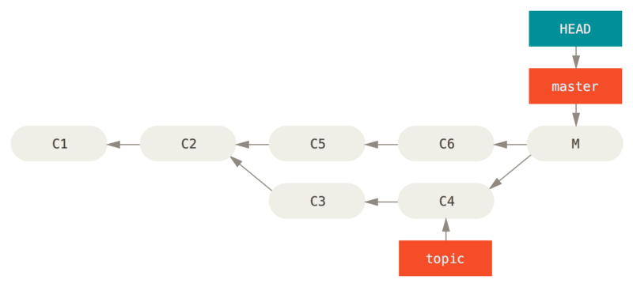{width="6.267716535433071in"
height="2.8472222222222223in"}

Figura 138. Começo de fusão acidental

Existem duas maneiras de abordar esse problema, dependendo do resultado
desejado.

#### **Corrigir as referências**

Se o commit de mesclagem indesejado existir apenas no seu repositório
local, a solução mais fácil e melhor é mover os ramos para que eles
apontem para onde você deseja. Na maioria dos casos, se você seguir o
errante git mergeCom a sua informação git reset \--hard HEAD\~, isso irá
redefinir os ponteiros de ramificação para que eles se pareçam com isso:

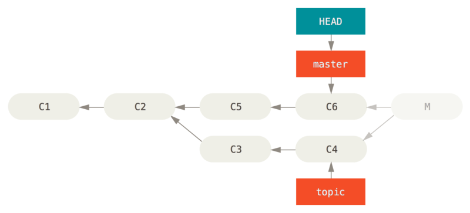{width="6.267716535433071in"
height="2.8472222222222223in"}

Figura 139. A História após git reset \--hard HEAD\~

Nós cobrimos resetDestruído
[[Demistificado]{.underline}](https://git-scm.com/book/pt-pt/v2/ch00/_git_reset),
por isso não deve ser muito difícil descobrir o que está acontecendo
aqui. Aqui está uma rápida atualização: reset \--hardgeralmente passa
por três passos:

1.  Mova os pontos HEAD do branch. Neste caso, queremos nos mover
    masterpara onde estava antes do commit de mesclagem (C6) Em que o
    assunto (em inglês, a e o . . . . em

2.  Faça o índice parecer HEAD.

3.  Faça com que o diretório de trabalho se pareça com o índice.

A desvantagem dessa abordagem é que ela está reescrevendo o histórico, o
que pode ser problemático com um repositório compartilhado. Confira
[[The Perils of
Rebasing]{.underline}](https://git-scm.com/book/pt-pt/v2/ch00/_rebase_peril)
para saber mais sobre o que pode acontecer; a versão curta é que, se
outras pessoas têm os commits que você está reescrevendo, você
provavelmente deve evitar reset- A . (í a questão: es. , , , íntepeo. .
E. . es. sobre a questão . (em, proprio, e os comandos e. . sobre a
questão , , . Essa abordagem também não funcionará se quaisquer outros
commits tiverem sido criados desde a fusão; mover os refs efetivamente
perderia essas mudanças.

#### **Reverter o compromisso**

Se mover os ponteiros de ramificação não funcionará para você, o Git lhe
dará a opção de fazer um novo commit que desfaça todas as alterações de
uma existente. O Git chama essa operação de "reverter" e, nesse cenário
específico, você a invocaria dessa maneira:

\$ git revert -m 1 HEAD

\[master b1d8379\] Revert \"Merge branch \'topic\'\"

O que é -m 1O sinalizador indica qual pai é a "linha principal" e deve
ser mantido. Quando você invoca uma fusão em HEAD(Apanhar ( a seguir em
a mesma: aguac (procedado a) que apaná-lo a que apaná-lo a que apancar
aprocedado. Apanargit merge topic), o novo compromisso tem dois pais: o
primeiro é HEAD(Apanhar ( a seguir em a mesma: aguac (procedado a) que
apaná-lo a que apaná-lo a que apancar aprocedado. ApanarC6), e o segundo
é a ponta do ramo sendo mesclado (C4) Em que o assunto (em inglês, a e o
. . . . em (e), a seguir em (em inglês), a e o. Neste caso, queremos
desfazer todas as alterações introduzidas pela fusão no pai 2 (C4),
mantendo todo o conteúdo do pai no 1 (C6) Em que o assunto (em inglês, a
e o . . . . em (e), a seguir em (em inglês), a e o.

A história com o commit de revertida é assim:

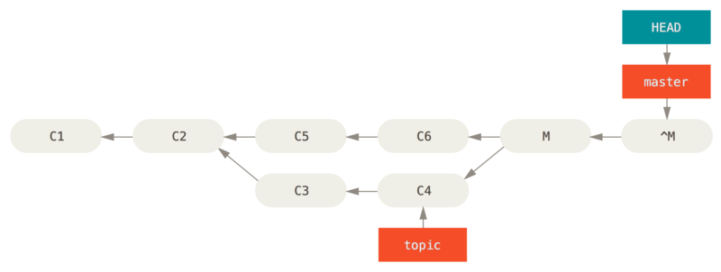{width="6.267716535433071in"
height="2.361111111111111in"}

Figura 140. A História após git revert -m 1

O novo commit \^Mtem exatamente o mesmo conteúdo que C6, então a partir
daqui é como se a fusão nunca tivesse acontecido, exceto que os commits
agora não semeados ainda estão dentro de HEADA história. Git vai ficar
confuso se você tentar se fundir topicEm que você masterMais uma vez:

\$ git merge topic

Already up-to-date.

Não há nada em topicque ainda não é acessível a partir de master- A . (í
a questão: es. , , , íntepeo. . E. . es. sobre a questão . (em, pro O
que é pior, se você adicionar trabalho a topice fundir novamente, Git só
vai trazer as mudanças *desde* a fusão reversa:

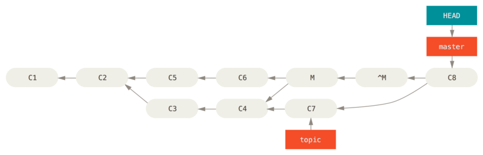{width="6.267716535433071in"
height="2.0277777777777777in"}

A figura 141. História com uma má fusão

A melhor maneira de contornar isso é não reverter a mesclagem original,
já que agora você deseja trazer as mudanças que foram revertidas e, **em
seguida**, criar um novo commit de mesclagem:

\$ git revert \^M

\[master 09f0126\] Revert \"Revert \"Merge branch \'topic\'\"\"

\$ git merge topic

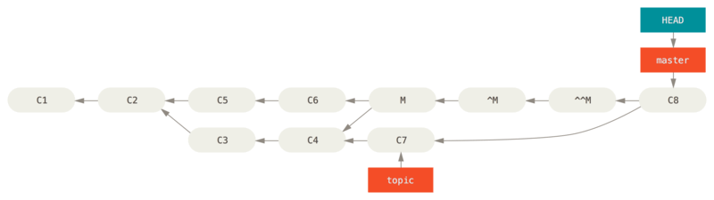{width="6.267716535433071in"
height="1.7638888888888888in"}A figura 142. História depois de re-mergir
uma fusão reversa

Neste exemplo, ME a \^MCancele-se. \^\^MMescle efetivamente as mudanças
de C3E a C4, e C8Mescles nas mudanças de C7, então agora topicestá
totalmente fundido.

### **Outros tipos de mesclagem**

Até agora, cobrimos a fusão normal de dois ramos, normalmente manuseados
com o que é chamado de estratégia "recursiva" de fusão. No entanto,
existem outras maneiras de mesclar filiais. Vamos cobrir alguns deles
rapidamente.

#### **Nossa ou sua preferência**

Primeiro de tudo, há outra coisa útil que podemos fazer com o modo
"recursivo" normal de fusão. Nós já vimos o ignore-all-spaceE a
ignore-space-changeopções que são passadas com um -XMas também podemos
dizer ao Git para favorecer um lado ou outro quando vê um conflito.

Por padrão, quando o Git vê um conflito entre dois ramos sendo
mesclados, ele adicionará marcadores de conflito de mesclagem ao seu
código e marcará o arquivo como conflitante e permitirá resolvê-lo. Se
você preferir que o Git simplesmente escolha um lado específico e ignore
o outro lado em vez de permitir que você resolva manualmente o conflito,
você pode passar o problema. mergeComandar qualquer um -Xoursou a
-Xtheirs- A . (í a questão: es. , , , íntepeo. . E. . es. sobre a
questão . (em, proprio, e os comandos e. . sobre a questão , , .

Se o Git vir isso, ele não adicionará marcadores de conflito. Quaisquer
diferenças que sejam mescladas, ele se fundirá. Quaisquer diferenças que
conflitam, ele simplesmente escolherá o lado que você especificar no
todo, incluindo arquivos binários.

Se voltarmos ao exemplo do "mundo do olá" que estávamos usando antes,
podemos ver que a fusão em nosso ramo causa conflitos.

\$ git merge mundo

Auto-merging hello.rb

CONFLICT (content): Merge conflict in hello.rb

Resolved \'hello.rb\' using previous resolution.

Automatic merge failed; fix conflicts and then commit the result.

Mas se nós executarmos com -Xoursou a -Xtheirs- Não é verdade.

\$ git merge -Xours mundo

Auto-merging hello.rb

Merge made by the \'recursive\' strategy.

hello.rb \| 2 +-

test.sh \| 2 ++

2 files changed, 3 insertions(+), 1 deletion(-)

create mode 100644 test.sh

Nesse caso, em vez de obter marcadores de conflito no arquivo com "olá
mundo" de um lado e "mundo de casca" do outro, ele simplesmente
escolherá "hola world". No entanto, todas as outras alterações não
conflitantes nesse ramo são mescladas com sucesso.

Esta opção também pode ser passada para o git merge-filecomando que
vimos anteriormente, executando algo como git merge-file \--ourspara
mesclagens de arquivos individuais.

Se você quer fazer algo assim, mas não tem Git nem mesmo tentar mesclar
mudanças do outro lado, há uma opção mais draconiana, que é a
*estratégia* de mesclagem "nosso". Isso é diferente da *opção* de
mesclagem recursiva "nossa".

Isso basicamente fará uma fusão falsa. Ele registrará um novo commit de
fusão com ambos os ramos como pais, mas nem vai olhar para o ramo que
você está se fundindo. Ele simplesmente irá gravar como resultado da
mesclagem o código exato em sua ramificação atual.

\$ git merge -s ours mundo

Merge made by the \'ours\' strategy.

\$ git diff HEAD HEAD\~

\$

Você pode ver que não há diferença entre o ramo em que estávamos e o
resultado da mesclagem.

Isso muitas vezes pode ser útil para basicamente enganar Git a pensar
que um ramo já está mesclado ao fazer uma mesclagem mais tarde. Por
exemplo, digamos que você se ramifique de um releaseramificação e ter
feito algum trabalho sobre ele que você vai querer se fundir de volta em
seu masterramificação em algum momento. Enquanto isso, algumas correções
de bugs em masterprecisa ser retrotransmitido para o seu releaseO ramo.
Você pode mesclar o ramo de correção de bugs no releaseO ramo e também
merge -s oursO mesmo ramo em seu masterbranch (mesmo que a correção já
esteja lá), então quando você mais tarde mesclar o releasebranch
novamente, não há conflitos do bugfix.

#### **Mefusão de Subárvore**

A ideia da merge da subárvore é que você tenha dois projetos, e um dos
projetos mapea para um subdiretório do outro. Quando você especifica uma
mesclagem de subárvore, o Git é muitas vezes inteligente o suficiente
para descobrir que um é uma subárvore do outro e se fundir
adequadamente.

Vamos passar por um exemplo de adicionar um projeto separado em um
projeto existente e, em seguida, mesclar o código do segundo em um
subdiretório do primeiro.

Primeiro, vamos adicionar o aplicativo Rack ao nosso projeto. Vamos
adicionar o projeto Rack como uma referência remota em nosso próprio
projeto e, em seguida, verificá-lo em sua própria filial:

\$ git remote add rack_remote https://github.com/rack/rack

\$ git fetch rack_remote \--no-tags

warning: no common commits

remote: Counting objects: 3184, done.

remote: Compressing objects: 100% (1465/1465), done.

remote: Total 3184 (delta 1952), reused 2770 (delta 1675)

Receiving objects: 100% (3184/3184), 677.42 KiB \| 4 KiB/s, done.

Resolving deltas: 100% (1952/1952), done.

From https://github.com/rack/rack

\* \[new branch\] build -\> rack_remote/build

\* \[new branch\] master -\> rack_remote/master

\* \[new branch\] rack-0.4 -\> rack_remote/rack-0.4

\* \[new branch\] rack-0.9 -\> rack_remote/rack-0.9

\$ git checkout -b rack_branch rack_remote/master

Branch rack_branch set up to track remote branch
refs/remotes/rack_remote/master.

Switched to a new branch \"rack_branch\"

Agora temos a raiz do projeto Rack em nossa rack_branchbranch e nosso
próprio projeto no masterO ramo. Se você verificar um e depois o outro,
você pode ver que eles têm raízes de projeto diferentes:

\$ ls

AUTHORS KNOWN-ISSUES Rakefile contrib lib

COPYING README bin example test

\$ git checkout master

Switched to branch \"master\"

\$ ls

README

É uma espécie de conceito estranho. Nem todos os ramos do seu
repositório realmente precisam ser ramos do mesmo projeto. Não é comum,
porque raramente é útil, mas é bastante fácil ter ramos completamente
diferentes.

Neste caso, queremos puxar o projeto Rack em nosso projeto.
masterProjeto como um subdiretório. Nós podemos fazer isso em Git com
git read-tree- A . (í a questão: es. , , , íntepeo. . E. . es. sobre a
questão . (em, proprio, e os comandos e. . sobre a questão , , . Você
aprenderá mais sobre read-treee seus amigos no [[Internos do
Git]{.underline}](https://git-scm.com/book/pt-pt/v2/ch00/ch10-git-internals),
mas por enquanto sabem que lê a raiz de um galho em sua área de
preparação atual e diretório de trabalho. Nós apenas mudamos de volta
para o seu masterRamo, e nós puxamos o rack_branchO ramo no rackO
subdiretório do nosso masterRamo do nosso projeto principal:

\$ git read-tree \--prefix=rack/ -u rack_branch

Quando nos comprometemos, parece que temos todos os arquivos Rack sob
esse subdiretório -- como se os copiássemos de um tarball. O que fica
interessante é que podemos facilmente mesclar mudanças de um dos ramos
para o outro. Então, se o projeto Rack atualizar, podemos puxar em
mudanças de upstream mudando para esse ramo e puxando:

\$ git checkout rack_branch

\$ git pull

Então, podemos fundir essas mudanças de volta para o nosso masterO ramo.
Para puxar as mudanças e pré-preparar a mensagem de commit, use o
\--squashopção, bem como a estratégia de mesclagem recursiva
-XsubtreeOpção. (A estratégia recursiva é o padrão aqui, mas nós a
incluímos para maior clareza.)

\$ git checkout master

\$ git merge \--squash -s recursive -Xsubtree=rack rack_branch

Squash commit \-- not updating HEAD

Automatic merge went well; stopped before committing as requested

Todas as mudanças do projeto Rack são mescladas e prontas para serem
comprometidas localmente. Você também pode fazer o oposto -- fazer
alterações no racksubdiretório do seu ramo mestre e, em seguida,
fundi-los em seu rack_branchramificação mais tarde para submetê-los aos
mantenedores ou empurrá-los para cima.

Isso nos dá uma maneira de ter um fluxo de trabalho um pouco semelhante
ao fluxo de trabalho de submódulo sem usar submódulos (que abordaremos
em
[[Submodules]{.underline}](https://git-scm.com/book/pt-pt/v2/ch00/_git_submodules)).
Podemos manter filiais com outros projetos relacionados em nosso
repositório e subárvore os mesclar em nosso projeto ocasionalmente. É
bom em alguns aspectos, por exemplo, todo o código é comprometido com um
único lugar. No entanto, tem outras desvantagens, pois é um pouco mais
complexo e mais fácil cometer erros na reintegração de alterações ou
empurrar acidentalmente um ramo para um repositório não relacionado.

Outra coisa um pouco estranha é que para obter um diff entre o que você
tem em seu rackSubdiretório e o código em seu rack_branchbranch -- para
ver se você precisa mesclá-los -- você não pode usar o normal diff-
Comando. Em vez disso, você deve correr git diff-treecom o ramo que você
deseja comparar com:

\$ git diff-tree -p rack_branch

Ou, para comparar o que está em seu rackSubdiretório com o que
masterbranch no servidor foi a última vez que você buscou, você pode
executar

\$ git diff-tree -p rack_remote/master

# **Ferramentas do Git - Rerere**

## **Rerere (tradução)**

O que é git rerereA funcionalidade é um pouco de um recurso oculto. O
nome significa "reuso de resolução gravada" e, como o nome indica,
permite que você peça ao Git para lembrar como você resolveu um conflito
de dobradinho para que, da próxima vez que ele veja o mesmo conflito, o
Git possa resolvê-lo automaticamente.

Há uma série de cenários em que esta funcionalidade pode ser muito útil.
Um dos exemplos mencionados na documentação é quando você quer ter
certeza de que uma ramificação de tópico de longa duração acabará por se
fundir de forma limpa, mas você não quer ter um monte de commits de
mesclagem intermediária atrapalhando seu histórico de commits. Com
rerereativado, você pode tentar a fusão ocasional, resolver os conflitos
e depois sair da mesclagem. Se você fizer isso continuamente, a fusão
final deve ser fácil porque rererePode fazer tudo por você
automaticamente.

Essa mesma tática pode ser usada se você quiser manter uma ramificação
rebaseada para que você não tenha que lidar com os mesmos conflitos de
rebaseing cada vez que você fizer isso. Ou se você quiser pegar um ramo
que você fundiu e corrigiu um monte de conflitos e, em seguida, decidir
rebaseá-lo em vez disso -- você provavelmente não terá que fazer todos
os mesmos conflitos novamente.

Outra aplicação de rerereÉ onde você mescla um monte de ramificações de
tópicos em evolução em uma cabeça testável ocasionalmente, como o
próprio projeto Git costuma fazer. Se os testes falharem, você pode
rebobinar as mesclagens e refazê-las sem o ramo tópico que fez os testes
falharem sem ter que resolver novamente os conflitos novamente.

Para permitir rerereFuncionalidade, você simplesmente tem que executar
esta configuração de configuração:

\$ git config \--global rerere.enabled true

Você também pode ativá-lo criando o .git/rr-cachediretório em um
repositório específico, mas a configuração de configuração é mais clara
e permite esse recurso globalmente para você.

Agora vamos ver um exemplo simples, semelhante ao do anterior. Digamos
que temos um arquivo chamado hello.rbIsso se parece com isso:

#! /usr/bin/env ruby

def hello

puts \'hello world\'

end

Em um ramo mudamos a palavra "olá" para "hola", então em outro ramo
mudamos o "mundo" para "mundo", assim como antes.

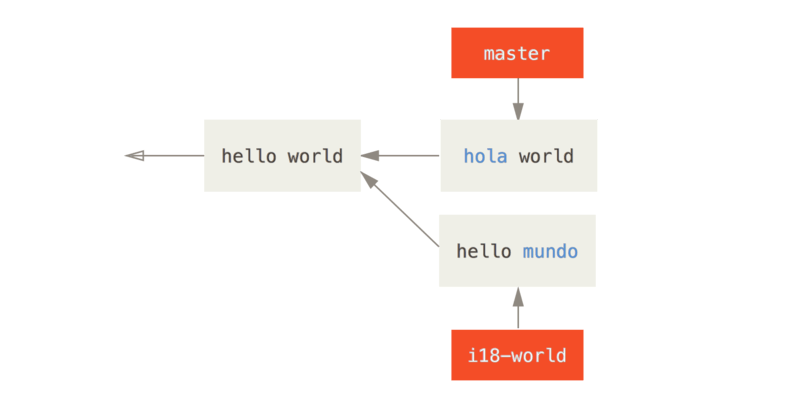{width="6.267716535433071in"
height="3.1944444444444446in"}

Quando unirmos os dois ramos, teremos um conflito de mesclagem:

\$ git merge i18n-world

Auto-merging hello.rb

CONFLICT (content): Merge conflict in hello.rb

Recorded preimage for \'hello.rb\'

Automatic merge failed; fix conflicts and then commit the result.

Você deve notar a nova linha Recorded preimage for FILE- Ali dentro.
Caso contrário, deve parecer exatamente como um conflito de fusão
normal. Neste ponto, rererePodemos nos dizer algumas coisas.
Normalmente, você pode correr git statusNeste ponto, para ver o que
todos os conflitos:

\$ git status

\# On branch master

\# Unmerged paths:

\# (use \"git reset HEAD \<file\>\...\" to unstage)

\# (use \"git add \<file\>\...\" to mark resolution)

\#

\# both modified: hello.rb

\#

No entanto, git rereretambém lhe dirá o que registrou o estado de
pré-fusão para o git rerere status:

\$ git rerere status

hello.rb

E a mais a que atrainer git rerere diffmostrará o estado atual da
resolução -- o que você começou para resolver e para o que você
resolveu.

\$ git rerere diff

\-\-- a/hello.rb

+++ b/hello.rb

@@ -1,11 +1,11 @@

#! /usr/bin/env ruby

def hello

-\<\<\<\<\<\<\<

\- puts \'hello mundo\'

-=======

+\<\<\<\<\<\<\< HEAD

puts \'hola world\'

-\>\>\>\>\>\>\>

+=======

\+ puts \'hello mundo\'

+\>\>\>\>\>\>\> i18n-world

end

Também (e isso não está realmente relacionado a rerere) Você pode usar
git ls-files -upara ver os arquivos em conflito e as versões anterior,
esquerda e direita:

\$ git ls-files -u

100644 39804c942a9c1f2c03dc7c5ebcd7f3e3a6b97519 1 hello.rb

100644 a440db6e8d1fd76ad438a49025a9ad9ce746f581 2 hello.rb

100644 54336ba847c3758ab604876419607e9443848474 3 hello.rb

Agora você pode resolver isso apenas para ser puts \'hola mundo\'E você
pode correr git rerere diffMais uma vez para ver o que rerere lembrará:

\$ git rerere diff

\-\-- a/hello.rb

+++ b/hello.rb

@@ -1,11 +1,7 @@

#! /usr/bin/env ruby

def hello

-\<\<\<\<\<\<\<

\- puts \'hello mundo\'

-=======

\- puts \'hola world\'

-\>\>\>\>\>\>\>

\+ puts \'hola mundo\'

end

Então, isso basicamente diz, quando Git vê um conflito de pedaços em um
hello.rbarquivo que tem "olá mundo" de um lado e "mundo de Hola" do
outro, ele vai resolvê-lo a "hola mundo".

Agora podemos marcá-lo como resolvido e comprometê-lo:

\$ git add hello.rb

\$ git commit

Recorded resolution for \'hello.rb\'.

\[master 68e16e5\] Merge branch \'i18n\'

Você pode ver que ele \"Recorrespondível resolução para FILE\".

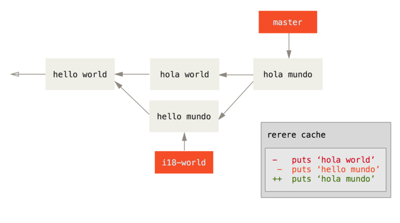{width="6.267716535433071in" height="3.5in"}

Agora, vamos desfazer essa fusão e, em seguida, rebaseá-lo em cima do
nosso ramo mestre. Nós podemos mover nosso ramo de volta usando git
resetcomo vimos em [[Reset
Demistificado]{.underline}](https://git-scm.com/book/pt-pt/v2/ch00/_git_reset).

\$ git reset \--hard HEAD\^

HEAD is now at ad63f15 i18n the hello

A nossa fusão está desfeita. Agora vamos rebasear o ramo tópico.

\$ git checkout i18n-world

Switched to branch \'i18n-world\'

\$ git rebase master

First, rewinding head to replay your work on top of it\...

Applying: i18n one word

Using index info to reconstruct a base tree\...

Falling back to patching base and 3-way merge\...

Auto-merging hello.rb

CONFLICT (content): Merge conflict in hello.rb

Resolved \'hello.rb\' using previous resolution.

Failed to merge in the changes.

Patch failed at 0001 i18n one word

Agora, temos o mesmo conflito de mesclagem como esperávamos, mas dê uma
olhada no Resolved FILE using previous resolutionLinha. Se olharmos para
o arquivo, veremos que ele já foi resolvido, não há marcadores de
conflito de mesclagem nele.

#! /usr/bin/env ruby

def hello

puts \'hola mundo\'

end

Além disso, git diffirá mostrar-lhe como ele foi automaticamente
re-resolvido:

\$ git diff

diff \--cc hello.rb

index a440db6,54336ba..0000000

\-\-- a/hello.rb

+++ b/hello.rb

@@@ -1,7 -1,7 +1,7 @@@

#! /usr/bin/env ruby

def hello

\- puts \'hola world\'

\- puts \'hello mundo\'

++ puts \'hola mundo\'

end

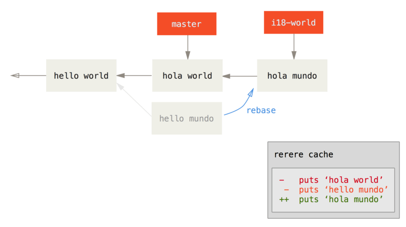{width="6.267716535433071in" height="3.5in"}

Você também pode recriar o estado de arquivo em conflito com git
checkout:

\$ git checkout \--conflict=merge hello.rb

\$ cat hello.rb

#! /usr/bin/env ruby

def hello

\<\<\<\<\<\<\< ours

puts \'hola world\'

=======

puts \'hello mundo\'

\>\>\>\>\>\>\> theirs

end

Vimos um exemplo disso em [[Advanced
Merging]{.underline}](https://git-scm.com/book/pt-pt/v2/ch00/_advanced_merging).
Por enquanto, vamos re-resolvê-lo apenas correndo git rerereMais uma
vez:

\$ git rerere

Resolved \'hello.rb\' using previous resolution.

\$ cat hello.rb

#! /usr/bin/env ruby

def hello

puts \'hola mundo\'

end

Resolvemos o arquivo automaticamente usando o rerereResolução em cache.
Agora você pode adicionar e continuar o rebase para completá-lo.

\$ git add hello.rb

\$ git rebase \--continue

Applying: i18n one word

Então, se você fizer um monte de re-fundos, ou quer manter um ramo de
tópico atualizado com sua filial mestre sem uma tonelada de fusões, ou
você rebasear com frequência, você pode ligar rererepara ajudar sua vida
um pouco.

# **Depuração com o Git**

## **Depuração com o Git**

Além de ser principalmente para controle de versão, o Git também fornece
alguns comandos para ajudá-lo a depurar seus projetos de código-fonte.
Como o Git é projetado para lidar com praticamente qualquer tipo de
conteúdo, essas ferramentas são bastante genéricas, mas muitas vezes
podem ajudá-lo a procurar um bug ou culpado quando as coisas dão errado.

### **Anotação do arquivo**

Se você rastrear um bug em seu código e quiser saber quando ele foi
introduzido e por que, a anotação de arquivos é muitas vezes sua melhor
ferramenta. Ele mostra qual commit foi o último a modificar cada linha
de qualquer arquivo. Então, se você ver que um método em seu código é
buggy, você pode anotar o arquivo com git blamedeterminar qual o
compromisso responsável pela introdução dessa linha.

O exemplo a seguir usa git blamepara determinar qual commit e committer
era responsável por linhas no kernel Linux de nível superior Makefilee,
além disso, usa o -Lopção para restringir a saída da anotação às linhas
69 a 82 desse arquivo:

\$ git blame -L 69,82 Makefile

b8b0618cf6fab (Cheng Renquan 2009-05-26 16:03:07 +0800 69) ifeq
(\"\$(origin V)\", \"command line\")

b8b0618cf6fab (Cheng Renquan 2009-05-26 16:03:07 +0800 70)
KBUILD_VERBOSE = \$(V)

\^1da177e4c3f4 (Linus Torvalds 2005-04-16 15:20:36 -0700 71) endif

\^1da177e4c3f4 (Linus Torvalds 2005-04-16 15:20:36 -0700 72) ifndef
KBUILD_VERBOSE

\^1da177e4c3f4 (Linus Torvalds 2005-04-16 15:20:36 -0700 73)
KBUILD_VERBOSE = 0

\^1da177e4c3f4 (Linus Torvalds 2005-04-16 15:20:36 -0700 74) endif

\^1da177e4c3f4 (Linus Torvalds 2005-04-16 15:20:36 -0700 75)

066b7ed955808 (Michal Marek 2014-07-04 14:29:30 +0200 76) ifeq
(\$(KBUILD_VERBOSE),1)

066b7ed955808 (Michal Marek 2014-07-04 14:29:30 +0200 77) quiet =

066b7ed955808 (Michal Marek 2014-07-04 14:29:30 +0200 78) Q =

066b7ed955808 (Michal Marek 2014-07-04 14:29:30 +0200 79) else

066b7ed955808 (Michal Marek 2014-07-04 14:29:30 +0200 80) quiet=quiet\_

066b7ed955808 (Michal Marek 2014-07-04 14:29:30 +0200 81) Q = @

066b7ed955808 (Michal Marek 2014-07-04 14:29:30 +0200 82) endif

Observe que o primeiro campo é o SHA-1 parcial do commit que modificou
essa linha pela última vez. Os próximos dois campos são valores
extraídos desse commit -- o nome do autor e a data de autoria desse
commit -- para que você possa ver facilmente quem modificou essa linha e
quando. Depois disso vem o número da linha e o conteúdo do arquivo.
Observe também o \^1da177e4c3f4ENHENIR as linhas, onde \^prefixo designa
linhas que foram introduzidas no commit inicial do repositório e
permaneceram inalteradas desde então. Isso é um pouco confuso, porque
agora você já viu pelo menos três maneiras diferentes pelas quais o Git
usa o \^para modificar um commit SHA-1, mas é isso que significa aqui.

Outra coisa legal sobre o Git é que ele não rastreia os renomeiosos de
arquivos explicitamente. Ele registra os instantâneos e, em seguida,
tenta descobrir o que foi renomeado implicitamente, após o fato. Uma das
características interessantes disso é que você pode pedir-lhe para
descobrir todos os tipos de movimento de código também. Se você passar
-Cpara git blame, o Git analisa o arquivo que você está anotando e tenta
descobrir de onde vieram originalmente os trechos de código nele, se
forem copiados de outro lugar. Por exemplo, digamos que você está
refatorando um arquivo chamado GITServerHandler.mem vários arquivos, um
dos quais é GITPackUpload.m- A . (í a questão: es. , , , íntepeo. . E. .
es. sobre a questão . (em, proprio, e os comandos e. . sobre a questão ,
, . Por culpar GITPackUpload.mCom o -Copção, você pode ver de onde as
seções do código vieram originalmente:

\$ git blame -C -L 141,153 GITPackUpload.m

f344f58d GITServerHandler.m (Scott 2009-01-04 141)

f344f58d GITServerHandler.m (Scott 2009-01-04 142) - (void)
gatherObjectShasFromC

f344f58d GITServerHandler.m (Scott 2009-01-04 143) {

70befddd GITServerHandler.m (Scott 2009-03-22 144) //NSLog(@\"GATHER
COMMI

ad11ac80 GITPackUpload.m (Scott 2009-03-24 145)

ad11ac80 GITPackUpload.m (Scott 2009-03-24 146) NSString \*parentSha;

ad11ac80 GITPackUpload.m (Scott 2009-03-24 147) GITCommit \*commit = \[g

ad11ac80 GITPackUpload.m (Scott 2009-03-24 148)

ad11ac80 GITPackUpload.m (Scott 2009-03-24 149) //NSLog(@\"GATHER COMMI

ad11ac80 GITPackUpload.m (Scott 2009-03-24 150)

56ef2caf GITServerHandler.m (Scott 2009-01-05 151) if(commit) {

56ef2caf GITServerHandler.m (Scott 2009-01-05 152) \[refDict setOb

56ef2caf GITServerHandler.m (Scott 2009-01-05 153)

Isto é realmente útil. Normalmente, você obtém como o commit original o
commit onde você copiou o código, porque essa é a primeira vez que você
tocou essas linhas neste arquivo. O Git informa o commit original onde
você escreveu essas linhas, mesmo que estivesse em outro arquivo.

### **Pesquisa binária**

Anotar um arquivo ajuda se você souber onde o problema está para
começar. Se você não sabe o que está quebrando, e houve dezenas ou
centenas de commits desde o último estado onde você sabe que o código
funcionou, você provavelmente vai recorrer. git bisectpara ajudar. O que
é bisectO comando faz uma pesquisa binária através do seu histórico de
confirmação para ajudá-lo a identificar o mais rápido possível qual
commit introduziu um problema.

Digamos que você acabou de lançar um código para um ambiente de
produção, você está recebendo relatórios de bugs sobre algo que não
estava acontecendo em seu ambiente de desenvolvimento, e você não pode
imaginar por que o código está fazendo isso. Você volta ao seu código, e
acontece que você pode reproduzir o problema, mas você não consegue
descobrir o que está errado. Você pode *bisect*bisectar o código para
descobrir. Primeiro você corre git bisect startpara fazer as coisas
acontecerem, e então você usa git bisect badpara dizer ao sistema que o
commit atual em que você está está está quebrado. Então, você deve dizer
bisect quando o último bom estado conhecido foi, usando git bisect good
\<good_commit\>:

\$ git bisect start

\$ git bisect bad

\$ git bisect good v1.0

Bisecting: 6 revisions left to test after this

\[ecb6e1bc347ccecc5f9350d878ce677feb13d3b2\] error handling on repo

O Git descobriu que cerca de 12 commits vieram entre o commit que você
marcou como o último bom commit (v1.0) e a versão ruim atual, e ela
verificou a do meio para você. Neste ponto, você pode executar seu teste
para ver se o problema existe como deste commit. Se isso acontecer,
então ele foi introduzido em algum momento antes deste commit médio; se
isso não acontecer, então o problema foi introduzido em algum momento
após o commit do meio. Acontece que não há problema aqui, e você diz ao
Git que digitando git bisect goodContinue a sua viagem:

\$ git bisect good

Bisecting: 3 revisions left to test after this

\[b047b02ea83310a70fd603dc8cd7a6cd13d15c04\] secure this thing

Agora você está em outro commit, a meio caminho entre o que você acabou
de testar e seu mau commit. Você executa seu teste novamente e descobre
que este commit está quebrado, então você diz a Git isso com git bisect
bad:

\$ git bisect bad

Bisecting: 1 revisions left to test after this

\[f71ce38690acf49c1f3c9bea38e09d82a5ce6014\] drop exceptions table

Este commit é bom, e agora o Git tem todas as informações necessárias
para determinar onde o problema foi introduzido. Ele informa o SHA-1 do
primeiro mau commit e mostra algumas das informações de commit e quais
arquivos foram modificados nesse commit para que você possa descobrir o
que aconteceu que pode ter introduzido este bug:

\$ git bisect good

b047b02ea83310a70fd603dc8cd7a6cd13d15c04 is first bad commit

commit b047b02ea83310a70fd603dc8cd7a6cd13d15c04

Author: PJ Hyett \<pjhyett@example.com\>

Date: Tue Jan 27 14:48:32 2009 -0800

secure this thing

:040000 040000 40ee3e7821b895e52c1695092db9bdc4c61d1730

f24d3c6ebcfc639b1a3814550e62d60b8e68a8e4 M config

Quando você terminar, você deve correr git bisect resetpara redefinir
sua cabeça para onde você estava antes de começar, ou você vai acabar em
um estado estranho:

\$ git bisect reset

Esta é uma ferramenta poderosa que pode ajudá-lo a verificar centenas de
commits para um bug introduzido em minutos. Na verdade, se você tiver um
script que sairá de 0 se o projeto for bom ou não 0 se o projeto for
ruim, você pode automatizar totalmente git bisect- A . (í a questão: es.
, , , íntepeo. . E. . es. sobre a questão . (em, proprio, e os comandos
e. . sobre a questão , , . Primeiro, você novamente diz o escopo do
bisect, fornecendo os commits ruins e bons conhecidos. Você pode fazer
isso listando-os com o bisect startcomando se você quiser, listando o
commit ruim conhecido primeiro e o bom commit conhecido segundo:

\$ git bisect start HEAD v1.0

\$ git bisect run test-error.sh

Fazer isso é executado automaticamente test-error.shem cada commit
check-out até o Git encontrar o primeiro commit quebrado. Você também
pode correr algo como makeou a make testsou o que você tem que executa
testes automatizados para você.

## **Submódulos**

Muitas vezes acontece que, ao trabalhar em um projeto, você precisa usar
outro projeto de dentro dele. Talvez seja uma biblioteca que um terceiro
desenvolveu ou que você está desenvolvendo separadamente e usando em
vários projetos pais. Um problema comum surge nesses cenários: você quer
ser capaz de tratar os dois projetos como separados, mas ainda ser capaz
de usar um de dentro do outro.

Aqui está um exemplo. Suponha que você esteja desenvolvendo um site e
criando feeds Atom. Em vez de escrever seu próprio código gerador de
átomos, você decide usar uma biblioteca. É provável que você tenha que
incluir esse código de uma biblioteca compartilhada como uma instalação
do CPAN ou uma gema Ruby, ou copiar o código-fonte para sua própria
árvore de projeto. O problema com a inclusão da biblioteca é que é
difícil personalizar a biblioteca de qualquer maneira e, muitas vezes,
mais difícil de implantá-la, porque você precisa garantir que todos os
clientes tenham essa biblioteca disponível. O problema com a cópia do
código para o seu próprio projeto é que todas as alterações
personalizadas que você faz são difíceis de mesclar quando as alterações
upstream se tornam disponíveis.

O Git aborda esse problema usando submódulos. Os submódulos permitem que
você mantenha um repositório Git como um subdiretório de outro
repositório Git. Isso permite que você clone outro repositório em seu
projeto e mantenha seus commits separados.

### **Começando com os submódulos**

Vamos percorrer o desenvolvimento de um projeto simples que foi dividido
em um projeto principal e alguns subprojetos.

Vamos começar adicionando um repositório Git existente como um submódulo
do repositório em que estamos trabalhando. Para adicionar um novo
submódulo, você usa o git submodule addComande com o URL absoluto ou
relativo do projeto que você gostaria de começar a rastrear. Neste
exemplo, vamos adicionar uma biblioteca chamada "DbConnector".

\$ git submodule add https://github.com/chaconinc/DbConnector

Cloning into \'DbConnector\'\...

remote: Counting objects: 11, done.

remote: Compressing objects: 100% (10/10), done.

remote: Total 11 (delta 0), reused 11 (delta 0)

Unpacking objects: 100% (11/11), done.

Checking connectivity\... done.

Por padrão, os submódulos adicionarão o subprojeto em um diretório
chamado o mesmo que o repositório, neste caso "DbConnector". Você pode
adicionar um caminho diferente no final do comando se quiser que ele vá
para outro lugar.

Se você correr git statusNeste ponto, você vai notar algumas coisas.

\$ git status

On branch master

Your branch is up-to-date with \'origin/master\'.

Changes to be committed:

(use \"git reset HEAD \<file\>\...\" to unstage)

new file: .gitmodules

new file: DbConnector

Primeiro você deve notar o novo .gitmodulesdo ficheiro. Este é um
arquivo de configuração que armazena o mapeamento entre o URL do projeto
e o subdiretório local para o qual você o puxou:

\[submodule \"DbConnector\"\]

path = DbConnector

url = https://github.com/chaconinc/DbConnector

Se você tiver vários submódulos, você terá várias entradas neste
arquivo. É importante notar que este arquivo é controlado pela versão
com seus outros arquivos, como o seu .gitignoredo ficheiro. É empurrado
e puxado com o resto do seu projeto. É assim que outras pessoas que
clonam este projeto sabem de onde obter os projetos de submódulo.

A outra listagem no git statussaída é a entrada da pasta do projeto. Se
você correr git diffVocê vê algo interessante:

\$ git diff \--cached DbConnector

diff \--git a/DbConnector b/DbConnector

new file mode 160000

index 0000000..c3f01dc

\-\-- /dev/null

+++ b/DbConnector

@@ -0,0 +1 @@

+Subproject commit c3f01dc8862123d317dd46284b05b6892c7b29bc

Embora DbConnectoré um subdiretório em seu diretório de trabalho, Git
vê-lo como um submódulo e não rastreia seu conteúdo quando você não está
nesse diretório. Em vez disso, o Git vê isso como um determinado commit
desse repositório.

Se você quiser um pouco mais agradável saída diff, você pode passar o
\--submoduleOpção para git diff- A . (í a questão: es. , , , íntepeo. .
E. . es

\$ git diff \--cached \--submodule

diff \--git a/.gitmodules b/.gitmodules

new file mode 100644

index 0000000..71fc376

\-\-- /dev/null

+++ b/.gitmodules

@@ -0,0 +1,3 @@

+\[submodule \"DbConnector\"\]

\+ path = DbConnector

\+ url = https://github.com/chaconinc/DbConnector

Submodule DbConnector 0000000\...c3f01dc (new submodule)

Quando você se compromete, você vê algo assim:

\$ git commit -am \'added DbConnector module\'

\[master fb9093c\] added DbConnector module

2 files changed, 4 insertions(+)

create mode 100644 .gitmodules

create mode 160000 DbConnector

Observe o 160000Modo para o DbConnectorentrada. Esse é um modo especial
no Git que basicamente significa que você está gravando um commit como
uma entrada de diretório, em vez de um subdiretório ou um arquivo.

Por fim, empurre essas mudanças:

\$ git push origin master

### **Clonagem de um projeto com submódulos**

Aqui vamos clonar um projeto com um submódulo nele. Quando você clona um
projeto, por padrão você obtém os diretórios que contêm submódulos, mas
nenhum dos arquivos dentro deles ainda:

\$ git clone https://github.com/chaconinc/MainProject

Cloning into \'MainProject\'\...

remote: Counting objects: 14, done.

remote: Compressing objects: 100% (13/13), done.

remote: Total 14 (delta 1), reused 13 (delta 0)

Unpacking objects: 100% (14/14), done.

Checking connectivity\... done.

\$ cd MainProject

\$ ls -la

total 16

drwxr-xr-x 9 schacon staff 306 Sep 17 15:21 .

drwxr-xr-x 7 schacon staff 238 Sep 17 15:21 ..

drwxr-xr-x 13 schacon staff 442 Sep 17 15:21 .git

-rw-r\--r\-- 1 schacon staff 92 Sep 17 15:21 .gitmodules

drwxr-xr-x 2 schacon staff 68 Sep 17 15:21 DbConnector

-rw-r\--r\-- 1 schacon staff 756 Sep 17 15:21 Makefile

drwxr-xr-x 3 schacon staff 102 Sep 17 15:21 includes

drwxr-xr-x 4 schacon staff 136 Sep 17 15:21 scripts

drwxr-xr-x 4 schacon staff 136 Sep 17 15:21 src

\$ cd DbConnector/

\$ ls

\$

O que é DbConnectorO diretório está lá, mas vazio. Você deve executar
dois comandos: git submodule initpara inicializar seu arquivo de
configuração local, e git submodule updatepara buscar todos os dados
desse projeto e verificar o commit apropriado listado no seu
superprojeto:

\$ git submodule init

Submodule \'DbConnector\' (https://github.com/chaconinc/DbConnector)
registered for path \'DbConnector\'

\$ git submodule update

Cloning into \'DbConnector\'\...

remote: Counting objects: 11, done.

remote: Compressing objects: 100% (10/10), done.

remote: Total 11 (delta 0), reused 11 (delta 0)

Unpacking objects: 100% (11/11), done.

Checking connectivity\... done.

Submodule path \'DbConnector\': checked out
\'c3f01dc8862123d317dd46284b05b6892c7b29bc\'

Agora o teu DbConnectorO subdiretório está no estado exato em que estava
quando você se comprometeu mais cedo.

Há outra maneira de fazer isso, no entanto, um pouco mais simples. Se
você passar \--recurse-submodulespara o git clonecomando, ele
inicializará e atualizará automaticamente cada submódulo no repositório.

\$ git clone \--recurse-submodules
https://github.com/chaconinc/MainProject

Cloning into \'MainProject\'\...

remote: Counting objects: 14, done.

remote: Compressing objects: 100% (13/13), done.

remote: Total 14 (delta 1), reused 13 (delta 0)

Unpacking objects: 100% (14/14), done.

Checking connectivity\... done.

Submodule \'DbConnector\' (https://github.com/chaconinc/DbConnector)
registered for path \'DbConnector\'

Cloning into \'DbConnector\'\...

remote: Counting objects: 11, done.

remote: Compressing objects: 100% (10/10), done.

remote: Total 11 (delta 0), reused 11 (delta 0)

Unpacking objects: 100% (11/11), done.

Checking connectivity\... done.

Submodule path \'DbConnector\': checked out
\'c3f01dc8862123d317dd46284b05b6892c7b29bc\'

### **Trabalhar em um projeto com submódulos**

Agora temos uma cópia de um projeto com submódulos e colaboraremos com
nossos colegas de equipe no projeto principal e no projeto do submódulo.

#### **Puxando em mudanças de upstream**

O modelo mais simples de usar submódulos em um projeto seria se você
estivesse simplesmente consumindo um subprojeto e quisesse receber
atualizações dele de tempos em tempos, mas não estivesse realmente
modificando nada no seu checkout. Vamos percorrer um exemplo simples.

Se você quiser verificar se há novos trabalhos em um submódulo, você
pode ir para o diretório e executar git fetchE a git mergea ramificação
upstream para atualizar o código local.

\$ git fetch

From https://github.com/chaconinc/DbConnector

c3f01dc..d0354fc master -\> origin/master

\$ git merge origin/master

Updating c3f01dc..d0354fc

Fast-forward

scripts/connect.sh \| 1 +

src/db.c \| 1 +

2 files changed, 2 insertions(+)

Agora, se você voltar para o projeto principal e executar git diff
\--submodulevocê pode ver que o submódulo foi atualizado e obter uma
lista de commits que foram adicionados a ele. Se você não quiser digitar
\--submoduleToda vez que você corre git diff, você pode defini-lo como o
formato padrão, definindo o diff.submoduleconfig value to "log".

\$ git config \--global diff.submodule log

\$ git diff

Submodule DbConnector c3f01dc..d0354fc:

\> more efficient db routine

\> better connection routine

Se você se comprometer neste ponto, então você vai bloquear o submódulo
para ter o novo código quando outras pessoas atualizarem.

Há uma maneira mais fácil de fazer isso também, se você preferir não
buscar e mercer manualmente no subdiretório. Se você correr git
submodule update \--remote, Git vai para seus submódulos e buscar e
atualizar para você.

\$ git submodule update \--remote DbConnector

remote: Counting objects: 4, done.

remote: Compressing objects: 100% (2/2), done.

remote: Total 4 (delta 2), reused 4 (delta 2)

Unpacking objects: 100% (4/4), done.

From https://github.com/chaconinc/DbConnector

3f19983..d0354fc master -\> origin/master

Submodule path \'DbConnector\': checked out
\'d0354fc054692d3906c85c3af05ddce39a1c0644\'

Este comando, por padrão, assumirá que você deseja atualizar o checkout
para o masterramificação do repositório do submódulo. Você pode, no
entanto, definir isso para algo diferente, se quiser. Por exemplo, se
você quiser que o submódulo do DbConnector rastreie o ramo "estável" do
repositório, você pode configurá-lo em qualquer um dos seus
.gitmodulesarquivo (para que todos os outros também o rastreiam), ou
apenas em seu local .git/configdo ficheiro. Vamos colocá-lo no
.gitmodulesFicheiro:

\$ git config -f .gitmodules submodule.DbConnector.branch stable

\$ git submodule update \--remote

remote: Counting objects: 4, done.

remote: Compressing objects: 100% (2/2), done.

remote: Total 4 (delta 2), reused 4 (delta 2)

Unpacking objects: 100% (4/4), done.

From https://github.com/chaconinc/DbConnector

27cf5d3..c87d55d stable -\> origin/stable

Submodule path \'DbConnector\': checked out
\'c87d55d4c6d4b05ee34fbc8cb6f7bf4585ae6687\'

Se você deixar de lado o -f .gitmodulessó vai fazer a mudança para você,
mas provavelmente faz mais sentido rastrear essas informações com o
repositório, então todos os outros também fazem.

Quando nós corremos git statusNeste ponto, o Git nos mostrará que temos
"novos compromissos" no submódulo.

\$ git status

On branch master

Your branch is up-to-date with \'origin/master\'.

Changes not staged for commit:

(use \"git add \<file\>\...\" to update what will be committed)

(use \"git checkout \-- \<file\>\...\" to discard changes in working
directory)

modified: .gitmodules

modified: DbConnector (new commits)

no changes added to commit (use \"git add\" and/or \"git commit -a\")

Se você definir a configuração status.submodulesummary, Git também irá
mostrar-lhe um pequeno resumo de alterações em seus submódulos:

\$ git config status.submodulesummary 1

\$ git status

On branch master

Your branch is up-to-date with \'origin/master\'.

Changes not staged for commit:

(use \"git add \<file\>\...\" to update what will be committed)

(use \"git checkout \-- \<file\>\...\" to discard changes in working
directory)

modified: .gitmodules

modified: DbConnector (new commits)

Submodules changed but not updated:

\* DbConnector c3f01dc\...c87d55d (4):

\> catch non-null terminated lines

Neste ponto, se você correr git diffPodemos ver ambas que modificamos o
nosso .gitmodulesverificar e também que há uma série de commits que
puxamos para baixo e estão prontos para se comprometer com o nosso
projeto de submódulo.

\$ git diff

diff \--git a/.gitmodules b/.gitmodules

index 6fc0b3d..fd1cc29 100644

\-\-- a/.gitmodules

+++ b/.gitmodules

@@ -1,3 +1,4 @@

\[submodule \"DbConnector\"\]

path = DbConnector

url = https://github.com/chaconinc/DbConnector

\+ branch = stable

Submodule DbConnector c3f01dc..c87d55d:

\> catch non-null terminated lines

\> more robust error handling

\> more efficient db routine

\> better connection routine

Isso é muito legal, pois podemos realmente ver o registro de commits com
os quais estamos prestes a nos comprometer em nosso submódulo. Uma vez
comprometido, você pode ver essa informação após o fato também quando
você executar git log -p- A . (í a questão: es. , , , íntepeo. . E. .
es. sobre a questão . (em, proprio, e os comandos e. . sobre a questão ,

\$ git log -p \--submodule

commit 0a24cfc121a8a3c118e0105ae4ae4c00281cf7ae

Author: Scott Chacon \<schacon@gmail.com\>

Date: Wed Sep 17 16:37:02 2014 +0200

updating DbConnector for bug fixes

diff \--git a/.gitmodules b/.gitmodules

index 6fc0b3d..fd1cc29 100644

\-\-- a/.gitmodules

+++ b/.gitmodules

@@ -1,3 +1,4 @@

\[submodule \"DbConnector\"\]

path = DbConnector

url = https://github.com/chaconinc/DbConnector

\+ branch = stable

Submodule DbConnector c3f01dc..c87d55d:

\> catch non-null terminated lines

\> more robust error handling

\> more efficient db routine

\> better connection routine

O Git tentará, por padrão, atualizar **todos os** seus submómulos quando
você executar git submodule update \--remoteEntão, se você tiver muitos
deles, você pode querer passar o nome do submódulo que você deseja
tentar atualizar.

#### **Trabalhando em um submódulo**

É bem provável que, se você estiver usando submódulos, esteja fazendo
isso porque realmente deseja trabalhar no código no submódulo ao mesmo
tempo em que está trabalhando no código no projeto principal (ou em
vários submódulos). Caso contrário, você provavelmente estaria usando um
sistema de gerenciamento de dependência mais simples (como Maven ou
Rubygems).

Então, agora vamos passar por um exemplo de fazer alterações no
submódulo ao mesmo tempo que o projeto principal e o commit e publicação
dessas mudanças ao mesmo tempo.

Até agora, quando nós corremos o git submodule updatePara buscar
alterações dos repositórios do submódulo, o Git receberia as alterações
e atualizaria os arquivos no subdiretório, mas deixaria o
sub-repositório no que é chamado de estado "Head desmarcado". Isso
significa que não há nenhuma filial de trabalho local (como "mestre",
por exemplo) de rastreamento de alterações. Sem alterações de
acompanhamento de ramificação de trabalho, isso significa que, mesmo se
você confirmar alterações no submódulo, essas alterações possivelmente
serão perdidas na próxima vez que você executar git submodule update- A
. (í a questão: es. , , , íntepeo. . E. . es. sobre a questão . (em,
proprio, e os comandos e. . sobre a questão , , . Você tem que fazer
algumas etapas extras se quiser que as mudanças em um submódulo sejam
rastreadas.

Para configurar seu submódulo para ser mais fácil de entrar e hackear,
você precisa fazer duas coisas. Você precisa entrar em cada submódulo e
verificar um ramo para trabalhar. Então você precisa dizer ao Git o que
fazer se você tiver feito alterações e, em seguida, git submodule update
\--remotepuxa em novo trabalho de upstream. As opções são que você pode
fundi-las em seu trabalho local ou tentar rebasear seu trabalho local em
cima das novas mudanças.

Primeiro de tudo, vamos entrar em nosso diretório de submódulo e
verificar um branch.

\$ git checkout stable

Switched to branch \'stable\'

Vamos tentar com a opção "merge". Para especificá-lo manualmente,
podemos apenas adicionar o \--mergeopção para o nosso updateLigue para
isso. Aqui veremos que houve uma mudança no servidor para este submódulo
e ele é mesclado.

\$ git submodule update \--remote \--merge

remote: Counting objects: 4, done.

remote: Compressing objects: 100% (2/2), done.

remote: Total 4 (delta 2), reused 4 (delta 2)

Unpacking objects: 100% (4/4), done.

From https://github.com/chaconinc/DbConnector

c87d55d..92c7337 stable -\> origin/stable

Updating c87d55d..92c7337

Fast-forward

src/main.c \| 1 +

1 file changed, 1 insertion(+)

Submodule path \'DbConnector\': merged in
\'92c7337b30ef9e0893e758dac2459d07362ab5ea\'

Se entrarmos no diretório DbConnector, teremos as novas mudanças já
incorporadas em nosso local. stableO ramo. Agora vamos ver o que
acontece quando fazemos nossa própria mudança local para a biblioteca e
alguém empurra outra mudança no upstream ao mesmo tempo.

\$ cd DbConnector/

\$ vim src/db.c

\$ git commit -am \'unicode support\'

\[stable f906e16\] unicode support

1 file changed, 1 insertion(+)

Agora, se atualizarmos nosso submódulo, podemos ver o que acontece
quando fizemos uma mudança local e o upstream também tem uma mudança que
precisamos incorporar.

\$ git submodule update \--remote \--rebase

First, rewinding head to replay your work on top of it\...

Applying: unicode support

Submodule path \'DbConnector\': rebased into
\'5d60ef9bbebf5a0c1c1050f242ceeb54ad58da94\'

Se você esquecer o \--rebaseou a \--merge, o Git apenas atualizará o
submódulo para o que está no servidor e redefinirá seu projeto para um
estado HEAD desmarcado.

\$ git submodule update \--remote

Submodule path \'DbConnector\': checked out
\'5d60ef9bbebf5a0c1c1050f242ceeb54ad58da94\'

Se isso acontecer, não se preocupe, você pode simplesmente voltar para o
diretório e verificar seu branch novamente (que ainda conterá seu
trabalho) e mesclar ou rebasear origin/stable(ou qualquer ramo remoto
que você quiser) manualmente.

Se você não tiver confirmado suas alterações em seu submódulo e executar
uma atualização de submódulo que causaria problemas, o Git buscará as
alterações, mas não substituirá o trabalho não salvo em seu diretório de
submódulas.

\$ git submodule update \--remote

remote: Counting objects: 4, done.

remote: Compressing objects: 100% (3/3), done.

remote: Total 4 (delta 0), reused 4 (delta 0)

Unpacking objects: 100% (4/4), done.

From https://github.com/chaconinc/DbConnector

5d60ef9..c75e92a stable -\> origin/stable

error: Your local changes to the following files would be overwritten by
checkout:

scripts/setup.sh

Please, commit your changes or stash them before you can switch
branches.

Aborting

Unable to checkout \'c75e92a2b3855c9e5b66f915308390d9db204aca\' in
submodule path \'DbConnector\'

Se você fez alterações que entram em conflito com algo alterado
upstream, o Git informará quando você executar a atualização.

\$ git submodule update \--remote \--merge

Auto-merging scripts/setup.sh

CONFLICT (content): Merge conflict in scripts/setup.sh

Recorded preimage for \'scripts/setup.sh\'

Automatic merge failed; fix conflicts and then commit the result.

Unable to merge \'c75e92a2b3855c9e5b66f915308390d9db204aca\' in
submodule path \'DbConnector\'

Você pode entrar no diretório submodule e corrigir o conflito como você
normalmente faria.

#### **Publicação de alterações do submódulo**

Agora temos algumas mudanças no nosso diretório de submódulo. Alguns
deles foram trazidos do upstream por nossas atualizações e outros foram
feitos localmente e não estão disponíveis para mais ninguém ainda, já
que ainda não os pressionamos.

\$ git diff

Submodule DbConnector c87d55d..82d2ad3:

\> Merge from origin/stable

\> updated setup script

\> unicode support

\> remove unnecessary method

\> add new option for conn pooling

Se nos comprometermos no projeto principal e empurrá-lo sem aumentar as
mudanças do submódulo também, outras pessoas que tentam verificar nossas
mudanças estarão em apuros, pois não terão como obter as mudanças de
submódulo que dependem. Essas mudanças só existirão em nossa cópia
local.

Para garantir que isso não aconteça, você pode pedir ao Git para
verificar se todos os seus submóveis foram pressionados corretamente
antes de empurrar o projeto principal. O que é git pushO comando leva o
\--recurse-submodulesargumento que pode ser definido para \"check\" ou
\"on-demand\". A opção "check" fará pushBasta falhar se alguma das
mudanças de submódulo comprometidas não tiver sido empurrada.

\$ git push \--recurse-submodules=check

The following submodule paths contain changes that can

not be found on any remote:

DbConnector

Please try

git push \--recurse-submodules=on-demand

or cd to the path and use

git push

to push them to a remote.

Como você pode ver, também nos dá alguns conselhos úteis sobre o que
podemos querer fazer a seguir. A opção simples é entrar em cada
submódulo e empurrar manualmente para os controles remotos para garantir
que eles estejam disponíveis externamente e, em seguida, tente esse
empurrão novamente. Se você quiser que o comportamento de verificação
aconteça para todos os pushes, você pode fazer desse comportamento o
padrão, fazendo git config push.recurseSubmodules check- A . (í a
questão: es. , , , íntepeo. . E. . es. sobre a questão . (em, proprio, e
os comandos e. . sobre a questão , , .

A outra opção é usar o valor "on-demand", que tentará fazer isso por
você.

\$ git push \--recurse-submodules=on-demand

Pushing submodule \'DbConnector\'

Counting objects: 9, done.

Delta compression using up to 8 threads.

Compressing objects: 100% (8/8), done.

Writing objects: 100% (9/9), 917 bytes \| 0 bytes/s, done.

Total 9 (delta 3), reused 0 (delta 0)

To https://github.com/chaconinc/DbConnector

c75e92a..82d2ad3 stable -\> stable

Counting objects: 2, done.

Delta compression using up to 8 threads.

Compressing objects: 100% (2/2), done.

Writing objects: 100% (2/2), 266 bytes \| 0 bytes/s, done.

Total 2 (delta 1), reused 0 (delta 0)

To https://github.com/chaconinc/MainProject

3d6d338..9a377d1 master -\> master

Como você pode ver lá, Git entrou no módulo DbConnector e o empurrou
antes de empurrar o projeto principal. Se esse impulso de submódulo
falhar por algum motivo, o principal impulso do projeto também falhará.
Você pode fazer esse comportamento o padrão, fazendo git config
push.recurseSubmodules on-demand- A . (í a questão: es. , , , íntepeo. .
E. . es. sobre a questão . (em, proprio, e os comandos e. . sobre

#### **Mesclando Mudanças de Submódulo**

Se você alterar uma referência de submódulo ao mesmo tempo que outra
pessoa, poderá ter alguns problemas. Ou seja, se os históricos do
submódulo divergiram e estão comprometidos com a divergência de filiais
em um superprojeto, pode levar um pouco de trabalho para você corrigir.

Se um dos commits é um ancestral direto do outro (uma fusão rápida),
então Git simplesmente escolherá o último para a mesclagem, de modo que
funcione bem.

O Git não tentará nem mesmo uma fusão trivial para você, no entanto. Se
o submódulo se comprometer divergir e precisar ser mesclado, você terá
algo parecido com isso:

\$ git pull

remote: Counting objects: 2, done.

remote: Compressing objects: 100% (1/1), done.

remote: Total 2 (delta 1), reused 2 (delta 1)

Unpacking objects: 100% (2/2), done.

From https://github.com/chaconinc/MainProject

9a377d1..eb974f8 master -\> origin/master

Fetching submodule DbConnector

warning: Failed to merge submodule DbConnector (merge following commits
not found)

Auto-merging DbConnector

CONFLICT (submodule): Merge conflict in DbConnector

Automatic merge failed; fix conflicts and then commit the result.

Então, basicamente, o que aconteceu aqui é que Git descobriu que os dois
ramos registram pontos na história do submódulo que são divergentes e
precisam ser mesclados. Ele explica isso como "merge following commits
não encontrados", o que é confuso, mas vamos explicar por que isso está
em um pouco.

Para resolver o problema, você precisa descobrir em que estado o
submódulo deve estar. Estranhamente, Git realmente não lhe dá muita
informação para ajudar aqui, nem mesmo os SHA-1s dos commits de ambos os
lados da história. Felizmente, é simples de descobrir. Se você correr
git diffvocê pode obter os SHA-1s dos commits registrados em ambas as
ramificações que você estava tentando mesclar.

\$ git diff

diff \--cc DbConnector

index eb41d76,c771610..0000000

\-\-- a/DbConnector

+++ b/DbConnector

Então, neste caso, eb41d76é o compromisso em nosso submódulo que
**we**tivemos e c771610é o compromisso que a upstream tinha. Se
entrarmos em nosso diretório submodicular, ele já deve estar ligado
eb41d76como a fusão não teria tocado. Se por qualquer motivo não for,
você pode simplesmente criar e fazer checkout um ramo apontando para
ele.

O que é importante é o SHA-1 do commit do outro lado. Isso é o que você
terá que se fundir e resolver. Você pode apenas tentar a mesclagem com o
SHA-1 diretamente, ou você pode criar um ramo para ele e, em seguida,
tentar mesclar isso. Sugerimos o último, mesmo que apenas para fazer uma
melhor mesclagem, envie uma mensagem de commit.

Então, entraremos em nosso diretório submodicular, criaremos um ramo
baseado nesse segundo SHA-1 a partir de git diffe manualmente mescle.

\$ cd DbConnector

\$ git rev-parse HEAD

eb41d764bccf88be77aced643c13a7fa86714135

\$ git branch try-merge c771610

(DbConnector) \$ git merge try-merge

Auto-merging src/main.c

CONFLICT (content): Merge conflict in src/main.c

Recorded preimage for \'src/main.c\'

Automatic merge failed; fix conflicts and then commit the result.

Temos um conflito de mesclagem real aqui, por isso, se resolvermos isso
e comprometê-lo, então podemos simplesmente atualizar o projeto
principal com o resultado.

\$ vim src/main.c **(1)**

\$ git add src/main.c

\$ git commit -am \'merged our changes\'

Recorded resolution for \'src/main.c\'.

\[master 9fd905e\] merged our changes

\$ cd .. **(2)**

\$ git diff **(3)**

diff \--cc DbConnector

index eb41d76,c771610..0000000

\-\-- a/DbConnector

+++ b/DbConnector

@@@ -1,1 -1,1 +1,1 @@@

\- Subproject commit eb41d764bccf88be77aced643c13a7fa86714135

-Subproject commit c77161012afbbe1f58b5053316ead08f4b7e6d1d

++Subproject commit 9fd905e5d7f45a0d4cbc43d1ee550f16a30e825a

\$ git add DbConnector **(4)**

\$ git commit -m \"Merge Tom\'s Changes\" **(5)**

\[master 10d2c60\] Merge Tom\'s Changes

1.  Primeiro resolvemos o conflito

2.  Então voltamos para o diretório principal do projeto

3.  Podemos verificar os SHA-1s novamente

4.  Resolver a entrada do submódulo em conflito

5.  Comprometam a nossa fusão

Pode ser um pouco confuso, mas não é muito difícil.

Curiosamente, há outro caso que o Git lida. Se um commit de mesclagem
existir no diretório submódulo que contém **ambos** os commits em seu
histórico, o Git irá sugerir-lhe como uma solução possível. Ele vê que
em algum momento do projeto do submódulo, alguém mesclado ramos contendo
esses dois commits, então talvez você queira isso.

É por isso que a mensagem de erro de antes era "fundo após commits não
encontrados", porque não poderia fazer **isso**. É confuso porque quem
esperaria que ele **tentasse** fazer isso?

Se ele encontrar um único commit de mesclagem aceitável, você verá algo
assim:

\$ git merge origin/master

warning: Failed to merge submodule DbConnector (not fast-forward)

Found a possible merge resolution for the submodule:

9fd905e5d7f45a0d4cbc43d1ee550f16a30e825a: \> merged our changes

If this is correct simply add it to the index for example

by using:

git update-index \--cacheinfo 160000
9fd905e5d7f45a0d4cbc43d1ee550f16a30e825a \"DbConnector\"

which will accept this suggestion.

Auto-merging DbConnector

CONFLICT (submodule): Merge conflict in DbConnector

Automatic merge failed; fix conflicts and then commit the result.

O que está sugerindo que você faz é atualizar o índice como você tinha
executado git add, que limpa o conflito, então comete. Você
provavelmente não deveria fazer isso. Você pode facilmente ir para o
diretório submodicular, ver qual é a diferença, avançar rapidamente para
este commit, testá-lo corretamente e, em seguida, entregá-lo.

\$ cd DbConnector/

\$ git merge 9fd905e

Updating eb41d76..9fd905e

Fast-forward

\$ cd ..

\$ git add DbConnector

\$ git commit -am \'Fast forwarded to a common submodule child\'

Isso realiza a mesma coisa, mas pelo menos dessa maneira você pode
verificar se ele funciona e tem o código em seu diretório submódulo
quando terminar.

### **Dicas de submódulo**

Existem algumas coisas que você pode fazer para tornar o trabalho com
submódulos um pouco mais fácil.

#### **Submódulo Foreach**

Há um foreachsubmódulo comando para executar algum comando arbitrário em
cada submódulo. Isso pode ser realmente útil se você tiver vários
submódulos no mesmo projeto.

Por exemplo, digamos que queremos iniciar um novo recurso ou fazer uma
correção de bugs e temos trabalho em andamento em vários submódulos.
Podemos facilmente esconder todo o trabalho em todos os nossos
submódulos.

\$ git submodule foreach \'git stash\'

Entering \'CryptoLibrary\'

No local changes to save

Entering \'DbConnector\'

Saved working directory and index state WIP on stable: 82d2ad3 Merge
from origin/stable

HEAD is now at 82d2ad3 Merge from origin/stable

Então podemos criar um novo ramo e mudar para ele em todos os nossos
submódulos.

\$ git submodule foreach \'git checkout -b featureA\'

Entering \'CryptoLibrary\'

Switched to a new branch \'featureA\'

Entering \'DbConnector\'

Switched to a new branch \'featureA\'

Fica com a ideia. Uma coisa realmente útil que você pode fazer é
produzir um bom diff unificado do que é alterado em seu projeto
principal e todos os seus subprojetos também.

\$ git diff; git submodule foreach \'git diff\'

Submodule DbConnector contains modified content

diff \--git a/src/main.c b/src/main.c

index 210f1ae..1f0acdc 100644

\-\-- a/src/main.c

+++ b/src/main.c

@@ -245,6 +245,8 @@ static int handle_alias(int \*argcp, const char
\*\*\*argv)

commit_pager_choice();

\+ url = url_decode(url_orig);

\+

/\* build alias_argv \*/

alias_argv = xmalloc(sizeof(\*alias_argv) \* (argc + 1));

alias_argv\[0\] = alias_string + 1;

Entering \'DbConnector\'

diff \--git a/src/db.c b/src/db.c

index 1aaefb6..5297645 100644

\-\-- a/src/db.c

+++ b/src/db.c

@@ -93,6 +93,11 @@ char \*url_decode_mem(const char \*url, int len)

return url_decode_internal(&url, len, NULL, &out, 0);

}

+char \*url_decode(const char \*url)

+{

\+ return url_decode_mem(url, strlen(url));

+}

\+

char \*url_decode_parameter_name(const char \*\*query)

{

struct strbuf out = STRBUF_INIT;

Aqui podemos ver que estamos definindo uma função em um submódulo e
chamando-a no projeto principal. Este é obviamente um exemplo
simplificado, mas espero que lhe dê uma ideia de como isso pode ser
útil.

#### **Alias úteis**

Você pode querer configurar alguns aliases para alguns desses comandos,
pois eles podem ser bastante longos e você não pode definir opções de
configuração para a maioria delas para torná-las padrão. Nós encobrimos
a criação de lias do
[[Git]{.underline}](https://git-scm.com/book/pt-pt/v2/ch00/_git_aliases)
no [[Alias
Git]{.underline}](https://git-scm.com/book/pt-pt/v2/ch00/_git_aliases),
mas aqui está um exemplo do que você pode querer configurar se você
planeja trabalhar muito com submódulos no Git.

\$ git config alias.sdiff \'!\'\"git diff && git submodule foreach \'git
diff\'\"

\$ git config alias.spush \'push \--recurse-submodules=on-demand\'

\$ git config alias.supdate \'submodule update \--remote \--merge\'

Desta forma, você pode simplesmente correr git supdatequando você deseja
atualizar seus submódulos, ou git spushpara empurrar com verificação de
dependência do submódulo.

### **Problemas com os submódulos**

No entanto, o uso de submódulos não é sem soluços.

Por exemplo, mudar de ramo com submódulos neles também pode ser
complicado. Se você criar uma nova ramificação, adicionar um submódulo
lá e, em seguida, voltar a uma ramificação sem esse submódulo, você
ainda tem o diretório submodule como um diretório não rastreado:

\$ git checkout -b add-crypto

Switched to a new branch \'add-crypto\'

\$ git submodule add https://github.com/chaconinc/CryptoLibrary

Cloning into \'CryptoLibrary\'\...

\...

\$ git commit -am \'adding crypto library\'

\[add-crypto 4445836\] adding crypto library

2 files changed, 4 insertions(+)

create mode 160000 CryptoLibrary

\$ git checkout master

warning: unable to rmdir CryptoLibrary: Directory not empty

Switched to branch \'master\'

Your branch is up-to-date with \'origin/master\'.

\$ git status

On branch master

Your branch is up-to-date with \'origin/master\'.

Untracked files:

(use \"git add \<file\>\...\" to include in what will be committed)

CryptoLibrary/

nothing added to commit but untracked files present (use \"git add\" to
track)

Remover o diretório não é difícil, mas pode ser um pouco confuso ter
isso lá. Se você fizer a remoção e depois voltar para a ramificação que
tem esse submódulo, você precisará executar submodule update \--initpara
repovoá-lo.

\$ git clean -ffdx

Removing CryptoLibrary/

\$ git checkout add-crypto

Switched to branch \'add-crypto\'

\$ ls CryptoLibrary/

\$ git submodule update \--init

Submodule path \'CryptoLibrary\': checked out
\'b8dda6aa182ea4464f3f3264b11e0268545172af\'

\$ ls CryptoLibrary/

Makefile includes scripts src

Novamente, não é muito difícil, mas pode ser um pouco confuso.

A outra ressalva principal que muitas pessoas encontram envolve a
mudança de subdiretórios para submódulos. Se você está rastreando
arquivos em seu projeto e deseja movê-los para um submódulo, você deve
ter cuidado ou o Git ficará com raiva de você. Suponha que você tenha
arquivos em um subdiretório do seu projeto e queira alterná-lo para um
submódulo. Se você excluir o subdiretório e executar submodule add, Git
grita para você:

\$ rm -Rf CryptoLibrary/

\$ git submodule add https://github.com/chaconinc/CryptoLibrary

\'CryptoLibrary\' already exists in the index

Você tem que deseta o CryptoLibraryO diretório primeiro. Então você pode
adicionar o submódulo:

\$ git rm -r CryptoLibrary

\$ git submodule add https://github.com/chaconinc/CryptoLibrary

Cloning into \'CryptoLibrary\'\...

remote: Counting objects: 11, done.

remote: Compressing objects: 100% (10/10), done.

remote: Total 11 (delta 0), reused 11 (delta 0)

Unpacking objects: 100% (11/11), done.

Checking connectivity\... done.

Agora suponha que você fez isso em um ramo. Se você tentar alternar de
volta para um ramo onde esses arquivos ainda estão na árvore real, em
vez de um submódulo -- você recebe esse erro:

\$ git checkout master

error: The following untracked working tree files would be overwritten
by checkout:

CryptoLibrary/Makefile

CryptoLibrary/includes/crypto.h

\...

Please move or remove them before you can switch branches.

Aborting

Você pode forçar a mudar com checkout -f, mas tenha cuidado para que
você não tenha mudanças não salvas lá, pois elas podem ser substituídas
por esse comando.

\$ git checkout -f master

warning: unable to rmdir CryptoLibrary: Directory not empty

Switched to branch \'master\'

Então, quando você voltar, você fica vazio CryptoLibrarydiretório por
algum motivo e git submodule updateTambém pode não consertá-lo. Você
pode precisar entrar no diretório do submódulo e executar um git
checkout .para recuperar todos os seus arquivos. Você poderia executar
isso em um submodule foreachscript para executá-lo para vários
submódulos.

É importante notar que os submódulos nos dias de hoje mantêm todos os
seus dados do Git no topo do projeto. .gitAo contrário de versões muito
mais antigas do Git, destruir um diretório de submódulo não perderá
nenhum commit ou ramificações que você tinha.

Com essas ferramentas, os submódulos podem ser um método bastante
simples e eficaz para o desenvolvimento de vários projetos relacionados,
mas ainda separados simultaneamente.

# **Ferramentas do Git - Agrupamento**

## **Agrupamentos**

Embora tenhamos abordado as formas comuns de transferir dados do Git
através de uma rede (HTTP, SSH, etc), há realmente mais uma maneira de
fazer para que não seja comumente usada, mas pode realmente ser bastante
útil.

O Git é capaz de "agrupar" seus dados em um único arquivo. Isso pode ser
útil em vários cenários. Talvez sua rede esteja para baixo e você queira
enviar alterações para seus colegas de trabalho. Talvez você esteja
trabalhando em algum lugar fora do local e não tenha acesso à rede local
por motivos de segurança. Talvez o seu cartão wireless/etérico tenha
acabado de quebrar. Talvez você não tenha acesso a um servidor
compartilhado no momento, você quer enviar por e-mail para alguém
atualizações e não deseja transferir 40 commits via format-patch- A . (í
a questão: es. , , , íntepeo. . E. . es. sobre a questão . (em, proprio,
e os comandos e. . sobre a questão , , .

É aqui que o git bundleO comando pode ser útil. O que é bundlecomando
irá empacotar tudo o que normalmente seria empurrado sobre o fio com um
git pushcomando em um arquivo binário que você pode enviar um e-mail
para alguém ou colocar uma unidade flash e, em seguida, desagregar-se em
outro repositório.

Vamos ver um exemplo simples. Digamos que você tenha um repositório com
dois commits:

\$ git log

commit 9a466c572fe88b195efd356c3f2bbeccdb504102

Author: Scott Chacon \<schacon@gmail.com\>

Date: Wed Mar 10 07:34:10 2010 -0800

second commit

commit b1ec3248f39900d2a406049d762aa68e9641be25

Author: Scott Chacon \<schacon@gmail.com\>

Date: Wed Mar 10 07:34:01 2010 -0800

first commit

Se você quiser enviar esse repositório para alguém e não tiver acesso a
um repositório para enviar, ou simplesmente não quiser configurar um,
você pode empacotá-lo com git bundle create- A . (í a questão: es. , , ,
íntepeo. . E. . es. sobre a questão . (em, proprio, e os comandos e. .
sobre a questão , , .

\$ git bundle create repo.bundle HEAD master

Counting objects: 6, done.

Delta compression using up to 2 threads.

Compressing objects: 100% (2/2), done.

Writing objects: 100% (6/6), 441 bytes, done.

Total 6 (delta 0), reused 0 (delta 0)

Agora você tem um arquivo chamado repo.bundleque tem todos os dados
necessários para recriar o repositório masterO ramo. Com o bundleVocê
precisa listar todas as referências ou intervalos específicos de commits
que você deseja incluir. Se você pretende que isso seja clonado em outro
lugar, você deve adicionar HEAD como referência, bem como nós fizemos
aqui.

Você pode enviar um e-mail para isso repo.bundlearquivar para outra
pessoa, ou colocá-lo em uma unidade USB e atraí-lo.

Por outro lado, diga que você é enviado isso repo.bundlearquivar e
querer trabalhar no projeto. Você pode clonar do arquivo binário em um
diretório, assim como você faria com um URL.

\$ git clone repo.bundle repo

Cloning into \'repo\'\...

\...

\$ cd repo

\$ git log \--oneline

9a466c5 second commit

b1ec324 first commit

Se você não incluir HEAD nas referências, você também deve especificar
-b masterou qualquer ramificação está incluída porque, caso contrário,
não saberá qual agência verificar.

Agora, digamos que você faça três commits e queira enviar os novos
commits de volta através de um pacote em um pendrive ou e-mail.

\$ git log \--oneline

71b84da last commit - second repo

c99cf5b fourth commit - second repo

7011d3d third commit - second repo

9a466c5 second commit

b1ec324 first commit

Primeiro precisamos determinar o intervalo de commits que queremos
incluir no pacote. Ao contrário dos protocolos de rede que definem o
conjunto mínimo de dados para transferir a rede para nós, teremos que
descobrir isso manualmente. Agora, você poderia fazer a mesma coisa e
agrupar todo o repositório, o que funcionará, mas é melhor apenas
agrupar a diferença - apenas os três commits que fizemos localmente.

Para fazer isso, você terá que calcular a diferença. Como descrevemos em
[[Commit
Ranges]{.underline}](https://git-scm.com/book/pt-pt/v2/ch00/_commit_ranges),
você pode especificar uma variedade de commits de várias maneiras. Para
obter os três commits que temos em nosso ramo mestre que não estavam na
filial que originalmente clonamos, podemos usar algo como
origin/master..masterou a master \^origin/master- A . (í a questão: es.
, , , íntepeo. . E. . es. sobre a questão . (em, proprio, e os comandos
e. . sobre a questão , , . Você pode testar isso com o log- Comando.

\$ git log \--oneline master \^origin/master

71b84da last commit - second repo

c99cf5b fourth commit - second repo

7011d3d third commit - second repo

Então, agora que temos a lista de commits que queremos incluir no
pacote, vamos empacotá-los. Nós fazemos isso com o git bundle
createdar-lhe um nome de arquivo que queremos que o nosso pacote seja e
o intervalo de commits que queremos entrar nele.

\$ git bundle create commits.bundle master \^9a466c5

Counting objects: 11, done.

Delta compression using up to 2 threads.

Compressing objects: 100% (3/3), done.

Writing objects: 100% (9/9), 775 bytes, done.

Total 9 (delta 0), reused 0 (delta 0)

Agora nós temos um commits.bundlearquivo em nosso diretório. Se pegarmos
isso e enviá-lo para o nosso parceiro, ela poderá importá-lo para o
repositório original, mesmo que mais trabalho tenha sido feito lá nesse
meio tempo.

Quando ela recebe o pacote, ela pode inspecioná-lo para ver o que ele
contém antes de importá-lo em seu repositório. O primeiro comando é o
bundle verifycomando que irá certificar-se de que o arquivo é realmente
um pacote Git válido e que você tem todos os antepassados necessários
para reconstituí-lo corretamente.

\$ git bundle verify ../commits.bundle

The bundle contains 1 ref

71b84daaf49abed142a373b6e5c59a22dc6560dc refs/heads/master

The bundle requires these 1 ref

9a466c572fe88b195efd356c3f2bbeccdb504102 second commit

../commits.bundle is okay

Se o bundler tivesse criado um pacote de apenas dois últimos commits que
eles fizeram, em vez de todos os três, o repositório original não seria
capaz de importá-lo, uma vez que está faltando histórico necessário. O
que é verifyO comando teria parecido com isso:

\$ git bundle verify ../commits-bad.bundle

error: Repository lacks these prerequisite commits:

error: 7011d3d8fc200abe0ad561c011c3852a4b7bbe95 third commit - second
repo

No entanto, nosso primeiro pacote é válido, para que possamos buscar
commits a partir dele. Se você quiser ver quais filiais estão no pacote
que podem ser importadas, há também um comando para listar apenas os
cabeçalhos:

\$ git bundle list-heads ../commits.bundle

71b84daaf49abed142a373b6e5c59a22dc6560dc refs/heads/master

O que é verifyO subcomando também lhe dirá as cabeças. O ponto é ver o
que pode ser puxado, para que você possa usar o fetchou a pullcomandos
para importar commits deste pacote. Aqui vamos buscar o ramo *mestre* do
pacote para uma ramificação chamada *outro-master* em nosso repositório:

\$ git fetch ../commits.bundle master:other-master

From ../commits.bundle

\* \[new branch\] master -\> other-master

Agora podemos ver que temos os commits importados no ramo *de outro
mestre*, bem como quaisquer commits que fizemos nesse meio tempo em
nosso próprio ramo *mestre*.

\$ git log \--oneline \--decorate \--graph \--all

\* 8255d41 (HEAD, master) third commit - first repo

\| \* 71b84da (other-master) last commit - second repo

\| \* c99cf5b fourth commit - second repo

\| \* 7011d3d third commit - second repo

\|/

\* 9a466c5 second commit

\* b1ec324 first commit

Então, a seguir, git bundlepode ser realmente útil para compartilhar ou
fazer operações do tipo rede quando você não tem a rede adequada ou
repositório compartilhado para fazê-lo.

# **Ferramentas do Git - Substituir**

## **Substituir**

Como já enfatizamos antes, os objetos no banco de dados de objetos do
Git são imutáveis, mas o Git fornece uma maneira interessante de
*fingir* substituir objetos em seu banco de dados por outros objetos.

O que é replaceO comando permite especificar um objeto no Git e dizer
\"toda vez que você se refere a *este* objeto, finja que é um
*different*objeto diferente\". Isso é mais comumente útil para
substituir um commit em sua história por outro sem ter que reconstruir
toda a história com, digamos, git filter-branch- A . (í a questão: es. ,
, , íntepeo. . E. . es. sobre a questão . (em, proprio, e os comandos e.
. sobre a questão , , .

Por exemplo, digamos que você tenha um enorme histórico de código e
queira dividir seu repositório em um histórico curto para novos
desenvolvedores e um histórico muito maior e muito maior para pessoas
interessadas em mineração de dados. Você pode enxertar um histórico no
outro \"substituindo\" o primeiro commit na nova linha com o mais
recente commit sobre o mais antigo. Isso é bom porque significa que você
não precisa reescrever todos os commits da nova história, como
normalmente teria que fazer para juntá-los juntos (porque o parentesco
afeta os SHA-1s).

Vamos tentar isso. Vamos pegar um repositório existente, dividi-lo em
dois repositórios, um recente e um histórico, e então veremos como
podemos recombiná-los sem modificar os recentes repositórios SHA-1
valores via replace- A . (í a questão: es. , , , íntepeo. . E. . es.
sobre a questão . (em, proprio, e os comandos e. . sobre a questão , , .

Vamos usar um repositório simples com cinco commits simples:

\$ git log \--oneline

ef989d8 fifth commit

c6e1e95 fourth commit

9c68fdc third commit

945704c second commit

c1822cf first commit

Queremos dividir isso em duas linhas da história. Uma linha vai do
commit um para comprometer quatro - que será o histórico. A segunda
linha será apenas commits quatro e cinco - essa será a história recente.

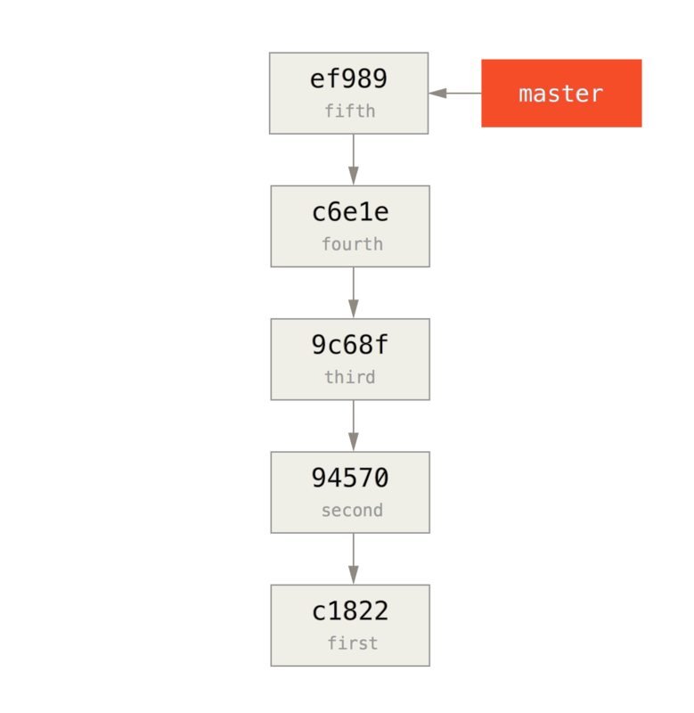{width="6.267716535433071in"
height="6.430555555555555in"}

Bem, criar a história histórica é fácil, podemos simplesmente colocar um
ramo na história e depois empurrar esse ramo para o ramo mestre de um
novo repositório remoto.

\$ git branch history c6e1e95

\$ git log \--oneline \--decorate

ef989d8 (HEAD, master) fifth commit

c6e1e95 (history) fourth commit

9c68fdc third commit

945704c second commit

c1822cf first commit

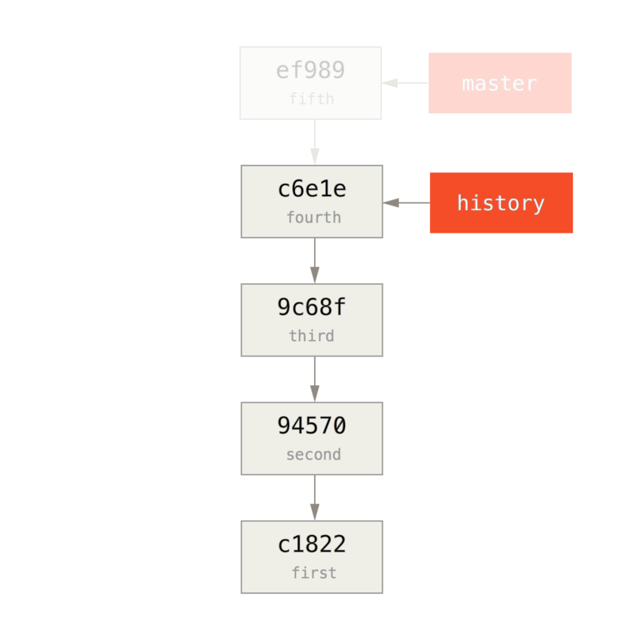{width="6.267716535433071in"
height="6.430555555555555in"}

Agora podemos empurrar o novo historyRamo para o masterbranch do nosso
novo repositório:

\$ git remote add project-history
https://github.com/schacon/project-history

\$ git push project-history history:master

Counting objects: 12, done.

Delta compression using up to 2 threads.

Compressing objects: 100% (4/4), done.

Writing objects: 100% (12/12), 907 bytes, done.

Total 12 (delta 0), reused 0 (delta 0)

Unpacking objects: 100% (12/12), done.

To git@github.com:schacon/project-history.git

\* \[new branch\] history -\> master

Ok, então nossa história é publicada. Agora, a parte mais difícil é
truncar nossa história recente, então é menor. Precisamos de uma
sobreposição para que possamos substituir um commit em um por um commit
equivalente no outro, então vamos dicar isso para apenas comprometer
quatro e cinco (então cometer quatro sobreposições).

\$ git log \--oneline \--decorate

ef989d8 (HEAD, master) fifth commit

c6e1e95 (history) fourth commit

9c68fdc third commit

945704c second commit

c1822cf first commit

É útil, neste caso, criar um commit básico que tenha instruções sobre
como expandir o histórico, para que outros desenvolvedores saibam o que
fazer se acertarem o primeiro commit no histórico truncado e precisarem
de mais. Então, o que vamos fazer é criar um objeto de commit inicial
como nosso ponto base com instruções, em seguida, rebasear os commits
restantes (quatro e cinco) em cima dele.

Para fazer isso, precisamos escolher um ponto para dividir, o qual para
nós é o terceiro commit, que é 9c68fdcem SHA-speak. Então, nosso commit
básico será baseado nessa árvore. Podemos criar nossa base commit usando
o commit-treecomando, que apenas pega uma árvore e nos dará um novo
objeto de commit SHA-1 sem pais de volta.

\$ echo \'get history from blah blah blah\' \| git commit-tree
9c68fdc\^{tree}

622e88e9cbfbacfb75b5279245b9fb38dfea10c

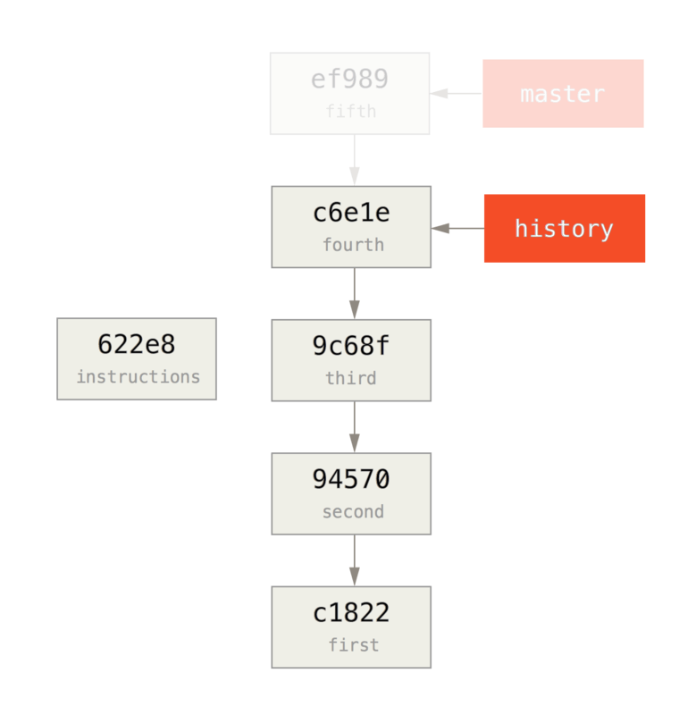{width="6.267716535433071in"
height="6.430555555555555in"}

OK, então agora que temos um commit básico, podemos rebasear o resto da
nossa história em cima disso com git rebase \--onto- A . (í a questão:
es. , , , íntepeo. . E. . es. sobre a questão . (em, proprio, e os
comandos e. O que é \--ontoO argumento será o SHA-1 que acabamos de
receber de commit-treee o ponto de rebase será o terceiro commit (o pai
do primeiro commit que queremos manter, 9c68fdc):

\$ git rebase \--onto 622e88 9c68fdc

First, rewinding head to replay your work on top of it\...

Applying: fourth commit

Applying: fifth commit

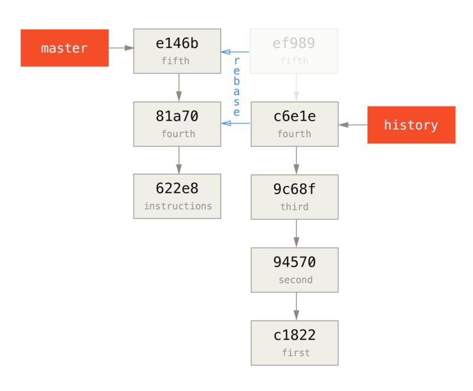{width="6.267716535433071in"
height="5.180555555555555in"}OK, então agora nós reescrevemos nossa
história recente em cima de um commit de base de jogo fora que agora tem
instruções sobre como reconstituir toda a história, se quisermos.
Podemos enviar esse novo histórico para um novo projeto e agora, quando
as pessoas clonarem esse repositório, elas só verão os dois commits mais
recentes e, em seguida, um commit básico com instruções.

Vamos mudar de função para alguém que clona o projeto pela primeira vez
que quer toda a história. Para obter os dados do histórico após a
clonagem deste repositório truncado, seria preciso adicionar um segundo
controle remoto para o repositório histórico e buscar:

\$ git clone https://github.com/schacon/project

\$ cd project

\$ git log \--oneline master

e146b5f fifth commit

81a708d fourth commit

622e88e get history from blah blah blah

\$ git remote add project-history
https://github.com/schacon/project-history

\$ git fetch project-history

From https://github.com/schacon/project-history

\* \[new branch\] master -\> project-history/master

Agora, o colaborador teria seus recentes compromissos no masterramo e os
compromissos históricos na project-history/masterO ramo.

\$ git log \--oneline master

e146b5f fifth commit

81a708d fourth commit

622e88e get history from blah blah blah

\$ git log \--oneline project-history/master

c6e1e95 fourth commit

9c68fdc third commit

945704c second commit

c1822cf first commit

Para combiná-los, você pode simplesmente ligar git replacecom o commit
que você deseja substituir e, em seguida, o commit que você deseja
substituí-lo. Portanto, queremos substituir o \"quarto\" commit no ramo
mestre pelo \"quarto\" commit no project-history/masterramo:

\$ git replace 81a708d c6e1e95

Agora, se você olhar para a história do masterRamo, parece-se assim:

\$ git log \--oneline master

e146b5f fifth commit

81a708d fourth commit

9c68fdc third commit

945704c second commit

c1822cf first commit

\- Fixe, não é? Sem ter que mudar todos os SHA-1s upstream, fomos
capazes de substituir um commit em nossa história por um commit
totalmente diferente e todas as ferramentas normais (bisect,, , - A , de
pé sobre o que sobre o rodeas de rodeas de rodeas de rodeas de rodeas,
de , de conta. , de , de que sobre o que sobre o que sobre o rodeas de
rodeas. blame, etc) vai funcionar como nós esperamos que eles façam.

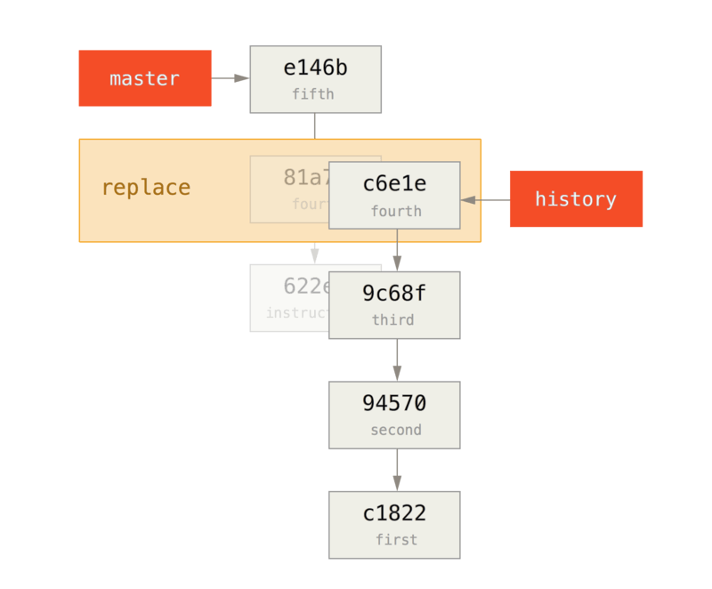{width="6.267716535433071in"
height="5.180555555555555in"}Curiosamente, ele ainda mostra 81a708dcomo
o SHA-1, mesmo que esteja realmente usando o c6e1e95Comprometer dados
pelos quais os substituímos. Mesmo se você executar um comando como
cat-file, mostrar-lhe-á os dados substituídos:

\$ git cat-file -p 81a708d

tree 7bc544cf438903b65ca9104a1e30345eee6c083d

parent 9c68fdceee073230f19ebb8b5e7fc71b479c0252

author Scott Chacon \<schacon@gmail.com\> 1268712581 -0700

committer Scott Chacon \<schacon@gmail.com\> 1268712581 -0700

fourth commit

Lembre-se que o pai real de 81a708dFoi o nosso compromisso de
placeholder (622e88e), não 9c68fdcecomo afirma aqui.

Outra coisa interessante é que esses dados são mantidos em nossas
referências:

\$ git for-each-ref

e146b5f14e79d4935160c0e83fb9ebe526b8da0d commit refs/heads/master

c6e1e95051d41771a649f3145423f8809d1a74d4 commit
refs/remotes/history/master

e146b5f14e79d4935160c0e83fb9ebe526b8da0d commit refs/remotes/origin/HEAD

e146b5f14e79d4935160c0e83fb9ebe526b8da0d commit
refs/remotes/origin/master

c6e1e95051d41771a649f3145423f8809d1a74d4 commit
refs/replace/81a708dd0e167a3f691541c7a6463343bc457040

Isso significa que é fácil compartilhar nossa substituição com outras
pessoas, porque podemos enviar isso para o nosso servidor e outras
pessoas podem baixá-lo facilmente. Isso não é tão útil no cenário de
enxerto da história que fomos até aqui (já que todos estariam baixando
as duas histórias de qualquer maneira, então por que separá-las?) Mas
pode ser útil em outras circunstâncias.
